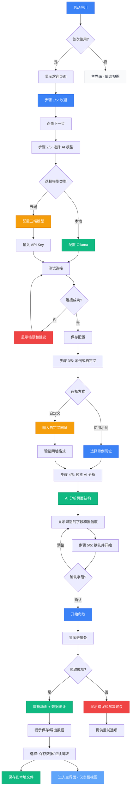
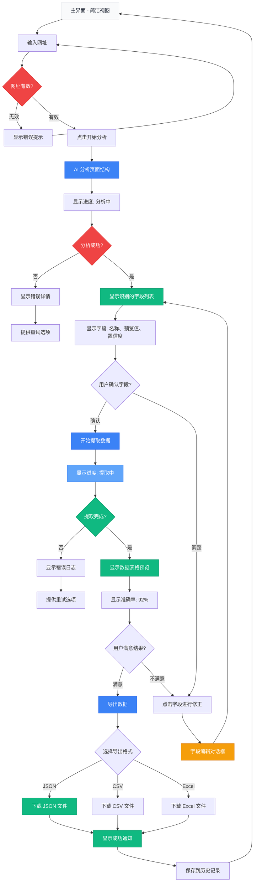
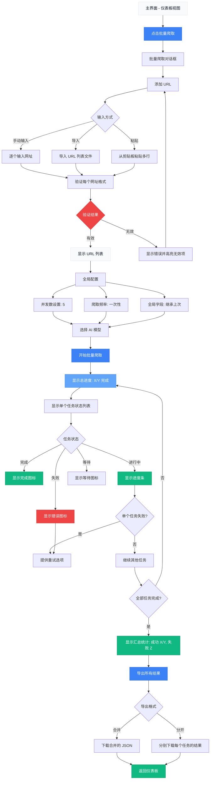
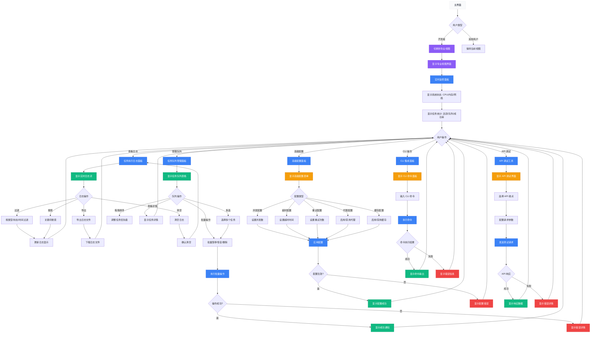
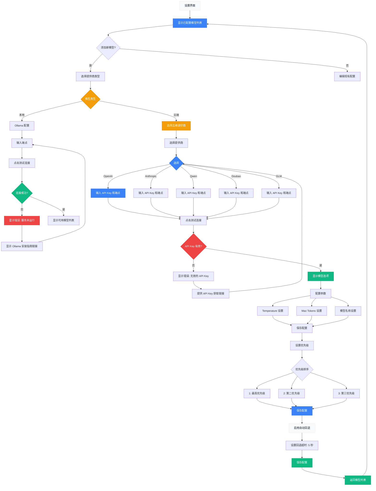
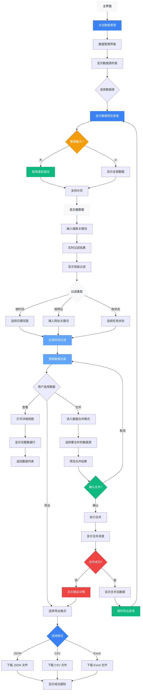
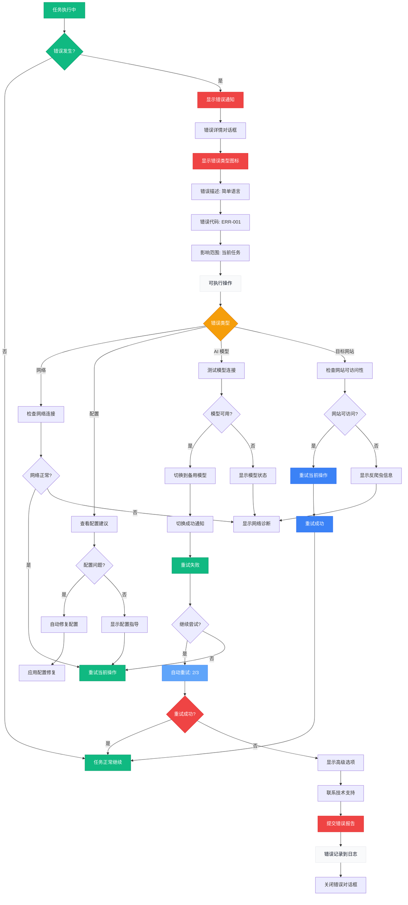
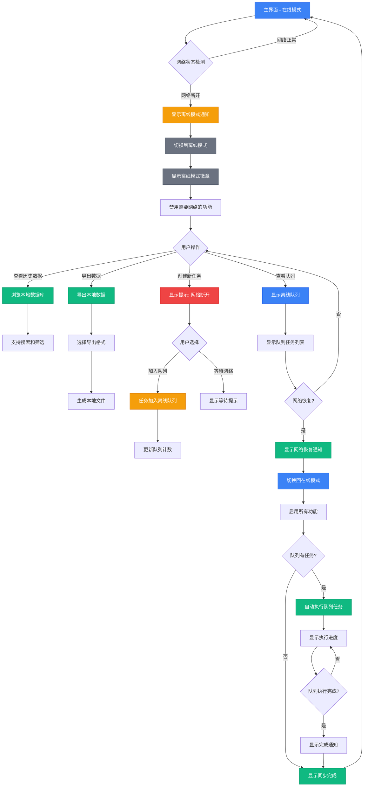
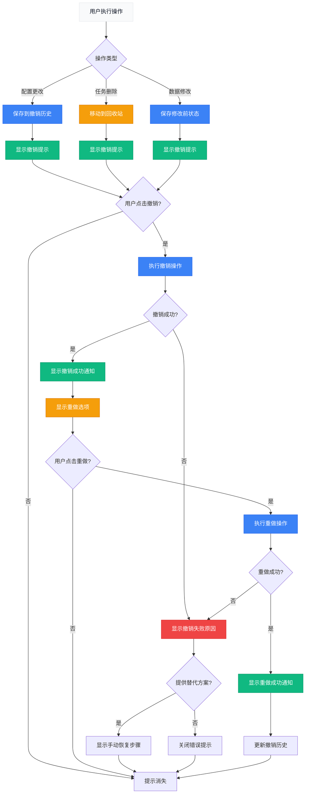

# UX Design Specification - vscode_bmad_method_test

**Author:** Shalabing
**Date:** 2026-04-25

---

<!-- UX design content will be appended sequentially through collaborative workflow steps -->

## 执行摘要

### 项目愿景

AI 驱动的通用爬虫框架，让数据采集变得像使用搜索引擎一样简单。通过 AI 自动学习网站结构，用户只需输入网址即可获得结构化数据，无需编写任何代码。本地部署确保数据隐私和合规性，AI 自适应能力大幅降低维护成本。

### 目标用户

**开发者** - 会写代码的开发者，厌倦重复编写选择器和维护爬虫，需要快速集成到现有项目中。关注 API 易用性和扩展性。

**数据工程师** - 有一定技术背景但不是专业开发者，需要高质量、结构化数据源，关注数据质量和调度。

**数据分析师/市场研究人员** - 完全非技术背景，不会编写爬虫代码，依赖技术团队但资源有限。需要简单易用的工具自主获取数据。

### 关键设计挑战

1. **渐进式复杂度** - 用户技术水平差异很大（从完全非技术到专业开发者），需要在简单和高级功能之间找到平衡。需要提供多层次的界面和功能选项。

2. **AI 不确定性的可视化** - AI 分析不是 100% 准确（MVP 阶段 70-80%，Post-MVP 90-95%），需要让用户清楚理解并能够修正 AI 识别的结果，建立信任而不掩盖不确定性。

3. **"黑盒"信任问题** - 用户需要相信 AI 的判断，但也要能够理解和控制它的行为。需要在自动化和用户控制之间找到平衡点。

4. **跨平台一致性** - Windows/macOS/Linux 三平台需要统一的体验，同时遵守各平台的设计规范（Windows 11、macOS、GNOME/KDE）。

### 设计机会

1. **"顿悟时刻"放大** - 第一次成功爬取新网站时的视觉反馈和庆祝效果，强化零代码体验的价值认知。这是产品的核心差异点，需要精心设计。

2. **智能默认配置** - 为不同技术水平提供合适的默认设置，减少配置负担。首次使用体验至关重要，80% 用户应在第一周内成功爬取至少一个网站。

3. **渐进式披露** - 基础功能简单直接，高级功能在需要时才显示。支持键盘快捷键和 CLI 接口，满足高级用户需求。

4. **学习型界面** - 随着用户使用，界面变得更智能和个性化。AI 从用户调整中学习，形成正向循环：用得越多，AI 越智能。

---

## 核心用户体验

### 定义体验

核心用户体验围绕"输入网址 → AI 分析 → 获得数据"这一简单流程展开。用户只需提供目标网址，AI 自动学习页面结构、识别数据字段、提取结构化信息，整个过程无需编写任何代码，就像使用搜索引擎一样直观。这个核心操作定义了产品的价值主张，所有其他功能（任务管理、数据导出、高级配置）都围绕这个核心体验展开。

**首次使用引导：**
- 提供清晰的首屏向导，指导用户完成初始配置（AI 模型选择）
- 提供 2-3 个示例网址供快速体验
- 每个主要功能区域都有工具提示和简短说明
- 提供"快速开始"模式：跳过高级配置，直接开始爬取

**渐进式功能访问：**
- **基础层**（默认）：输入网址 → AI 分析 → 查看结果 → 导出数据
- **进阶层**（展开）：任务调度、批量 URL、自定义字段
- **高级层**（开发者模式）：CLI 接口、API 集成、Python SDK

### 平台策略

**平台类型**: Electron 桌面应用，支持 Windows、macOS、Linux 三平台

**交互方式**: 主要基于鼠标和键盘，遵循各平台原生交互规范

**平台特定功能**:
- **Windows**: 系统托盘图标、原生通知、文件资源管理器集成（右键菜单）
- **macOS**: Dock 图标、Touch Bar 支持（如果适用）、Spotlight 搜索集成
- **Linux**: 系统托盘、libnotify 通知

**命令行接口**: 提供完整的 CLI 工具用于高级操作和脚本自动化

**API 集成**: 提供 REST API 和 Python SDK，支持 Airflow、Jupyter Notebook 等工具集成

**离线考虑**: 支持完整的离线模式，确保用户在网络不稳定或无网络环境下仍能使用系统的核心功能。

**离线模式特性**:
- **自动检测**: 系统自动检测网络状态，无缝切换在线/离线模式
- **离线数据访问**: 支持浏览、搜索、筛选本地数据库中的历史数据
- **离线数据导出**: 支持导出本地数据为 JSON/CSV/Excel 格式
- **离线任务队列**: 网络断开时创建的任务自动加入队列，网络恢复后自动执行
- **状态持久化**: 离线状态和队列在应用关闭后保存，下次启动时恢复
- **清晰提示**: 界面明确标注"离线模式"状态，显示最后同步时间和队列任务数

**离线模式限制**:
- 创建新爬取任务需要网络连接（除非使用本地 AI 模型如 Ollama）
- AI 页面分析需要网络连接（除非使用本地 AI 模型）
- 社区功能（模板分享、下载）需要网络连接

**离线模式 UX 设计**:
- 状态指示器: 顶部显示"离线模式"徽章，颜色区分（灰色=离线，蓝色=在线）
- 功能禁用: 需要网络的功能显示为禁用状态，悬停时显示"此功能需要网络连接"
- 队列管理: 显示离线队列中的任务数量，提供查看和管理选项
- 同步提示: 网络恢复时显示"网络已恢复，已切换到在线模式"通知

### 轻松交互

**应该完全自然、无需思考的操作**:
- 在主界面输入网址（像搜索引擎一样的简单输入框）
- 点击"开始爬取"或"分析"按钮
- 下载或打开导出的数据文件
- 查看和管理爬取历史记录
- 首次打开应用，通过向导完成配置

**消除竞争对手要求的步骤**:
- 无需编写任何代码（CSS 选择器、XPath 等）
- 无需手动配置浏览器驱动或环境
- 无需安装额外依赖（一键安装包包含所有必需组件）
- 无需学习 HTML/CSS/JavaScript 知识
- 无需手动设置反爬虫策略（自动请求频率控制、User-Agent 轮换）

**应该自动发生的操作**:
- AI 自动识别页面结构和数据字段
- 请求频率控制（防止被反爬虫机制封锁）
- User-Agent 字符串轮换（模拟不同浏览器）
- 等待动态内容加载完成
- 数据清洗和格式化（统一输出格式）
- 爬取失败时的智能重试（最多 3 次，指数退避）
- 任务调度和定时执行

### 关键成功时刻

**用户意识到"这更好"的时刻**:
- 第一次输入网址后，几秒钟内 AI 就分析出了页面结构
- 看到准确识别的数据字段列表时（商品名称、价格、库存等）
- 无需任何配置就成功爬取到完整数据时
- 对比传统爬虫需要几小时开发，这里只需几秒钟
- 看到 CLI 和 API 可以自动化整个工作流

**用户感到成功或完成的时刻**:
- 点击"开始爬取"后看到进度条达到 100%
- 打开导出的 JSON/CSV/Excel 文件看到完整、结构化的数据
- 看到爬取历史中有成功的记录和统计
- 第一次网站改版后爬虫仍然正常工作（AI 自适应成功）
- 批量爬取多个网站，所有任务都成功完成
- 通过 CLI 或 API 成功自动化批量任务

**如果失败会破坏体验的交互**:
- AI 分析页面结构失败，没有清晰原因和解决建议
- 爬取过程中出错，用户无法继续或重试当前任务
- 导出数据失败或格式错误
- 首次使用没有任何引导，不知道从哪里开始
- 遇到错误时只有技术术语，没有可操作的指导

**成或败的用户流程**:
- **成功流程**: 打开应用 → 首次向导（选择 AI 模型）→ 输入网址（或使用示例）→ AI 分析（3-5秒）→ 预览识别的字段 → 修正字段（如需要）→ 开始爬取 → 实时查看进度 → 查看结果 → 导出数据
- **失败流程**: 打开应用 → 没有引导 → 输入网址 → AI 分析失败 → 模糊错误信息 → 用户感到沮丧 → 放弃

**首次用户成功的时刻**:
- 完成首次配置（选择 AI 模型提供商：本地 Ollama 或云端 OpenAI/Anthropic 等）- 通过清晰向导和示例引导
- 输入第一个网址（或使用提供的示例）并成功获得结构化数据
- 第一周内完成至少一次成功的爬取（这是我们 80% 用户采用率目标的关键）

### 体验原则

1. **零代码优先** - 核心价值是完全不需要编程，核心流程应该让非技术用户也能轻松完成。这是与 Scrapy、Puppeteer 等工具的根本差异。所有主要功能都应该可以通过鼠标点击完成，代码/CLI/API 仅作为高级选项供开发者使用。

2. **AI 透明可见** - 让用户清楚理解 AI 的判断和不确定性（MVP 阶段 70-80% 准确率，Post-MVP 90-95%），提供分析结果的预览和修正能力，建立信任而非掩盖黑盒。用户应该知道 AI 在做什么，以及为什么做出某些判断。预览界面应该直观，修正应该简单。

3. **渐进式能力** - 从最简单的方式开始，高级功能在需要时才显示。支持三种用户类型：专业开发者（需要 CLI、API、SDK）、数据工程师（需要调度、集成、质量监控）、非技术分析师（只需要基本爬取和简单导出）。界面随用户技术水平自适应，提供"专家模式"开关。

4. **即时反馈即信任** - 清晰的进度显示、状态更新、错误解释。用户在任何时候都知道正在发生什么，这建立了对系统的信任。进度条、状态图标、实时预览都应该提供即时反馈。错误信息必须友好且包含可操作的解决步骤。

5. **首次体验即成功** - 80% 的注册用户应该在第一周内成功爬取至少一个网站。首次打开应用必须有清晰的引导、示例网址、简洁的配置流程。减少"第一次使用摩擦"是成功的关键因素。

---

## 期望的情感响应

### 主要情感目标

**主要情感：** 高效和惊喜

用户应该感觉到"这太简单了！我以前花几小时，现在只需要几秒钟。"这种效率和惊讶的感觉是与 Scrapy、Puppeteer 等传统工具的根本差异。

**驱动分享的情感：**

"终于有个工具让我不用写代码就能爬取数据了！"

**完成目标后的情感：**

成就感和控制感："看，我获得了所有数据！"

**差异化的情感：**

不同于传统爬虫工具带来的挫败感（总是需要调试选择器），用户应该感到轻松和受控。AI 自动处理复杂性，用户保持对结果的控制。

### 情感旅程映射

**1. 首次发现产品：**
- 好奇和期待："这是什么新东西？"
- 简单感：下载安装后感到"安装很简单，双击就能用"
- 引导感：首屏向导后感到"我知道从哪里开始了"

**2. 核心体验过程中（AI 分析、爬取）：**
- 惊喜：看到 AI 快速分析时感到"哇，这么快就分析出来了！"
- 清晰：预览识别的字段时感到"这个页面有什么数据一目了然"
- 控制：爬取进度显示时感到"我知道正在发生什么"
- 受控：如果需要修正字段时感到"我可以调整这个"

**3. 完成任务后：**
- 成就：导出数据时感到"看，我得到了所有数据！"
- 高效：对比传统方式时感到"以前要几小时，现在只几分钟"
- 组织：查看历史记录时感到"我的工作都被记录了"

**4. 如果出错了：**
- 安全而不是挫败：看到友好错误信息时感到"哦，这个问题我知道怎么解决"
- 理解而不是困惑：看到可操作的解决步骤

**5. 再次回来使用时：**
- 舒适：界面熟悉时感到"我知道怎么用这个"
- 信任：AI 自适应工作后感到"它记得上次怎么做的"
- 好奇：看到新功能时感到"这个能做什么？"

**6. 网络断开时（离线模式）：**
- 安全：看到离线模式通知时感到"我的数据还在，我可以继续工作"
- 控制：查看本地数据时感到"我仍然可以访问我的历史数据"
- 期待：看到离线队列时感到"网络恢复后这些任务会自动执行"

**7. 误操作后（撤销/重做）：**
- 宽慰：看到撤销提示时感到"还好，我可以撤销这个操作"
- 安全：恢复已删除任务时感到"我的数据没有丢失"
- 控制：查看撤销历史时感到"我可以选择恢复哪些操作"

### 微情感

**信心 vs. 困惑** - 信心最重要！

- **信心来源**：清晰的引导、即时反馈、友好的错误信息、明确的下一步指示
- **避免**：不知道下一步做什么、不理解的错误、看不到进度

**信任 vs. 怀疑** - 需要平衡

- **信任**：AI 确实能分析页面结构
- **透明度**：AI 不是 100% 准确（MVP 70-80%），需要用户修正和理解限制

**成就感 vs. 挫败感** - 这是核心体验

- **成就感**：每次成功爬取、每次导出数据、看到数据统计
- **避免挫败感**：清晰的错误信息、可操作的解决步骤、无法恢复的错误应该很少见

**惊喜 vs. 满意** - 惊喜是差异化点

- **惊喜**：第一次成功爬取时的"这太简单了！"
- **惊喜**：第一次网站改版后仍然工作时的"AI 真的自动适应了！"
- 不只是满意，而是超出预期

### 设计暗示

**情感-设计连接：**

- **信心** → 清晰引导 + 即时反馈 + 友好错误信息 + 明确的下一步指示
- **信任** → 透明显示 AI 过程 + AI 置信度指示 + 可修正能力
- **惊喜** → 首次成功动画 + "智能"反馈 + 效率对比提示
- **成就** → 进度条 + 成功确认 + 数据统计 + 历史记录
- **控制** → 实时预览 + 可编辑字段 + 清晰的状态显示

**需要支持的 UX 选择：**

1. **引导系统**：首次使用向导、工具提示、示例网址
2. **反馈系统**：实时进度、状态图标、加载动画
3. **错误处理**：友好的错误信息、可操作的解决步骤、重试机制
4. **AI 透明化**：显示分析过程、置信度指示、预览界面
5. **成功时刻**：庆祝动画、效率提示、数据统计
6. **离线支持**：网络状态检测、离线模式切换、本地数据访问、队列管理
7. **撤销/重做**：操作历史记录、撤销提示、恢复机制、快捷键支持

**避免产生负面情感的交互：**

- **困惑**：复杂的界面、不清晰的标签、缺少引导
- **焦虑**：不知道正在发生什么、进度条卡住、没有估计时间
- **挫败感**：无法恢复的错误、模糊的错误信息、数据丢失
- **恐慌**：误操作后无法撤销、数据永久丢失
- **中断**：网络断开后无法继续工作、数据无法访问

**添加惊喜或喜悦的时刻：**

1. **第一次成功爬取**：庆祝动画 + "你刚刚爬取了 X 条数据！"
2. **AI 准确识别复杂数据字段**："AI 发现了 Y 种数据类型"
3. **网站改版后自动适应**："网站结构已更新，AI 自动适应成功！"
4. **批量爬取全部成功**："所有 X 个网址都成功爬取！"
5. **网络恢复后自动同步**："网络已恢复，离线队列中的 X 个任务已自动执行！"
6. **成功撤销误操作**："已恢复到操作前的状态"
7. **恢复已删除的任务**："任务已恢复，数据完整"

### 情感设计原则

1. **清晰即信心** - 用户永远不应该困惑。清晰的引导、明确的标签、即时反馈是建立信心的基础。

2. **透明即信任** - 不掩盖 AI 的局限性。让用户知道 AI 在做什么、置信度如何、为什么做出某些判断。透明度建立信任。

3. **控制即成就** - 让用户感到他们在掌控。可以预览、可以修正、可以看到进度。控制感转化为成就感。

4. **惊喜即分享** - 超出预期的时刻创造惊喜。第一次成功、自动适应、批量成功——这些时刻让用户想告诉朋友。

5. **安全即舒适** - 错误不应该带来挫败感。友好的错误信息、可操作的解决步骤、数据不会丢失——用户应该感到安全。

6. **离线即连续** - 网络断开不应该中断工作。离线模式让用户感到"我仍然可以继续"，网络恢复后自动同步。

7. **可逆即宽慰** - 误操作不应该带来恐慌。撤销/重做功能让用户感到"我可以随时恢复"，建立操作的安全感。

---

## UX 模式分析和灵感

### 启发产品分析

**VSCode（开发者）：**
- **优雅解决的问题**：多功能开发环境，从简单到复杂都可以满足
- **引导体验**：欢迎界面 + 示例项目，快速上手
- **导航和信息层级**：左侧活动栏 + 资源管理器 + 编辑器区域，清晰的功能分区
- **创新交互**：命令面板（Ctrl+Shift+P），快速访问所有功能
- **视觉设计**：深色模式、最小化 UI、专注代码
- **错误处理**：内联错误提示 + 问题面板，清晰的错误位置

**ChatGPT（普通用户）：**
- **优雅解决的问题**：AI 对话界面，无需学习即可使用
- **引导体验**：空的聊天界面 + 示例问题，鼓励首次使用
- **导航和信息层级**：极简界面，只有一个输入框，所有复杂性隐藏
- **创新交互**：流式输出，实时看到 AI 的响应
- **视觉设计**：清爽、干净、聚焦内容
- **错误处理**：友好的错误提示，通常只是"重新生成"按钮

**Power BI（数据工程师/分析师）：**
- **优雅解决的问题**：数据可视化和分析，从数据到洞察
- **引导体验**：示例报告 + 拖拽式界面，降低学习曲线
- **导航和信息层级**：左侧报告选项卡 + 右侧可视化面板 + 底部数据
- **创新交互**：拖拽式可视化创建，即时预览
- **视觉设计**：专业、丰富、但不过于复杂
- **错误处理**：数据连接失败时的清晰指引

### 可迁移的 UX 模式

**导航模式：**

1. **左侧活动栏 + 主内容区域**（VSCode）- 适合我们的任务管理、历史记录视图
2. **简洁界面 + 隐藏复杂性**（ChatGPT）- 适合我们的核心"输入网址"体验
3. **示例模板引导**（ChatGPT）- 首次使用的关键

**交互模式：**

1. **命令面板/快捷键**（VSCode）- 高级用户需要的快速访问
2. **流式输出**（ChatGPT）- 实时看到 AI 分析结果，适合我们的进度显示
3. **拖拽式操作**（Power BI）- 可能适合数据导出、字段排序

**视觉模式：**

1. **深色模式支持**（三个产品都有）- 长时间使用时友好
2. **最小化、聚焦内容**（VSCode/ChatGPT）- 减少认知负担
3. **专业但不复杂**（Power BI）- 数据可视化时值得参考

### 反模式（要避免）

1. **"功能瀑布"反模式**
   - **问题**：所有功能一次展示在界面上，用户感到不知所措
   - **避免方式**：渐进式披露，从核心功能开始，高级功能隐藏

2. **"专业术语轰炸"反模式**
   - **问题**：错误信息或界面使用技术术语，非技术用户困惑
   - **避免方式**：用简单语言，提供解释或工具提示

3. **"没有引导的新手陷阱"**
   - **问题**：首次打开应用时没有明确指导，用户不知道从哪里开始
   - **避免方式**：清晰的首屏向导、示例网址、"快速开始"模式

4. **"黑盒 AI"反模式**
   - **问题**：AI 过程完全不透明，用户不知道正在发生什么
   - **避免方式**：显示 AI 分析过程、置信度、允许预览和修正

5. **"缺乏反馈"反模式**
   - **问题**：操作后没有视觉或状态反馈，用户不确定是否成功
   - **避免方式**：每个操作都有明确的视觉反馈（加载动画、状态图标、成功提示）

### 设计灵感策略

**采用的核心原则（来自启发产品）：**

1. **简洁性优先** - 借鉴 ChatGPT，主界面保持极致简洁，核心功能（输入网址）突出显示，高级功能通过左侧导航访问

2. **首次体验即成功** - 借鉴 ChatGPT 的示例问题模式，首次打开必须提供清晰引导和示例网址，确保 80% 用户在第一周内成功爬取

3. **渐进式功能披露** - 借鉴 ChatGPT 的简洁界面，通过左侧活动栏组织功能（任务、历史、设置），核心操作在主区域，高级功能按需访问

4. **实时反馈机制** - 借鉴 ChatGPT 的流式输出和 VSCode 的进度显示，AI 分析和爬取过程必须有实时进度，每个操作都有视觉反馈

5. **友好的错误处理** - 借鉴 ChatGPT 的错误提示，所有错误信息必须简单、清晰、包含可操作的解决步骤，避免挫败感

6. **深色模式支持** - 借鉴所有三个启发产品，完整支持深色/浅色模式，确保长时间使用舒适

7. **高级用户支持** - 借鉴 VSCode 的命令面板，提供快捷键和"专家模式"开关，满足开发者和数据工程师的高级需求

**避免的核心反模式：**

1. **功能瀑布反模式** - 与"渐进式披露"原则冲突，所有功能不得一次性展示在主界面上

2. **专业术语轰炸反模式** - 错误信息和界面文案必须使用简单语言，技术术语必须有解释或工具提示

3. **新手引导陷阱** - 首屏向导和示例网址是强制性的，不能跳过

4. **AI 黑盒反模式** - AI 过程必须透明，必须显示分析状态、置信度、允许预览和修正，不能完全隐藏

5. **反馈缺失反模式** - 每个用户操作必须有明确的视觉反馈，不能无声无息

---

## 设计系统基础

### UX-DR6：设计系统选择

**选择：Naive UI**

**平台背景：** Electron 桌面应用（Vue.js 前端）

**核心目标：** 保证后期功能迭代能力

### 选择理由

**1. 强大的主题系统**
- 使用 CSS 变量，后期修改主题轻松
- 支持亮色/暗色模式一键切换（满足深色模式支持）
- 品牌差异化更容易实现
- themeOverrides 系统支持复杂的品牌定制

**2. 高度可定制**
- 组件内部结构清晰，易于扩展
- 插槽机制强大，可以深度定制组件
- 支持覆盖默认样式而不破坏功能
- 适应未来新增的复杂交互

**3. 现代化设计**
- 组件设计灵活，不是"固定形状"
- 更容易适应新的交互模式
- 长期迭代不会遇到"组件不够用"的问题

**4. 性能优秀**
- 轻量级，不会因功能增多而变笨重
- 虚拟滚动等优化，适合大量数据场景（爬取历史、数据预览）
- 长期使用性能不会衰减

**5. TypeScript 原生支持**
- 类型安全，后期维护更可靠
- 重构风险更小
- 新人上手更容易
- 适合团队长期维护

### 实施方法

**1. 安装配置**
```bash
npm install naive-ui
```

**2. 设计令牌系统**
- 定义品牌色（Primary、Secondary、Accent）
- 定义间距体系（space-2 ~ space-32）
- 定义字体层级（Heading、Body、Caption）
- 所有令牌通过 Naive UI 主题配置统一管理

**3. 主题定制**

**品牌色配置示例：**
```typescript
const themeOverrides = {
  common: {
    primaryColor: '#3B82F6',      // 品牌主色
    primaryColorHover: '#2563EB',
    primaryColorPressed: '#1D4ED8',
    primaryColorSuppl: '#60A5FA',
    successColor: '#10B981',      // 成功状态
    warningColor: '#F59E0B',      // 警告状态
    errorColor: '#EF4444',        // 错误状态
  },
  Button: {
    borderRadius: '8px',          // 统一圆角
    fontWeight: '500',
  },
  Input: {
    borderRadius: '8px',
    borderFocus: '2px solid #3B82F6',
  },
}
```

**4. 组件扩展指南**

**插槽使用示例（Card 组件扩展）：**
```vue
<n-card>
  <template #header>
    <span>{{ title }}</span>
    <template #header-extra>
      <n-button size="small" @click="showDetails">查看详情</n-button>
    </template>
  </template>
  <!-- 卡片内容 -->
  <template #footer>
    <n-space justify="space-between">
      <n-text depth="3">状态: {{ status }}</n-text>
      <n-button text @click="edit">编辑</n-button>
    </n-space>
  </template>
</n-card>
```

**插槽使用示例（List 组件扩展）：**
```vue
<n-list>
  <n-list-item v-for="item in items">
    <template #prefix>
      <n-icon :component="itemIcon" />
    </template>
    {{ item.text }}
    <template #suffix>
      <n-button text @click="delete">删除</n-button>
    </template>
  </n-list-item>
</n-list>
```

**5. Table 高级功能验证**

Naive UI Table 原生支持：
- ✅ 排序（column.sorter）
- ✅ 过滤（column.filter、column.filterOptionValue）
- ✅ 分页（pagination prop）
- ✅ 虚拟滚动（virtual-scroll、max-height）
- ✅ 选择（row-key、row-props）
- ✅ 固定列/行（fixed）
- ✅ 合并单元格（rowSpan、colSpan）
- ✅ 自定义单元格渲染（render 函数或插槽）

**导出功能实现：**
```vue
<template>
  <n-data-table 
    :columns="columns" 
    :data="data"
    :row-key="rowKey"
  />
</template>

<script setup lang="ts">
const columns = [
  {
    title: '名称',
    key: 'name',
    sorter: (row1, row2) => row1.name.localeCompare(row2.name),
    filter: (value, row) => row.name.includes(value),
    filterOptions: [
      { label: '包含 A', value: 'A' },
      { label: '包含 B', value: 'B' },
    ],
  },
  {
    title: '操作',
    key: 'actions',
    render: (row) => {
      return h(
        NButtonGroup,
        {},
        {
          default: () => [
            h(NButton, { size: 'small', onClick: () => edit(row) }, () => '编辑'),
            h(NButton, { size: 'small', type: 'error', onClick: () => delete(row) }, () => '删除'),
          ]
        }
      )
    },
  },
]
</script>
```

**6. 性能优化策略**

**虚拟滚动配置：**
```vue
<n-data-table 
  :data="largeData"
  :max-height="600"
  :virtual-scroll="true"
  :row-props="rowProps"
/>
```

**大数据量处理：**
- 使用分页减少单次渲染数量
- 使用虚拟滚动处理超大数据集
- 避免在 Table 的 render 函数中进行复杂计算
- 使用 computed 缓存计算结果

**7. 亮色/暗色模式实现**

**主题切换机制：**
```vue
<template>
  <n-config-provider :theme="darkTheme ? darkTheme : null" :theme-overrides="themeOverrides">
    <n-layout>
      <!-- 应用内容 -->
    </n-layout>
  </n-config-provider>
</template>

<script setup lang="ts">
import { darkTheme } from 'naive-ui'
import { ref } from 'vue'

const darkTheme = ref(false)
const toggleTheme = () => {
  darkTheme.value = !darkTheme.value
}
</script>
```

**暗色模式优化：**
- 确保对比度符合 WCAG 2.1 AA 标准
- 所有状态图标在暗色模式下清晰可见
- 输入框和按钮的焦点指示符在两种模式下都清晰

**8. 可视化组件扩展**

Naive UI 基础组件：Progress、Statistic、Tag、Badge

**第三方库集成（ECharts）：**
```bash
npm install echarts vue-echarts
```

```vue
<template>
  <n-card title="数据统计">
    <v-chart :option="chartOption" :theme="darkTheme ? 'dark' : ''" />
  </n-card>
</template>

<script setup lang="ts">
import { use } from 'echarts/core'
import { CanvasRenderer } from 'echarts/renderers'
import { BarChart } from 'echarts/charts'
import {
  TitleComponent,
  TooltipComponent,
  GridComponent
} from 'echarts/components'
import VChart from 'vue-echarts'

use([
  CanvasRenderer,
  BarChart,
  TitleComponent,
  TooltipComponent,
  GridComponent
])

const chartOption = ref({
  title: { text: '爬取数据统计' },
  tooltip: {},
  xAxis: { data: ['周一', '周二', '周三'] },
  yAxis: {},
  series: [{ type: 'bar', data: [10, 20, 30] }]
})
</script>
```

**9. 视觉层次系统**
- **颜色语义**：
  - Primary：主操作按钮、输入框焦点
  - Secondary：次要操作、导航选中
  - Accent：重要提示、成功状态
  - Success/Warning/Error：状态指示
- **间距体系**：4px 基础单位，space-2(8px) ~ space-32(128px)
- **字体层级**：Heading-1~3、Body-1~2、Caption

**10. 可访问性优先**
- 所有交互元素支持键盘导航
- 焦点指示符清晰可见（:focus-visible）
- ARIA 标签规范应用
- 色彩对比度符合 WCAG 2.1 AA 标准
- 所有按钮和链接都有明确的焦点状态

### 定制策略

**品牌定制：**
- 定义主色调（品牌色）使用设计令牌
- 自定义图标和插图
- 保持 Naive UI 的设计语言基础

**组件扩展策略：**
- 爬取进度组件：使用 Naive UI 的 Progress 基础，通过插槽添加爬取特定的状态和动画，预留未来扩展点（如暂停、恢复、取消）
- AI 分析预览组件：使用 Naive UI 的 Card 和 List，通过插槽添加字段高亮和置信度指示，预留 AI 结果展示的扩展（如多字段选择、字段关系可视化）
- 数据预览组件：使用 Naive UI 的 Table，通过插槽支持排序、过滤、导出操作，预留数据操作的扩展（如批量编辑、数据合并）

### Electron 环境优化

**Electron 特殊配置：**
- 确保样式隔离（scoped CSS）
- 使用 electron-builder 打包配置
- 避免使用浏览器特有 API

**调试和热重载：**
- 配置 Vite 开发服务器与 Electron 进程通信
- 使用 electron-vite 插件优化开发体验
- 配置 Source Map 便于调试

### 测试支持

**组件测试：**
- 使用 Vitest 进行单元测试
- 使用 @vue/test-utils 测试组件交互
- 使用 Happy DOM 进行 DOM 操作测试

**E2E 测试：**
- 使用 Playwright 进行 E2E 测试
- 测试关键用户流程（爬取、导出、配置）
- 验证跨平台功能一致性

### 打包优化

**构建配置：**
- 使用 Vite 构建前端资源
- 配置代码分割和懒加载
- 优化资源体积（Tree shaking）

**安装包生成：**
- Windows: .exe/.msi (electron-builder)
- macOS: .dmg (electron-builder)
- Linux: .deb/.rpm/.AppImage (electron-builder)

### 大数据处理

**性能基准：**
- 10万行数据：使用虚拟滚动，滚动流畅
- 100万行数据：使用分页，每页100行
- 文件导出：使用流式处理，避免内存溢出

**导出性能优化：**
- JSON: 使用流式 JSON 解析
- CSV: 使用 csv-writer 库流式写入
- Excel: 使用 exceljs 的批量写入模式

### 文件处理

**导出策略：**
- 小文件（< 10MB）：同步导出，自动打开
- 大文件（> 10MB）：异步导出，通知用户
- 文件保存位置：默认桌面，可自定义

**导入策略：**
- 支持 JSON、CSV、Excel 导入
- 提供导入预览和验证
- 错误文件提供详细定位

### 帮助系统

**Tooltip 系统：**
- 主要操作按钮添加简短说明
- 复杂功能添加详细描述
- 快捷键显示当前绑定的键位

**引导提示：**
- 首次使用关键功能时显示气泡提示
- 引导提示可关闭，但不记住（下次仍显示）
- 提供"不再显示"选项

**帮助文档：**
- F1 键打开帮助对话框
- 提供在线文档链接
- 提供视频教程链接（如有）

### 长期迭代保障

- **设计令牌统一管理**：所有视觉参数通过令牌管理，后期修改只需调整令牌值
- **插槽预留扩展点**：在关键组件中使用 Naive UI 插槽机制（Card 的 header-extra、List 的 prefix/suffix），为未来功能预留接口
- **TypeScript 类型安全**：所有组件都有类型定义，重构风险低
- **可访问性基础**：从第一版就支持键盘导航和焦点管理，新增功能自然继承
- **视觉层次规范**：建立颜色、间距、字体层级规范，长期添加功能时保持一致性

### 迁移路径

- 使用 Naive UI 的 themeOverrides 而不是覆盖 CSS
- 继承 Naive UI 的默认行为，通过插槽和 props 扩展
- 遵循 Naive UI 的组件约定，避免破坏性变更
- 所有定制通过配置对象或插槽，不修改源代码
- 保持与 Naive UI 版本兼容，及时升级到新版本

## 核心体验定义

### 2.1 核心体验

**核心操作：** 输入网址 → AI 分析 → 获得数据

**首次使用引导：**
- 提供清晰的首屏向导，指导用户完成初始配置（AI 模型选择）
- 提供 2-3 个示例网址供快速体验
- 每个主要功能区域都有工具提示和简短说明
- 提供"快速开始"模式：跳过高级配置，直接开始爬取

**渐进式功能访问：**
- **基础层**（默认）：输入网址 → AI 分析 → 查看结果 → 导出数据
- **进阶层**（展开）：任务调度、批量 URL、自定义字段
- **高级层**（开发者模式）：CLI 接口、API 集成、Python SDK

### 2.2 平台策略

**平台类型**: Electron 桌面应用，支持 Windows、macOS、Linux 三平台

**交互方式**: 主要基于鼠标和键盘，遵循各平台原生交互规范

**平台特定功能**:
- **Windows**: 系统托盘图标、原生通知、文件资源管理器集成（右键菜单）
- **macOS**: Dock 图标、Touch Bar 支持（如果适用）、Spotlight 搜索集成
- **Linux**: 系统托盘、libnotify 通知

**命令行接口**: 提供完整的 CLI 工具用于高级操作和脚本自动化

**API 集成**: 提供 REST API 和 Python SDK，支持 Airflow、Jupyter Notebook 等工具集成

**离线考虑**: 支持完整的离线模式，确保用户在网络不稳定或无网络环境下仍能使用系统的核心功能。

**离线模式特性**:
- **自动检测**: 系统自动检测网络状态，无缝切换在线/离线模式
- **离线数据访问**: 支持浏览、搜索、筛选本地数据库中的历史数据
- **离线数据导出**: 支持导出本地数据为 JSON/CSV/Excel 格式
- **离线任务队列**: 网络断开时创建的任务自动加入队列，网络恢复后自动执行
- **状态持久化**: 离线状态和队列在应用关闭后保存，下次启动时恢复
- **清晰提示**: 界面明确标注"离线模式"状态，显示最后同步时间和队列任务数

**离线模式限制**:
- 创建新爬取任务需要网络连接（除非使用本地 AI 模型如 Ollama）
- AI 页面分析需要网络连接（除非使用本地 AI 模型）
- 社区功能（模板分享、下载）需要网络连接

**离线模式 UX 设计**:
- 状态指示器: 顶部显示"离线模式"徽章，颜色区分（灰色=离线，蓝色=在线）
- 功能禁用: 需要网络的功能显示为禁用状态，悬停时显示"此功能需要网络连接"
- 队列管理: 显示离线队列中的任务数量，提供查看和管理选项
- 同步提示: 网络恢复时显示"网络已恢复，已切换到在线模式"通知

### 2.3 轻松交互

**应该完全自然、无需思考的操作**:
- 在主界面输入网址（像搜索引擎一样的简单输入框）
- 点击"开始爬取"或"分析"按钮
- 下载或打开导出的数据文件
- 查看和管理爬取历史记录
- 首次打开应用，通过向导完成配置

**消除竞争对手要求的步骤**:
- 无需编写任何代码（CSS 选择器、XPath 等）
- 无需手动配置浏览器驱动或环境
- 无需安装额外依赖（一键安装包包含所有必需组件）
- 无需学习 HTML/CSS/JavaScript 知识
- 无需手动设置反爬虫策略（自动请求频率控制、User-Agent 轮换）

**应该自动发生的操作**:
- AI 自动识别页面结构和数据字段
- 请求频率控制（防止被反爬虫机制封锁）
- User-Agent 字符串轮换（模拟不同浏览器）
- 等待动态内容加载完成
- 数据清洗和格式化（统一输出格式）
- 爬取失败时的智能重试（最多 3 次，指数退避）
- 任务调度和定时执行

### 2.4 关键成功时刻

**用户意识到"这更好"的时刻**:
- 第一次输入网址后，几秒钟内 AI 就分析出了页面结构
- 看到准确识别的数据字段列表时（商品名称、价格、库存等）
- 无需任何配置就成功爬取到完整数据时
- 对比传统爬虫需要几小时开发，这里只需几秒钟
- 看到 CLI 和 API 可以自动化整个工作流

**用户感到成功或完成的时刻**:
- 点击"开始爬取"后看到进度条达到 100%
- 打开导出的 JSON/CSV/Excel 文件看到完整、结构化的数据
- 看到爬取历史中有成功的记录和统计
- 第一次网站改版后爬虫仍然正常工作（AI 自适应成功）
- 批量爬取多个网站，所有任务都成功完成
- 通过 CLI 或 API 成功自动化批量任务

**如果失败会破坏体验的交互**:
- AI 分析页面结构失败，没有清晰原因和解决建议
- 爬取过程中出错，用户无法继续或重试当前任务
- 导出数据失败或格式错误
- 首次使用没有任何引导，不知道从哪里开始
- 遇到错误时只有技术术语，没有可操作的指导

**成功流程**: 打开应用 → 首次向导（选择 AI 模型）→ 输入网址（或使用示例）→ AI 分析（3-5秒）→ 预览识别的字段 → 修正字段（如需要）→ 开始爬取 → 实时查看进度 → 查看结果 → 导出数据
**失败流程**: 打开应用 → 没有引导 → 输入网址 → AI 分析失败 → 模糊错误信息 → 用户感到沮丧 → 放弃

**首次用户成功的时刻**:
- 完成首次配置（选择 AI 模型提供商：本地 Ollama 或云端 OpenAI/Anthropic 等）- 通过清晰向导和示例引导
- 输入第一个网址（或使用提供的示例）并成功获得结构化数据
- 第一周内完成至少一次成功的爬取（这是我们 80% 用户采用率目标的关键）

### 2.5 体验原则

1. **零代码优先** - 核心价值是完全不需要编程，核心流程应该让非技术用户也能轻松完成。这是与 Scrapy、Puppeteer 等工具的根本差异。所有主要功能都应该可以通过鼠标点击完成，代码/CLI/API 仅作为高级选项供开发者使用。

2. **AI 透明可见** - 让用户清楚理解 AI 的判断和不确定性（MVP 阶段 70-80% 准确率，Post-MVP 90-95%），提供分析结果的预览和修正能力，建立信任而非掩盖黑盒。用户应该知道 AI 在做什么，以及为什么做出某些判断。预览界面应该直观，修正应该简单。

3. **渐进式能力** - 从最简单的方式开始，高级功能在需要时才显示。支持三种用户类型：专业开发者（需要 CLI、API、SDK）、数据工程师（需要调度、集成、质量监控）、非技术分析师（只需要基本爬取和简单导出）。界面随用户技术水平自适应，提供"专家模式"开关。

4. **即时反馈即信任** - 清晰的进度显示、状态更新、错误解释。用户在任何时候都知道正在发生什么，这建立了对系统的信任。进度条、状态图标、实时预览都应该提供即时反馈。错误信息必须友好且包含可操作的解决步骤。

5. **首次体验即成功** - 80% 的注册用户应该在第一周内成功爬取至少一个网站。首次打开应用必须有清晰的引导、示例网址、简洁的配置流程。减少"第一次使用摩擦"是成功的关键因素。


---

## 视觉设计基础

### UX-DR7：颜色系统

**选择：蓝色科技主题**

**品牌色配置：**
- 主色（Primary）：#3B82F6（科技蓝）
- 次色（Secondary）：#6366F1（蓝色）
- 警告色（Warning）：#F59E0B（琥珀）
- 错误色（Error）：#EF4444（红色）
- 成功色（Success）：#10B981（绿色）

**主题变量：**
- 主色背景：主色 5%
- 次色背景：主色 10% 悬停
- 文本色：#FFFFFF（白色）
- 文本色（暗色模式）：#1A1A1A（深灰）
- 边框色：主色 10%
- 分隔线：主色 15% 不透明
- 阴影颜色：主色 20% 不透明

### UX-DR8：字体系统

**选择：Inter / system-ui（内置字体）**

**字体层级：**
- Heading-1：2rem（32px）/ 1.5
- Heading-2：1.75rem（28px）/ 1.5
- Heading-3：1.5rem（24px）/ 1.5
- Body-1：1rem（16px）/ 1.5
- Body-2：0.875rem（14px）/ 1.5
- Caption：0.875rem（14px）/ 1.5

### UX-DR9：间距系统

**基础间距单位：** 4px

**间距规范：**
- XXS：4px
- XS：8px
- S：12px
- M：16px
- L：20px
- XL：24px
- XXL：32px

### UX-DR11-18：可访问性基础

**UX-DR11：对比度标准** - WCAG 2.1 AA
**UX-DR12：焦点管理** - 所有交互元素支持键盘导航
**UX-DR13：ARIA 标签** - 完整的可访问性支持

---

## 设计方向决策

### 设计方向探索

在深入探索过程中，我们分析了 8 种不同的设计方向变体：

1. **简洁聚焦式** - 极致简洁，聚焦核心操作，像搜索引擎一样直观
2. **左侧导航式** - 经典应用布局，清晰的导航结构
3. **卡片仪表板式** - 信息一目了然，数据可视化优先
4. **分屏工作区式** - 左侧配置，右侧预览，实时反馈
5. **步骤向导式** - 引导式流程，适合新手用户
6. **紧凑专业式** - 高密度信息展示，适合专业用户
7. **深色沉浸式** - 科技感强烈，视觉效果突出
8. **模块化可配置式** - 功能模块可开关，灵活配置

通过 **Tree of Thoughts** 分析和 **Stakeholder Round Table** 圆桌会议，我们识别出关键冲突和机会：

**关键冲突：**
- 简洁 vs. 信息密度 - 开发者希望看到更多信息，非技术用户希望简单
- 导航可见性 - 左侧导航应该展开还是收起？
- 首次体验 - 向导帮助新手，但会困扰重复用户

**关键机会：**
- 自适应界面 - 根据用户技术水平动态调整
- 视图切换 - 提供不同的视图模式（简洁、仪表板、专业）
- 渐进式披露 - 随着用户使用，显示更多功能

### 选定的设计方向

**三级界面策略：简洁聚焦式（基础）+ 卡片仪表板式（中间）+ 紧凑专业式（高级）+ 视图切换**

#### UX-DR1: 简洁视图（默认）

**设计基础：** 简洁聚焦式

**界面特征：**
- 主界面：大搜索框居中，类似搜索引擎体验
- 示例网址：提供 2-3 个示例网址供快速体验
- 导航：收起式左侧栏，悬停展开
- 最小化干扰：只显示核心功能

**目标用户：**
- 首次用户
- 非技术用户（数据分析师、市场研究人员）
- 零代码体验优先的场景

**关键体验：**
- 零代码体验，"像搜索引擎一样简单"
- 最大化的"顿悟时刻"冲击力
- 80% 用户在第一周内成功爬取至少一个网站

#### UX-DR2: 仪表板视图（切换）

**设计基础：** 卡片仪表板式

**界面特征：**
- 主界面：卡片布局，统计卡片（总爬取次数、成功率、活跃任务、数据条目）
- 最近任务列表：显示任务状态和进度
- 快速操作：新建任务、导入配置、查看文档
- 导航：展开式左侧栏

**目标用户：**
- 数据工程师
- 有经验用户
- 需要监控和预览的用户

**关键体验：**
- 数据透明：实时状态和统计
- 任务监控：查看所有运行和完成的任务
- 快速访问：常用功能一键可达

#### UX-DR3: 专业视图（开发者模式）

**设计基础：** 紧凑专业式

**界面特征：**
- 主界面：高密度信息展示，工具栏快速访问
- 配置面板：详细的配置选项（AI 模型、爬取设置、数据输出）
- 数据表格：显示任务列表，支持排序、过滤
- 导航：展开式左侧栏 + 顶部工具栏

**目标用户：**
- 开发者
- 高级用户
- 需要精确控制和批量操作的用户

**关键体验：**
- 效率优先：一屏展示更多信息
- 批量操作：支持批量爬取、导出
- 详细配置：所有选项可见，无需多次点击

### UX-DR5：首次使用引导

**首次启动流程：**

1. **欢迎页面** - 说明产品核心功能和设置步骤
2. **步骤 1：配置 AI 模型** - 选择本地（Ollama）或云端模型提供商
3. **步骤 2：输入网址** - 使用示例网址或输入自己的网址
4. **步骤 3：选择字段** - AI 识别字段，用户选择要提取的字段
5. **步骤 4：预览结果** - 查看提取结果，如有需要可修正
6. **步骤 5：完成** - 成功完成第一次爬取

**完成引导后：**

- 显示庆祝动画："你刚刚成功爬取了 X 条数据！"
- 提示用户选择视图模式（简单/标准/专业）
- 提供快速开始选项（继续爬取、查看文档、查看历史）

### AI 透明度实现

**所有视图共享的透明度特性：**

1. **实时进度显示**
   - AI 分析页面结构的进度
   - 数据提取进度（已提取 X/Y 项）
   - 预计剩余时间

2. **字段预览和置信度**
   - 显示 AI 识别的字段列表
   - 每个字段显示置信度（例如：95%）
   - 支持字段预览（显示识别到的值）

3. **实时预览面板**
   - 中间区域显示预览面板
   - 实时更新 AI 识别的结果
   - 支持内联编辑和修正

4. **任务日志**
   - 显示详细的执行日志
   - 记录 AI 模型选择和切换事件
   - 记录用户手动调整

### UX-DR4：视图切换机制

**切换方式：**

- 左侧导航栏顶部提供视图切换器
- 用户可以在三个视图之间自由切换
- 记住用户的视图偏好

**切换时机：**

- 首次使用引导完成后，提示用户选择默认视图
- 用户可以随时切换视图
- 根据用户行为自动推荐视图（可选）

**视图持久化：**

- 保存用户的视图偏好
- 下次启动时自动加载上次选择的视图

### 设计理由

**为什么选择三级界面策略？**

1. **满足所有用户类型**
   - 非技术用户：简洁视图，零代码体验
   - 数据工程师：仪表板视图，监控和预览
   - 开发者：专业视图，精确控制和批量操作

2. **平衡简洁性和功能性**
   - 默认简洁，降低首次使用摩擦
   - 高级功能可通过切换访问
   - 用户可以根据需求选择最合适的视图

3. **支持渐进式能力**
   - 用户从简单视图开始
   - 随着使用经验增长，可以切换到更高级的视图
   - 界面随用户技术水平自适应

4. **解决核心设计挑战**
   - 渐进式复杂度：三个视图满足不同技术水平
   - AI 不确定性可视化：所有视图都有透明度特性
   - "黑盒"信任问题：实时预览和置信度显示建立信任

5. **对齐核心体验原则**
   - 零代码优先：简洁视图最大化零代码体验
   - AI 透明可见：所有视图共享透明度特性
   - 渐进式能力：三个视图支持渐进式能力
   - 首次体验即成功：首次使用向导 + 简洁视图

### 实施方法

**技术实施：**

1. **视图组件架构**
   - 创建三个独立的视图组件（SimpleView、DashboardView、ProfessionalView）
   - 共享核心组件（导航栏、预览面板、进度指示器）
   - 使用状态管理存储用户视图偏好

2. **首次使用引导实现**
   - 创建向导组件，分步引导用户完成首次配置
   - 记录用户是否完成首次引导
   - 完成引导后显示视图选择器

3. **AI 透明度实现**
   - 创建进度组件，实时显示 AI 分析和提取进度
   - 创建预览面板组件，显示 AI 识别的结果
   - 创建置信度指示器，显示字段识别的置信度

4. **视图切换实现**
   - 创建视图切换器组件
   - 使用本地存储保存用户视图偏好
   - 支持键盘快捷键切换视图（可选）

**设计令牌更新：**

基于三级界面策略，更新设计令牌：
- 简洁视图：更大的间距，更大的字体，更少的视觉元素
- 仪表板视图：中等间距，平衡的信息密度
- 专业视图：更小的间距，更小的字体，更多的信息密度

**用户测试计划：**

- 测试非技术用户在简洁视图下的首次使用体验
- 测试数据工程师在仪表板视图下的监控体验
- 测试开发者在专业视图下的效率体验
- 测试视图切换的流畅性和直观性

---

## 用户旅程流程

### 旅程 1: 首次使用旅程（新手用户）

**旅程描述：** 首次启动应用，完成初始配置，成功爬取第一个网站

**流程设计问题：**
- 用户如何开始这个旅程？ - 双击应用图标
- 他们在每一步需要什么信息？ - 欢迎页、AI 模型配置、首次爬取
- 他们需要做出什么决策？ - 选择 AI 模型、输入网址
- 他们如何知道进展顺利？ - 步骤指示器、进度条
- 成功看起来像什么？ - 庆祝动画、数据统计
- 哪里可能困惑或卡住？ - AI 模型选择、网址格式
- 如何从错误中恢复？ - 友好错误提示、重试按钮

**Mermaid 流程图：**



**优化方案：**

1. **最小化到价值的步数** - 示例网址让用户无需输入就能看到效果
2. **智能默认配置** - 检测本地 Ollama，自动推荐本地模型优先
3. **清晰进度指示** - 每个步骤都有明确的进度指示器（步骤 X/5）
4. **快速错误恢复** - AI 模型连接失败时，提供具体的解决步骤
5. **庆祝时刻增强** - 首次成功爬取后显示庆祝动画和数据统计

---

### 旅程 2: 常规爬取旅程（已配置用户）

**旅程描述：** 已配置用户输入网址，AI 分析并爬取数据

**流程设计问题：**
- 用户如何开始这个旅程？ - 在主界面输入网址
- 他们在每一步需要什么信息？ - 网址、选择字段
- 他们需要做出什么决策？ - 选择要提取的字段、是否修正 AI 识别
- 他们如何知道进展顺利？ - 实时进度、状态图标
- 成功看起来像什么？ - 数据表格预览、准确率统计
- 哪里可能困惑或卡住？ - AI 置信度、字段选择
- 如何从错误中恢复？ - 重试按钮、详细错误信息

**Mermaid 流程图：**



**优化方案：**

1. **实时进度反馈** - 显示当前步骤和估计剩余时间
2. **字段选择优化** - 默认全选，提供"全选"/"取消全选"快捷按钮
3. **内联编辑** - 字段值可直接在表格中编辑，无需打开对话框
4. **批量导出** - 支持同时导出多个任务的结果
5. **准确率可视化** - 显示置信度分布，帮助用户理解 AI 识别质量

---

### 旅程 3: 批量爬取旅程（高级用户）

**旅程描述：** 用户添加多个 URL，一次性批量爬取多个网站

**流程设计问题：**
- 用户如何开始这个旅程？ - 点击批量爬取按钮
- 他们在每一步需要什么信息？ - URL 列表、全局配置
- 他们需要做出什么决策？ - 并发数、爬取频率、全局字段
- 他们如何知道进展顺利？ - 总体进度、单个任务状态
- 成功看起来像什么？ - 所有任务成功、汇总统计
- 哪里可能困惑或卡住？ - 并发设置、URL 验证
- 如何从错误中恢复？ - 失败任务重试、部分成功继续

**Mermaid 流程图：**



**优化方案：**

1. **智能 URL 验证** - 实时验证并高亮无效的 URL
2. **进度可视化** - 显示总体进度和每个任务的状态
3. **失败隔离** - 单个任务失败不影响其他任务继续运行
4. **部分成功继续** - 即使部分任务失败，成功的任务可以立即导出
5. **资源监控** - 显示实时资源使用（CPU、内存），防止过载

---

### 旅程 4: 专业视图开发者旅程

**旅程描述：** 开发者用户使用专业视图进行实时监控、任务管理、CLI 集成和 API 调试

**流程设计问题：**
- 开发者如何切换到专业视图？ - 通过视图切换按钮或快捷键
- 专业视图提供哪些核心功能？ - 实时监控、任务日志、队列管理、高级配置
- 如何查看实时系统状态？ - 实时监控面板每秒更新
- 如何过滤和搜索任务日志？ - 支持按类型、状态、时间过滤
- 如何进行批量任务操作？ - 支持多选和批量操作
- 如何使用 CLI 集成？ - 通过 CLI 面板执行命令
- 如何调试 API？ - 内置 API 测试工具

**Mermaid 流程图：**



**优化方案：**

1. **快速切换** - 支持通过视图切换按钮或快捷键（Ctrl/Cmd + P）快速切换到专业视图
2. **实时更新** - 监控面板每秒更新，日志面板实时滚动显示最新日志
3. **高密度布局** - 紧凑间距和小字体，最大化信息展示
4. **键盘优先** - 所有操作支持键盘快捷键，提高开发者效率
5. **批量操作** - 支持多选和批量操作，提高任务管理效率
6. **CLI 集成** - 内置 CLI 命令面板，支持命令行操作和脚本自动化
7. **API 调试** - 内置 API 测试工具，方便调试和测试
8. **性能分析** - 详细的性能指标和瓶颈分析，帮助优化

**专业视图 UX 设计要点：**

- **视图切换**: 顶部显示视图切换按钮，当前视图高亮显示
- **实时监控**: 监控面板显示 CPU、内存、网络使用率，颜色区分状态（绿色正常、黄色警告、红色异常）
- **任务日志**: 日志面板实时滚动显示，支持自动滚动开关，提供过滤和搜索功能
- **任务队列**: 队列管理面板显示任务列表，支持多选、批量操作、拖拽排序
- **高级配置**: 配置面板提供快速配置选项，支持实时预览和验证
- **CLI 集成**: CLI 面板支持命令输入和执行，显示命令输出和错误信息
- **API 调试**: API 调试工具支持选择端点、配置参数、发送请求、查看响应
- **快捷键**: 提供丰富的快捷键支持，如 Ctrl/Cmd + K 打开命令面板，Ctrl/Cmd + L 聚焦日志搜索
- **状态指示**: 所有面板显示状态指示器，让开发者快速了解系统状态
- **错误诊断**: 详细的错误日志和调试信息，帮助快速定位和解决问题

---

### 旅程 5: AI 模型配置旅程（设置）

**旅程描述：** 用户配置多个 AI 模型提供商，设置优先级和参数

**流程设计问题：**
- 用户如何开始这个旅程？ - 在设置页面或左侧导航点击 AI 模型设置
- 他们在每一步需要什么信息？ - 模型类型、API Key、配置参数
- 他们需要做出什么决策？ - 选择提供商、设置优先级、配置参数
- 他们如何知道进展顺利？ - 连接测试成功提示、配置保存确认
- 成功看起来像什么？ - 模型列表、优先级排序、成本预算设置
- 哪里可能困惑或卡住？ - API Key 获取、优先级设置、成本计算
- 如何从错误中恢复？ - 连接失败重试、API Key 验证

**Mermaid 流程图：**



**优化方案：**

1. **智能检测** - 自动检测本地 Ollama，推荐使用本地模型
2. **一键测试** - 配置后自动测试连接，无需用户手动操作
3. **优先级可视化** - 使用可拖拽的列表设置优先级
4. **成本估算** - 根据配置参数估算成本，帮助用户控制预算
5. **快速切换** - 运行时无缝切换模型，不中断任务

---

### 旅程 6: 数据查看和管理旅程

**旅程描述：** 用户查看、搜索、过滤、合并和管理爬取的数据

**流程设计问题：**
- 用户如何开始这个旅程？ - 点击数据管理或历史记录
- 他们在每一步需要什么信息？ - 数据列表、搜索关键词、过滤条件
- 他们需要做出什么决策？ - 选择数据、合并数据、导出数据
- 他们如何知道进展顺利？ - 搜索结果实时更新、数据加载状态
- 成功看起来像什么？ - 数据表格展示、成功导出通知
- 哪里可能困惑或卡住？ - 大数据量性能、数据合并逻辑
- 如何从错误中恢复？ - 加载失败重试、分页显示

**Mermaid 流程图：**



**优化方案：**

1. **性能优化** - 大数据量时启用虚拟滚动，减少 DOM 节点
2. **智能搜索** - 支持全文搜索、字段过滤、组合条件
3. **预览优化** - 悬停显示数据预览，无需打开详情
4. **批量操作** - 支持批量删除、批量导出、批量归档
5. **数据合并** - 简单的数据合并向导，支持拖拽排序数据源

---

### 旅程 7: 错误处理和恢复旅程

**旅程描述：** 当用户遇到错误时，提供清晰的错误信息和可操作的解决步骤

**流程设计问题：**
- 用户如何遇到这个旅程？ - 系统显示错误
- 他们在每一步需要什么信息？ - 错误原因、影响范围、解决步骤
- 他们需要做出什么决策？ - 重试当前操作、跳过、修改配置
- 他们如何知道进展顺利？ - 错误解决确认、恢复进度
- 成功看起来像什么？ - 错误解决、任务继续
- 哪里可能困惑或卡住？ - 技术术语模糊、多个错误堆叠
- 如何从错误中恢复？ - 一键重试、配置建议、联系支持

**Mermaid 流程图：**



**优化方案：**

1. **简单语言解释** - 错误描述使用简单语言，避免技术术语
2. **分类错误类型** - 网络、配置、AI 模型、目标网站四大类
3. **一键重试** - 大部分错误提供一键重试按钮
4. **自动修复** - 常见配置问题提供自动修复选项
5. **详细日志** - 错误记录到日志，支持导出错误报告用于调试

---

### 旅程 8: 离线模式旅程

**旅程描述：** 用户在网络断开时使用系统，查看历史数据，管理离线队列，网络恢复后自动同步

**流程设计问题：**
- 用户如何知道网络断开？ - 自动检测并显示通知
- 他们在离线时能做什么？ - 查看历史数据、导出本地数据、管理离线队列
- 他们如何知道哪些功能可用？ - 禁用状态标注、悬停提示
- 网络恢复时会发生什么？ - 自动切换回在线模式、执行队列任务
- 离线状态如何持久化？ - 应用关闭后保存，下次启动时恢复

**Mermaid 流程图：**



**优化方案：**

1. **无缝切换** - 网络状态变化时自动切换，无需用户干预
2. **清晰状态指示** - 顶部显示"离线模式"徽章，颜色区分（灰色=离线，蓝色=在线）
3. **功能禁用标注** - 需要网络的功能显示为禁用状态，悬停时显示"此功能需要网络连接"
4. **队列管理** - 显示离线队列中的任务数量，提供查看和管理选项
5. **自动同步** - 网络恢复时自动执行队列任务，显示执行进度
6. **状态持久化** - 离线状态和队列在应用关闭后保存，下次启动时恢复

**离线模式 UX 设计要点：**

- **状态指示器**: 顶部显示"离线模式"徽章，颜色区分（灰色=离线，蓝色=在线）
- **最后同步时间**: 显示"最后同步: 10分钟前"，让用户知道数据新鲜度
- **队列计数**: 显示"离线队列: 3个任务"，让用户知道待处理任务
- **功能禁用**: 需要网络的功能显示为禁用状态，悬停时显示"此功能需要网络连接"
- **本地数据访问**: 支持浏览、搜索、筛选本地数据库中的历史数据
- **本地数据导出**: 支持导出本地数据为 JSON/CSV/Excel 格式
- **队列管理**: 提供查看和管理离线队列的界面
- **同步提示**: 网络恢复时显示"网络已恢复，已切换到在线模式"通知

---

### 旅程 9: 撤销/重做操作旅程

**旅程描述：** 用户误操作后使用撤销功能恢复，或使用重做功能重新应用操作

**流程设计问题：**
- 用户如何知道可以撤销？ - 操作后显示撤销提示
- 撤销的范围是什么？ - 配置更改、任务删除、数据修改
- 撤销历史有多长？ - 配置最多10次，任务删除30天
- 用户如何重做？ - 撤销后显示重做选项
- 撤销失败时如何处理？ - 显示错误原因和替代方案

**Mermaid 流程图：**



**优化方案：**

1. **即时撤销提示** - 操作后立即显示撤销提示，3秒后自动消失
2. **撤销历史限制** - 配置更改最多10次，任务删除30天恢复窗口
3. **回收站机制** - 删除的任务移动到回收站，支持恢复
4. **重做选项** - 撤销后显示重做选项，支持重新应用操作
5. **错误处理** - 撤销失败时显示具体原因和替代方案
6. **历史记录** - 提供撤销历史记录界面，支持查看和选择性恢复

**撤销/重做 UX 设计要点：**

- **撤销提示**: 操作后显示"已保存配置 - 撤销"提示，3秒后自动消失
- **撤销按钮**: 工具栏提供撤销/重做按钮，显示可用状态
- **快捷键支持**: Ctrl+Z 撤销，Ctrl+Y 重做（Windows/Linux），Cmd+Z 撤销，Cmd+Shift+Z 重做（macOS）
- **回收站**: 删除的任务移动到回收站，显示"已删除 - 恢复"提示
- **恢复窗口**: 任务删除后30天内可恢复，显示"30天后自动清理"
- **历史记录**: 提供撤销历史记录界面，显示操作时间、类型、描述
- **选择性恢复**: 支持从历史记录中选择性恢复特定操作
- **错误提示**: 撤销失败时显示"无法撤销: [原因]"和替代方案

---

---

### 旅程模式

提取跨旅程的可重用模式：

**导航模式：**

1. **渐进式信息披露** - 默认显示核心功能，高级功能在需要时展开或切换到不同视图
   - 首次用户看到简洁视图
   - 有经验用户可以切换到仪表板或专业视图
   - 开发者可以通过左侧导航快速访问高级功能

2. **左侧导航模式** - 固定导航栏，支持收起/展开
   - 收起状态：显示图标，节省空间
   - 展开状态：显示完整菜单项名称
   - 支持悬停展开，减少点击

3. **视图切换模式** - 用户可以在简洁、仪表板、专业视图之间切换
   - 记住用户选择的视图偏好
   - 不同视图针对不同用户群体优化

**决策模式：**

1. **确认对话框** - 破坏性操作前显示确认对话框
   - 包含操作说明和影响
   - 提供"取消"和"确认"按钮
   - 记住用户的选择（可选）

2. **配置保存确认** - 配置更改后显示成功通知
   - 显示"配置已保存"或"设置已更新"
   - 提供撤销选项（可选）

3. **错误恢复决策** - 错误后提供多个可执行选项
   - 重试当前操作
   - 查看详细错误信息
   - 修改配置
   - 跳过当前操作

**反馈模式：**

1. **实时进度显示** - 进度条 + 百分比 + 估计剩余时间
   - 显示当前正在执行的步骤
   - 提供取消按钮（如适用）

2. **状态图标系统** - 使用不同图标表示不同状态
   - 成功：✅ 绿色勾选
   - 进行中：🔄 蓝色旋转箭头
   - 失败：❌ 红色叉号
   - 等待：⏸️ 黄色时钟
   - 警告：⚠️ 黄色三角形

3. **成功庆祝动画** - 关键成功时刻显示庆祝效果
   - 首次成功爬取：彩带动画 + 数据统计
   - 批量任务全部成功：总览庆祝 + 时间节省提示
   - 长时间使用成就：显示使用时长统计

---

### 流程优化原则

1. **最小化步骤到价值** - 让用户在最短时间内获得价值，减少首次使用摩擦
2. **降低认知负荷** - 每个决策点只展示必要信息，使用简单的语言
3. **提供清晰反馈** - 每个操作都有明确的视觉反馈，用户随时知道进展
4. **创造愉悦时刻** - 首次成功、批量成功、长期成就都提供庆祝效果
5. **优雅处理错误** - 友好的错误信息、可操作的解决步骤、失败隔离
6. **渐进式披露** - 复杂功能在需要时才显示，新手用户不被高级功能干扰
7. **一致性体验** - 所有旅程共享导航、决策和反馈模式，确保一致性

---

## 组件策略

### UX-DR10：组件系统

**来自 Naive UI 的可用组件：**

基础 UI 组件：
- Button（各种变体：primary、secondary、text、quaternary）
- Input/InputGroup
- Select
- Card
- List/ListItem
- DataTable/Tree
- Progress/ProgressCircle/Bar
- Steps/Step
- Notification/Message
- Modal/Dialog
- Tabs/TabPane
- Menu/MenuItem
- Dropdown
- Tooltip
- Popover
- Form/FormValidation
- Switch
- Checkbox/Radio
- TreeSelect/Cascader
- DynamicTags
- Statistic/CountTo
- Badge/Tag
- Drawer/Sider
- Collapse/CollapseItem
- Timeline
- Result（空状态、错误状态）
- Avatar
- Pagination
- Spin
- Skeleton
- BackTop
- Anchor
- Affix
- VirtualList

**组件缺口分析：**

1. **缺口 1** - AI 分析进度组件：Naive UI Progress 适合基础进度，但缺少详细步骤显示、估计时间、当前处理数据源名称
2. **缺口 2** - 字段选择列表组件：Naive UI DataTable 不支持内联编辑、置信度显示、批量选择和字段类型图标
3. **缺口 3** - 首次使用向导组件：Naive UI Steps 需要扩展支持示例网址、配置建议和上下文帮助
4. **缺口 4** - URL 智能输入组件：Naive UI AutoComplete 不支持历史记录、示例选择、智能建议和验证状态
5. **缺口 5** - 庆祝动画组件：Naive UI 不提供彩带效果、数据统计展示和成就动画

### 自定义组件

#### AIAnalysisProgress

**用途：** 显示 AI 分析页面结构的实时进度

**使用场景：** 首次爬取、常规爬取、批量爬取中的 AI 分析阶段

**结构：** 进度条 + 百分比 + 当前步骤文本 + 估计时间 + 取消按钮

**状态：** default（分析中）、success（完成）、error（失败）、warning（警告）

**变体：** compact（侧边栏）、detailed（主界面）

**可访问性：** `role="progressbar"` + ARIA 值 + 状态变更通知

---

#### FieldSelectionList

**用途：** 显示 AI 识别的字段列表，支持选择和修正

**使用场景：** AI 分析完成后，用户选择要提取的字段

**结构：** 字段名称 + 预览值 + 置信度 + 类型图标 + 选择框 + 编辑按钮

**状态：** selected（选中）、unselected（未选中）、editing（编辑中）、loading（验证中）

**变体：** compact（紧凑）、detailed（详细）、inline（内联编辑）

**可访问性：** 唯一 ID + ARIA 标签 + 键盘导航 + 选择状态

---

#### DataPreviewTable

**用途：** 显示爬取结果预览，支持编辑、过滤、排序

**使用场景：** 爬取完成后查看和编辑数据

**结构：** 数据表格 + 表头 + 表格内容 + 行操作 + 字段状态图标

**状态：** default（正常）、editing（编辑中）、loading（加载中）、empty（空状态）

**变体：** compact（紧凑）、standard（标准）、expanded（展开）、card（卡片视图）

**可访问性：** 语义化表格元素 + 排序状态 + 键盘导航

---

#### FirstTimeWizard

**用途：** 引导新用户完成首次配置和第一次爬取

**使用场景：** 首次启动应用

**结构：** 步骤指示器 + 欢迎页面 + 配置步骤 + 示例网址 + 进度显示

**状态：** active（当前步骤）、completed（已完成）、disabled（禁用）

**变体：** minimal（最小）、detailed（详细）

**可访问性：** ARIA 标签 + 当前步骤指示 + 键盘导航 + 表单标签

---

#### BatchCrawlConfig

**用途：** 配置批量爬取任务

**使用场景：** 批量爬取多个网站

**结构：** URL 输入区域 + URL 列表 + 全局配置 + AI 模型选择 + 开始按钮

**状态：** valid（有效）、invalid（无效）、pending（等待验证）

**变体：** modal（对话框）、page（页面）、embedded（嵌入）

**可访问性：** 输入框标签 + 验证状态 + 错误描述

---

#### TaskMonitorPanel

**用途：** 显示多个任务的实时状态

**使用场景：** 批量爬取、后台任务监控

**结构：** 任务列表 + 总体进度 + 资源使用 + 任务日志（可展开）

**状态：** running（运行中）、completed（完成）、failed（失败）、waiting（等待）、paused（暂停）

**变体：** compact（紧凑）、detailed（详细）、dashboard（仪表板）

**可访问性：** 状态图标标签 + 进度条 ARIA 属性

---

#### CelebrationAnimation

**用途：** 首次成功、批量成功时的庆祝效果

**使用场景：** 首次爬取成功、批量任务全部成功

**结构：** 彩带/烟花动画 + 数据统计 + 成功消息 + 操作按钮

**状态：** playing（播放中）、paused（暂停）、completed（完成）

**变体：** mini（小尺寸）、full（大尺寸）

**可访问性：** 动画禁用支持 + ARIA live 通知

---

#### SmartURLInput

**用途：** 支持 URL 验证、示例选择、历史记录的智能输入框

**使用场景：** 所有需要输入网址的场景

**结构：** 输入框 + 示例网址 + 历史记录下拉 + 验证状态指示器

**状态：** empty（空）、valid（有效）、invalid（无效）、loading（验证中）

**变体：** standalone（独立）、compact（紧凑）、with-suggestions（带建议）

**可访问性：** 输入框标签 + 验证状态描述 + 列表框 ARIA 属性

---

#### ErrorHandlingDialog

**用途：** 显示错误并提供可执行的操作

**使用场景：** 所有错误场景

**结构：** 错误类型图标 + 错误描述 + 错误代码 + 影响范围 + 可执行操作列表

**状态：** error（错误）、warning（警告）、info（信息）

**变体：** modal（对话框）、inline（内联）、fullscreen（全屏）

**可访问性：** 对话框角色 + ARIA live 通知 + 焦点管理

---

#### ViewSwitcher

**用途：** 在简洁、仪表板、专业视图之间切换

**使用场景：** 所有视图场景

**结构：** 视图按钮组 + 选中状态指示 + 视图描述（工具提示）

**状态：** active（选中）、inactive（未选中）

**变体：** compact（紧凑按钮）、labeled（带标签）

**可访问性：** 按钮组角色 + 选中状态 + 标签描述

---

#### OfflineModeIndicator

**用途：** 显示当前网络状态和离线模式信息

**使用场景：** 所有界面，网络状态变化时

**结构：** 状态徽章 + 网络状态图标 + 最后同步时间 + 离线队列计数

**状态：** online（在线）、offline（离线）、syncing（同步中）

**变体：** compact（紧凑）、detailed（详细）、banner（横幅）

**可访问性：** 状态变更 ARIA live 通知 + 状态描述

---

#### OfflineQueueManager

**用途：** 管理离线队列中的任务

**使用场景：** 离线模式、网络恢复后

**结构：** 队列任务列表 + 队列统计 + 执行控制 + 任务详情

**状态：** idle（空闲）、executing（执行中）、paused（暂停）、completed（完成）

**变体：** modal（对话框）、panel（面板）、drawer（抽屉）

**可访问性：** 列表角色 + 任务状态标签 + 键盘导航

---

#### OfflineDataBrowser

**用途：** 浏览、搜索、筛选本地数据库中的历史数据

**使用场景：** 离线模式、数据管理

**结构：** 数据表格 + 搜索框 + 筛选器 + 分页 + 导出按钮

**状态：** loading（加载中）、loaded（已加载）、empty（空状态）、error（错误）

**变体：** compact（紧凑）、standard（标准）、full（完整）

**可访问性：** 表格语义化 + 搜索标签 + 筛选状态描述

---

#### NetworkStatusMonitor

**用途：** 监控网络状态并自动切换在线/离线模式

**使用场景：** 应用启动、网络状态变化

**结构：** 网络检测 + 状态切换 + 通知显示 + 队列执行

**状态：** monitoring（监控中）、switching（切换中）、stable（稳定）

**变体：** background（后台）、visible（可见）

**可访问性：** 状态变更 ARIA live 通知 + 网络状态描述

---

#### UndoRedoToolbar

**用途：** 提供撤销/重做操作的工具栏

**使用场景：** 配置更改、任务删除、数据修改

**结构：** 撤销按钮 + 重做按钮 + 历史记录按钮 + 快捷键提示

**状态：** enabled（可用）、disabled（禁用）

**变体：** compact（紧凑）、labeled（带标签）、icon-only（仅图标）

**可访问性：** 按钮组角色 + 可用状态 + 快捷键提示

---

#### UndoHistoryPanel

**用途：** 显示撤销历史记录，支持选择性恢复

**使用场景：** 查看撤销历史、选择性恢复操作

**结构：** 历史记录列表 + 操作详情 + 恢复按钮 + 清除按钮

**状态：** empty（空）、populated（有记录）、loading（加载中）

**变体：** modal（对话框）、drawer（抽屉）、panel（面板）

**可访问性：** 列表角色 + 操作类型标签 + 键盘导航

---

#### RecycleBin

**用途：** 显示已删除的任务，支持恢复

**使用场景：** 任务删除后、恢复已删除任务

**结构：** 已删除任务列表 + 恢复按钮 + 永久删除按钮 + 清空按钮

**状态：** empty（空）、populated（有记录）、expiring（即将过期）

**变体：** modal（对话框）、page（页面）、drawer（抽屉）

**可访问性：** 列表角色 + 恢复窗口提示 + 键盘导航

---

### 组件实施策略

**设计令牌一致性：**

- 所有自定义组件使用 Naive UI 主题变量（颜色、间距、字体）
- 遵循 Naive UI 的组件约定和交互模式
- 保持与 Naive UI 的视觉一致性

**可访问性优先：**

- 所有组件支持键盘导航
- 所有交互元素有清晰的焦点状态
- 所有动态内容变更通过 ARIA live 通知屏幕阅读器
- 色彩对比度符合 WCAG 2.1 AA 标准

**性能优化：**

- DataPreviewTable 支持虚拟滚动处理大数据量
- TaskMonitorPanel 使用防抖处理实时更新
- CelebrationAnimation 使用 GPU 加速动画

**渐进式增强：**

- 基础功能在所有浏览器中可用
- 高级功能在支持浏览器中启用
- 动画和过渡效果可以通过系统偏好设置禁用

---

### 实施路线图

**阶段 1 - 核心组件（MVP）：**

1. **SmartURLInput** - 首次使用旅程、常规爬取旅程
2. **FirstTimeWizard** - 首次使用旅程
3. **AIAnalysisProgress** - 所有爬取旅程
4. **FieldSelectionList** - 常规爬取旅程
5. **NetworkStatusMonitor** - 网络状态监控（离线模式基础）
6. **OfflineModeIndicator** - 离线模式状态显示

**阶段 2 - 支持组件（MVP+）：**

7. **DataPreviewTable** - 常规爬取、数据管理
8. **TaskMonitorPanel** - 批量爬取
9. **ErrorHandlingDialog** - 所有旅程
10. **ViewSwitcher** - 所有视图
11. **OfflineDataBrowser** - 离线数据访问
12. **OfflineQueueManager** - 离线队列管理
13. **UndoRedoToolbar** - 撤销/重做操作

**阶段 3 - 增强组件（Post-MVP）：**

14. **BatchCrawlConfig** - 批量爬取
15. **CelebrationAnimation** - 首次成功、批量成功
16. **UndoHistoryPanel** - 撤销历史记录
17. **RecycleBin** - 任务删除恢复
18. 性能优化和特性增强

---

## UX 一致性模式

### 按钮层次

**何时使用：** 确定操作优先级和视觉层次

**视觉设计：**
- Primary 按钮：品牌色（#3B82F6），圆角 8px，字体粗细 500
- Secondary 按钮：灰色边框，圆角 8px
- Text 按钮：无背景，品牌色文字
- 取消按钮：灰色文字

**行为：**
- Primary：主操作（开始爬取、保存、确认）
- Secondary：次要操作（重试、修改、下一步）
- Text：辅助操作（查看详情、了解更多）
- 取消：放弃操作（取消、关闭、返回）

**可访问性：**
- 所有按钮支持键盘导航
- 焦点状态：2px 品牌色边框
- 高对比度焦点指示器

**移动端考虑：**
- 最小触摸目标：44x44px
- 按钮间距：至少 8px

**变体：** small、medium、large

---

### 反馈模式

**何时使用：** 通知用户操作结果或系统状态

**成功反馈：**
- 图标：✅ 绿色勾选
- 背景：浅绿色背景（rgba(16, 185, 129, 0.1)）
- 文本：绿色文字（#10B981）
- 动画：淡入 + 轻微缩放

**错误反馈：**
- 图标：❌ 红色叉号
- 背景：浅红色背景（rgba(239, 68, 68, 0.1)）
- 文本：红色文字（#EF4444）
- 动画：淡入 + 抖动

**警告反馈：**
- 图标：⚠️ 黄色三角形
- 背景：浅黄色背景（rgba(245, 158, 11, 0.1)）
- 文本：黄色文字（#F59E0B）
- 动画：淡入 + 闪烁

**信息反馈：**
- 图标：ℹ️ 蓝色圆圈
- 背景：浅蓝色背景（rgba(59, 130, 246, 0.1)）
- 文本：蓝色文字（#3B82F6）
- 动画：淡入

**行为：**
- 自动消失：5 秒
- 可手动关闭
- 位置：右上角或顶部中央
- 支持堆叠（最多 3 个）

**可访问性：** `role="alert"` 或 `role="status"` + `aria-live`

---

### 表单模式和验证

**何时使用：** 收集用户输入和配置

**URL 输入表单：**
- 标签：清晰描述（"输入网址"）
- 输入框：支持粘贴、历史记录
- 验证：实时验证格式
- 错误提示：显示在输入框下方
- 示例：提供 2-3 个示例网址

**API Key 输入表单：**
- 标签："API Key"
- 输入框：密码类型，显示/隐藏切换
- 验证：测试连接按钮
- 安全提示：说明密钥加密存储

**配置表单：**
- 分组相关配置（AI 模型、爬取设置、导出设置）
- 提供"恢复默认"按钮
- 支持"保存并关闭"和"保存"
- 配置变更后显示"有未保存的更改"提示

**验证规则：**
- 实时验证（失去焦点时）
- 提交时验证所有字段
- 显示具体的错误信息
- 禁用提交按钮直到所有字段有效

**行为：** 支持键盘导航、Esc 关闭、撤销最近更改

**可访问性：** 关联 `<label>` + `aria-describedby` + `aria-invalid`

---

### 导航模式

**何时使用：** 在界面不同部分间移动

**左侧导航：**
- 固定在左侧，支持收起/展开
- 收起状态：显示图标，悬停显示标签
- 展开状态：显示完整菜单项名称
- 当前选中：品牌色背景 + 白色文字

**视图切换：**
- 位置：左侧导航顶部或顶部导航
- 按钮组：简洁、仪表板、专业
- 选中状态：品牌色背景 + 白色文字
- 记住用户选择

**面包屑导航：**
- 位置：内容区域顶部
- 结构：首页 > 当前区域 > 当前页面
- 可点击：非当前页面的面包屑

**行为：** 支持键盘快捷键、悬停预览

**可访问性：** `role="navigation"` + `aria-label` + `aria-current="page"`

**移动端考虑：** 收起默认状态、底部导航栏、汉堡菜单

---

### 模态和覆盖模式

**何时使用：** 聚焦用户注意力或请求确认

**确认对话框：**
- 触发：破坏性操作前
- 内容：操作说明 + 影响范围
- 按钮：取消（灰色）+ 确认（品牌色）
- 尺寸：medium（最大宽度 500px）

**错误对话框：**
- 触发：错误发生时
- 内容：错误类型图标 + 错误描述 + 错误代码 + 可执行操作
- 按钮：重试、查看详情、关闭
- 尺寸：medium

**设置对话框：**
- 触发：打开设置
- 内容：标签页导航 + 配置选项
- 按钮：取消、应用、保存
- 尺寸：large（最大宽度 800px）

**首次使用向导：**
- 触发：首次启动
- 内容：多步骤 + 进度指示
- 按钮：上一步、下一步、跳过
- 尺寸：fullscreen 或 large

**行为：** 遮罩层、点击遮罩关闭、Esc 关闭、焦点管理

**可访问性：** `role="dialog"` 或 `role="alertdialog"` + 焦点陷阱

---

### 空状态和加载状态

**何时使用：** 无内容可用或内容正在加载

**首次使用空状态：**
- 插图：产品插图或图标
- 标题："开始你的第一次爬取"
- 描述："输入网址，AI 自动提取数据"
- 操作：开始爬取（主按钮）+ 查看示例（文本按钮）

**历史记录空状态：**
- 插图：时钟图标
- 标题："还没有爬取历史"
- 描述："完成第一次爬取后，历史记录将显示在这里"
- 操作：立即开始爬取（主按钮）

**搜索无结果：**
- 插图：搜索图标
- 标题："没有找到结果"
- 描述："尝试使用不同的关键词"
- 操作：清除搜索（文本按钮）

**加载状态：**
- 骨架屏：显示内容结构预览
- 进度条：显示进度百分比
- 加载动画：旋转图标
- 估计时间：显示预计剩余时间

**可访问性：** 空状态通过 `aria-live` 通知，加载状态通过 `role="status"` 通知

---

### 搜索和过滤模式

**何时使用：** 查找和筛选数据

**实时搜索：**
- 输入框：实时过滤，无需按 Enter
- 占位符："搜索..."
- 自动聚焦：打开搜索时自动聚焦输入框
- 清除按钮：输入非空时显示

**高级过滤：**
- 展开/收起：默认收起，点击展开
- 过滤条件：按时间、按网址、按状态
- 组合条件：支持 AND 逻辑
- 清除过滤：一键清除所有条件

**搜索结果：**
- 高亮匹配：关键词高亮显示
- 结果计数："找到 X 个结果"
- 无结果：显示搜索无结果空状态
- 排序：按时间、按名称

**行为：** 实时更新、防抖、键盘导航

**可访问性：** 输入框标签 + `aria-describedby` + 列表框 ARIA 属性

---

### 设计系统集成

**与 Naive UI 集成：**
- 按钮层次使用 Naive UI Button 的 type 属性
- 反馈模式使用 Naive UI Notification 和 Message 组件
- 表单使用 Naive UI Form 组件和验证规则
- 导航使用 Naive UI Menu 和 Sider 组件
- 模态使用 Naive UI Modal 组件

**自定义模式规则：**
1. **品牌色应用**：所有主操作使用品牌色（#3B82F6）
2. **圆角统一**：所有卡片、按钮、输入框使用 8px 圆角
3. **间距一致**：使用 4px 基础单位（8px、12px、16px、24px、32px）
4. **阴影统一**：悬停时使用品牌色 20% 不透明度的阴影
5. **字体层级**：Heading、Body、Caption 字号一致

---

### UX-DR19：响应式策略

**桌面端：**
- 完整左侧导航 + 主内容区
- 多显示器支持：最大化窗口布局、任务管理、数据预览并排显示
- 分屏优化：配置 + 预览 + 左侧导航 + 主内容，利用 1920px+ 宽度
- 键盘快捷键：高级用户全局快捷键（Cmd+D 保存、Cmd+Shift+C 复制、Cmd+1/2/3 视图切换）
- 通知增强：系统集成通知（macOS 通知中心、Windows Action Center）
- 数据管道集成：本地 PostgreSQL 直连、Airflow Operator 支持

**高级用户工作流优化：**
- 桌面端用户工作流程不同：更多多任务并行、快速切换、CLI 集成
- 性能优化：虚拟列表处理 100,000 行数据 + 缓存
- 数据导出模板：支持自定义导出格式和字段映射
- 全局搜索：Cmd+Shift+F 跨所有数据源和配置

**可访问性深化：**
- AI 识别结果置信度可视化：颜色编码（高=绿、中=黄、低=橙）
- 等待状态图标优化：加载中、排队中、暂停
- 进度条高对比度：满足 WCAG 2.1 AA 的最小对比度

**性能优化机会：**
- 虚拟列表优化：100,000 行数据使用虚拟滚动 + 缓存
- 数据表格渲染：固定表头，行级虚拟渲染
- 图表懒加载：大数据集才加载
- Service Worker 后台处理：通知、统计计算、调度检查

**桌面端专属模式：**
- 拖放文件到应用爬取：支持 .json、.csv、.html 文件拖拽
- 右键上下文菜单：对数据项操作（复制、导出、删除、批量选择）
- 批量选择模式：Shift+点击多选、Ctrl+A 全选
- 全局搜索（Cmd+Shift+F）：跨所有数据源和配置

---

### 离线模式一致性

**何时使用：** 网络断开或网络不稳定时

**状态指示：**
- 位置：顶部导航栏或状态栏
- 样式：徽章形式，颜色区分（灰色=离线，蓝色=在线）
- 内容：状态文字 + 图标 + 最后同步时间 + 队列计数
- 动画：状态切换时淡入淡出

**功能禁用：**
- 视觉：需要网络的功能显示为禁用状态（灰色、半透明）
- 提示：悬停时显示"此功能需要网络连接"
- 交互：禁用状态下无法点击或交互

**离线队列管理：**
- 显示：队列任务数量 + 执行状态
- 操作：查看队列、暂停执行、取消任务
- 同步：网络恢复后自动执行，显示进度

**本地数据访问：**
- 界面：与在线模式相同的浏览、搜索、筛选界面
- 标注：显示"离线模式，仅显示本地数据"提示
- 导出：支持导出本地数据为 JSON/CSV/Excel

**行为：** 自动检测网络状态、无缝切换、状态持久化

**可访问性：** 状态变更通过 `aria-live` 通知 + 状态描述

---

### 撤销/重做一致性

**何时使用：** 配置更改、任务删除、数据修改后

**撤销提示：**
- 位置：操作后显示在界面顶部或底部
- 样式：通知形式，包含"撤销"按钮
- 时长：3 秒后自动消失
- 内容：操作描述 + 撤销按钮

**撤销/重做按钮：**
- 位置：工具栏或顶部导航
- 样式：图标按钮，显示可用/禁用状态
- 快捷键：Ctrl+Z 撤销，Ctrl+Y 重做（Windows/Linux），Cmd+Z 撤销，Cmd+Shift+Z 重做（macOS）
- 提示：悬停时显示快捷键提示

**撤销历史：**
- 界面：历史记录列表，显示操作时间、类型、描述
- 操作：选择性恢复、清除历史、查看详情
- 限制：配置更改最多10次，任务删除30天

**回收站：**
- 界面：已删除任务列表，显示删除时间、恢复窗口
- 操作：恢复、永久删除、清空回收站
- 提示：显示"30天后自动清理"

**行为：** 即时撤销提示、历史记录管理、错误处理

**可访问性：** 撤销提示通过 `aria-live` 通知 + 快捷键提示

---

### 可访问性策略

**WCAG 2.1 AA 合规：**

**色彩对比度：**
- 正常文本：4.5:1 对比比
- 大文本（18px+）：3.1:1 对比比
- 交互元素：3.1:1 对比比
- 非文本元素：4.5:1 对比比

**键盘导航：**
- 所有交互元素支持键盘导航（Tab/Shift+Tab）
- 清晰的焦点指示器：2px 品牌色边框
- 跳过链接（skip link）：跳到主内容、跳过导航
- 快捷键支持：Cmd/Ctrl + 数字键切换视图

**屏幕阅读器：**
- 语义化 HTML（header、nav、main、article、section）
- ARIA 标签和角色：导航使用 `role="navigation"`，动态内容使用 `aria-live="polite"`
- 状态变化实时通知（aria-live="assertive"）

**焦点管理：**
- 模态框打开时聚焦第一个可交互元素
- 模态框关闭时返回焦点到触发元素
- 避免焦点陷阱（focus trap）确保键盘导航正确
- 唯一顺序：Tab → 内容 → 按钮 → 关闭按钮

**高对比度模式支持：**
- 系统偏好设置支持切换高对比度模式
- 所有交互元素默认支持标准对比度，高对比度模式可按需启用

## 总结

### 关键要点

1. **零代码优先**：核心体验无需编程，像使用搜索引擎一样简单
2. **AI 透明可见**：用户理解 AI 的判断和不确定性，通过预览和修正建立信任
3. **渐进式能力**：从简单到复杂，支持不同技术水平用户
4. **即时反馈即信任**：每个操作都有清晰的视觉反馈
5. **蓝色科技主题**：专业、智能、可靠的视觉风格
6. **Naive UI 设计系统**：保证长期迭代能力
7. **18 个自定义组件**：补充 Naive UI，满足 AI 爬虫框架独特需求，包括离线模式和撤销/重做功能
8. **7 个 UX 一致性模式**：确保用户体验一致和可预测
9. **离线模式支持**：网络断开时仍能使用核心功能，无缝切换在线/离线模式
10. **撤销/重做机制**：误操作可恢复，配置更改可撤销，任务删除可恢复
11. **8 个用户旅程**：覆盖首次使用、常规爬取、批量操作、AI 模型配置、数据管理、错误处理、离线模式、撤销/重做

### 新增功能亮点

**离线模式（FR132, FR133, FR134）：**
- 自动检测网络状态，无缝切换在线/离线模式
- 支持离线浏览、搜索、筛选本地数据
- 支持离线导出本地数据
- 离线任务队列管理，网络恢复后自动执行
- 状态持久化，应用关闭后保存离线状态

**撤销/重做（FR135, FR136）：**
- 配置更改支持撤销（最多10次）
- 任务删除支持恢复（30天窗口）
- 提供撤销历史记录界面
- 支持键盘快捷键（Ctrl+Z/Ctrl+Y）
- 撤销失败时显示错误原因和替代方案

### 实施优先级

**P0 - 核心功能（MVP）：**
- 首次使用向导和引导
- 核心爬取流程（输入网址 → AI 分析 → 获得数据）
- 基础数据管理和导出
- 网络状态监控和离线模式基础

**P1 - 增强功能（MVP+）：**
- 批量爬取和任务调度
- 离线数据访问和队列管理
- 撤销/重做操作
- 错误处理和恢复

**P2 - 高级功能（Post-MVP）：**
- 庆祝动画和成就系统
- 撤销历史记录和选择性恢复
- 回收站和任务恢复
- 性能优化和特性增强

### 设计原则回顾

1. **用户价值优先** - 每个设计决策都服务于用户需求
2. **简单开始，渐进增强** - 新手用户不被高级功能干扰
3. **透明可见的 AI** - 用户理解 AI 的判断和不确定性
4. **即时反馈建立信任** - 每个操作都有清晰的视觉反馈
5. **优雅处理错误** - 友好的错误信息和可操作的解决步骤
6. **一致性体验** - 所有旅程共享导航、决策和反馈模式
7. **可访问性优先** - 所有组件支持键盘导航和屏幕阅读器
8. **性能优化** - 大数据量使用虚拟滚动，实时更新使用防抖

---

## 屏幕布局规格

### 屏幕 1: 欢迎向导 - 步骤 1/5（欢迎页面）

**布局结构：**
```
┌─────────────────────────────────────────────────────────┐
│  [应用图标]  AI 爬虫框架                          [最小化][关闭] │
├─────────────────────────────────────────────────────────┤
│                                                         │
│  ●○○○○  步骤 1/5                                        │
│                                                         │
│  ┌─────────────────────────────────────────────────┐   │
│  │                                                 │   │
│  │   🎉 欢迎使用 AI 爬虫框架                        │   │
│  │                                                 │   │
│  │   3 分钟完成配置，开始爬取数据                   │   │
│  │                                                 │   │
│  │   ┌─────────┐  ┌─────────┐  ┌─────────┐       │   │
│  │   │ 示例 1  │  │ 示例 2  │  │ 示例 3  │       │   │
│  │   │ 电商网站│  │ 新闻网站│  │ 博客网站│       │   │
│  │   └─────────┘  └─────────┘  └─────────┘       │   │
│  │                                                 │   │
│  │   [跳过向导，直接开始]                          │   │
│  │                                                 │   │
│  └─────────────────────────────────────────────────┘   │
│                                                         │
│                    [上一步(禁用)]  [下一步]              │
│                                                         │
└─────────────────────────────────────────────────────────┘
```

**组件尺寸：**
- 窗口：最小 1024px × 768px，推荐 1280px × 800px
- 步骤指示器：高度 60px，宽度 100%，居中对齐
- 欢迎卡片：最大宽度 600px，高度自适应，居中
- 示例卡片：每个 180px × 120px，间距 16px
- 按钮组：高度 48px，宽度自适应，底部对齐

**信息层级：**
1. 主标题："欢迎使用 AI 爬虫框架"（24px，粗体，#111827）
2. 副标题："3 分钟完成配置，开始爬取数据"（16px，常规，#6B7280）
3. 示例卡片标题（14px，中等，#374151）
4. 示例卡片描述（12px，常规，#6B7280）
5. 按钮文字（14px，中等）

**间距系统：**
- 卡片内边距：32px
- 示例卡片间距：16px
- 按钮间距：12px
- 底部边距：48px

---

### 屏幕 2: 欢迎向导 - 步骤 2/5（AI 模型配置）

**布局结构：**
```
┌─────────────────────────────────────────────────────────┐
│  [应用图标]  AI 爬虫框架                          [最小化][关闭] │
├─────────────────────────────────────────────────────────┤
│                                                         │
│  ●●○○○  步骤 2/5                                        │
│                                                         │
│  ┌─────────────────────────────────────────────────┐   │
│  │  选择 AI 模型提供商                              │   │
│  │                                                 │   │
│  │  ┌─────────────┐  ┌─────────────┐              │   │
│  │  │ 🖥️ 本地模型  │  │ ☁️ 云端模型  │              │   │
│  │  │ Ollama      │  │ OpenAI 等   │              │   │
│  │  │ 免费，隐私  │  │ 付费，强大  │              │   │
│  │  └─────────────┘  └─────────────┘              │   │
│  │                                                 │   │
│  │  [配置详情展开/收起]                             │   │
│  │                                                 │   │
│  │  ┌─────────────────────────────────────────┐   │   │
│  │  │ Ollama 配置                             │   │   │
│  │  │                                         │   │   │
│  │  │  端点: [http://localhost:11434        ] │   │   │
│  │  │  模型: [llama3:8b                    ] │   │   │
│  │  │                                         │   │   │
│  │  │  [测试连接]                             │   │   │
│  │  └─────────────────────────────────────────┘   │   │
│  │                                                 │   │
│  │  ✅ 连接成功！响应时间: 245ms                   │   │
│  │                                                 │   │
│  └─────────────────────────────────────────────────┘   │
│                                                         │
│                    [上一步]  [下一步]                  │
│                                                         │
└─────────────────────────────────────────────────────────┘
```

**组件尺寸：**
- 模型选择卡片：每个 240px × 120px
- 配置表单：最大宽度 500px
- 输入框：高度 40px，宽度 100%
- 按钮：高度 40px，宽度自适应

**状态指示：**
- 未选择：灰色边框，无背景
- 已选择：蓝色边框（#3B82F6），浅蓝背景（#EFF6FF）
- 连接测试中：加载动画
- 连接成功：绿色勾选图标
- 连接失败：红色叉号图标 + 错误提示

---

### 屏幕 3: 欢迎向导 - 步骤 3/5（示例或自定义网址）

**布局结构：**
```
┌─────────────────────────────────────────────────────────┐
│  [应用图标]  AI 爬虫框架                          [最小化][关闭] │
├─────────────────────────────────────────────────────────┤
│                                                         │
│  ●●●○○  步骤 3/5                                        │
│                                                         │
│  ┌─────────────────────────────────────────────────┐   │
│  │  选择网址来源                                  │   │
│  │                                                 │   │
│  │  ┌─────────────┐  ┌─────────────┐              │   │
│  │  │ 📋 使用示例  │  │ ✏️ 自定义网址 │              │   │
│  │  │ 快速体验    │  │ 输入自己的网址│              │   │
│  │  └─────────────┘  └─────────────┘              │   │
│  │                                                 │   │
│  └─────────────────────────────────────────────────┘   │
│                                                         │
│  ┌─────────────────────────────────────────────────┐   │
│  │  示例网址（推荐新手使用）                      │   │
│  │                                                 │   │
│  │  ┌─────────────────────────────────────────┐   │   │
│  │  │ 🛒 电商网站示例                        │   │   │
│  │  │ https://example-shop.com/products       │   │   │
│  │  │ 商品列表，包含价格、库存、评分等字段    │   │   │
│  │  │ [选择此示例]                            │   │   │
│  │  └─────────────────────────────────────────┘   │   │
│  │                                                 │   │
│  │  ┌─────────────────────────────────────────┐   │   │
│  │  │ 📰 新闻网站示例                        │   │   │
│  │  │ https://example-news.com/articles       │   │   │
│  │  │ 文章列表，包含标题、作者、发布时间等  │   │   │
│  │  │ [选择此示例]                            │   │   │
│  │  └─────────────────────────────────────────┘   │   │
│  │                                                 │   │
│  │  ┌─────────────────────────────────────────┐   │   │
│  │  │ 📝 博客网站示例                        │   │   │
│  │  │ https://example-blog.com/posts          │   │   │
│  │  │ 博客文章，包含标题、内容、标签等字段  │   │   │
│  │  │ [选择此示例]                            │   │   │
│  │  └─────────────────────────────────────────┘   │   │
│  │                                                 │   │
│  └─────────────────────────────────────────────────┘   │
│                                                         │
│  ┌─────────────────────────────────────────────────┐   │
│  │  自定义网址                                    │   │
│  │                                                 │   │
│  │  [https://                                    ]   │   │
│  │                                                 │   │
│  │  ✅ 网址格式有效                              │   │
│  │                                                 │   │
│  │  [验证网址]                                    │   │
│  │                                                 │   │
│  └─────────────────────────────────────────────────┘   │
│                                                         │
│                    [上一步]  [下一步]                  │
│                                                         │
└─────────────────────────────────────────────────────────┘
```

**组件尺寸：**
- 网址来源选择卡片：每个 240px × 100px
- 示例网址卡片：每个高度 120px，宽度 100%
- 自定义网址输入框：高度 48px，宽度 100%
- 验证按钮：高度 40px，宽度自适应

**状态指示：**
- 未选择来源：灰色边框，无背景
- 已选择示例：蓝色边框（#3B82F6），浅蓝背景（#EFF6FF）
- 已选择自定义：蓝色边框（#3B82F6），浅蓝背景（#EFF6FF）
- 网址验证中：加载动画
- 网址有效：绿色勾选图标
- 网址无效：红色叉号图标 + 错误提示

**交互逻辑：**
- 选择"使用示例"：显示示例网址列表，隐藏自定义输入框
- 选择"自定义网址"：显示自定义输入框，隐藏示例网址列表
- 点击示例卡片：选中该示例，启用"下一步"按钮
- 输入自定义网址：实时验证格式，有效时启用"下一步"按钮
- 点击"验证网址"：手动触发网址格式验证

---

### 屏幕 4: 欢迎向导 - 步骤 4/5（AI 分析预览）

**布局结构：**
```
┌─────────────────────────────────────────────────────────┐
│  [应用图标]  AI 爬虫框架                          [最小化][关闭] │
├─────────────────────────────────────────────────────────┤
│                                                         │
│  ●●●●○  步骤 4/5                                        │
│                                                         │
│  ┌─────────────────────────────────────────────────┐   │
│  │  🤖 AI 分析完成                                  │   │
│  │                                                 │   │
│  │  页面类型: 电商商品列表                          │   │
│  │  识别字段: 8 个                                  │   │
│  │  整体置信度: 92%                                │   │
│  │                                                 │   │
│  └─────────────────────────────────────────────────┘   │
│                                                         │
│  ┌─────────────────────────────────────────────────┐   │
│  │  识别的字段（选择要提取的字段）                 │   │
│  │                                                 │   │
│  │  ☑ 商品名称    [预览: iPhone 15 Pro]  置信度: 95% │   │
│  │  ☑ 价格        [预览: ¥8999]          置信度: 98% │   │
│  │  ☑ 库存        [预览: 有货]            置信度: 90% │   │
│  │  ☑ 评分        [预览: 4.8/5.0]         置信度: 85% │   │
│  │  ☑ 评论数      [预览: 1,234]          置信度: 88% │   │
│  │  ☑ 商品图片    [预览: [缩略图]]      置信度: 92% │   │
│  │  ☑ 商品链接    [预览: /product/123]  置信度: 96% │   │
│  │  ☐ 商品描述    [预览: 最新款...]      置信度: 78% │   │
│  │                                                 │   │
│  │  [全选] [取消全选] [添加字段] [编辑字段]         │   │
│  │                                                 │   │
│  └─────────────────────────────────────────────────┘   │
│                                                         │
│  ┌─────────────────────────────────────────────────┐   │
│  │  💡 提示                                        │   │
│  │                                                 │   │
│  │  • 置信度低于 80% 的字段可能需要手动修正        │   │
│  │  • 可以点击"编辑字段"调整字段名称或选择规则    │   │
│  │  • 取消勾选的字段将不会被提取                  │   │
│  │                                                 │   │
│  └─────────────────────────────────────────────────┘   │
│                                                         │
│                    [上一步]  [下一步]                  │
│                                                         │
└─────────────────────────────────────────────────────────┘
```

**组件尺寸：**
- 分析结果卡片：高度 100px
- 字段列表：每个高度 48px
- 字段预览：最大宽度 200px
- 提示信息卡片：高度自适应
- 按钮组：高度 48px

**状态指示：**
- AI 分析中：加载动画 + "正在分析页面结构..."
- AI 分析完成：绿色勾选图标 + 分析结果摘要
- 字段选中：蓝色复选框 + 浅蓝背景
- 字段未选中：灰色复选框 + 无背景
- 置信度 90-100%：绿色标签
- 置信度 80-89%：蓝色标签
- 置信度 70-79%：黄色标签
- 置信度 <70%：红色标签

**交互逻辑：**
- 点击字段复选框：切换字段选中状态
- 点击"全选"：选中所有字段
- 点击"取消全选"：取消所有选中
- 点击"添加字段"：打开添加字段对话框
- 点击"编辑字段"：编辑选中的字段
- 至少选中一个字段时：启用"下一步"按钮
- 未选中任何字段时：禁用"下一步"按钮

---

### 屏幕 5: 欢迎向导 - 步骤 5/5（确认并开始）

**布局结构：**
```
┌─────────────────────────────────────────────────────────┐
│  [应用图标]  AI 爬虫框架                          [最小化][关闭] │
├─────────────────────────────────────────────────────────┤
│                                                         │
│  ●●●●●  步骤 5/5                                        │
│                                                         │
│  ┌─────────────────────────────────────────────────┐   │
│  │  🎉 准备开始爬取                                │   │
│  │                                                 │   │
│  │  确认以下配置信息，然后开始第一次爬取：        │   │
│  │                                                 │   │
│  └─────────────────────────────────────────────────┘   │
│                                                         │
│  ┌─────────────────────────────────────────────────┐   │
│  │  配置摘要                                      │   │
│  │                                                 │   │
│  │  🤖 AI 模型: Ollama (llama3:8b)                 │   │
│  │  🌐 目标网址: https://example-shop.com/products │   │
│  │  📊 提取字段: 7 个（商品名称、价格、库存...）  │   │
│  │  🎯 预期准确率: 92%                             │   │
│  │  ⏱️ 预计耗时: 3-5 秒                            │   │
│  │                                                 │   │
│  │  [修改配置]                                    │   │
│  │                                                 │   │
│  └─────────────────────────────────────────────────┘   │
│                                                         │
│  ┌─────────────────────────────────────────────────┐   │
│  │  📋 爬取选项                                    │   │
│  │                                                 │   │
│  │  ☑ 爬取完成后自动保存数据                      │   │
│  │  ☐ 爬取完成后显示庆祝动画                      │   │
│  │  ☑ 爬取完成后显示数据统计                      │   │
│  │  ☐ 爬取完成后自动打开数据预览                  │   │
│  │                                                 │   │
│  └─────────────────────────────────────────────────┘   │
│                                                         │
│  ┌─────────────────────────────────────────────────┐   │
│  │  💡 提示                                        │   │
│  │                                                 │   │
│  │  • 这是第一次爬取，建议使用示例网址体验        │   │
│  │  • 爬取过程中可以随时取消操作                  │   │
│  │  • 爬取完成后可以导出数据或继续爬取            │   │
│  │                                                 │   │
│  └─────────────────────────────────────────────────┘   │
│                                                         │
│                    [上一步]  [开始爬取]                │
│                                                         │
└─────────────────────────────────────────────────────────┘
```

**组件尺寸：**
- 准备开始卡片：高度 80px
- 配置摘要卡片：高度自适应
- 爬取选项表单：高度自适应
- 提示信息卡片：高度自适应
- 按钮组：高度 48px

**状态指示：**
- 配置就绪：绿色勾选图标 + "配置已就绪"
- 配置需要修改：黄色警告图标 + "建议修改配置"
- 开始爬取中：禁用按钮 + 加载动画 + "正在爬取..."
- 爬取成功：庆祝动画 + 数据统计
- 爬取失败：红色叉号图标 + 错误信息

**交互逻辑：**
- 点击"修改配置"：返回到对应步骤进行修改
- 勾选/取消爬取选项：实时更新选项状态
- 点击"开始爬取"：开始第一次爬取
- 爬取过程中：显示进度条，禁用所有操作
- 爬取成功：显示庆祝动画和数据统计
- 爬取失败：显示错误信息和重试选项

---

### 屏幕 6: 主界面 - 简洁视图

**布局结构：**
```
┌─────────────────────────────────────────────────────────┐
│  [应用图标]  AI 爬虫框架    [🔔]  [⚙️]        [最小化][关闭] │
├─────────────────────────────────────────────────────────┤
│                                                         │
│  ┌─────────────────────────────────────────────────┐   │
│  │                                                 │   │
│  │   🌐 输入网址，开始爬取                          │   │
│  │                                                 │   │
│  │   [https://example.com                    ] [🔍] │   │
│  │                                                 │   │
│  │   [📋 示例网址]  [🕐 历史记录]                   │   │
│  │                                                 │   │
│  │   [开始分析]                                    │   │
│  │                                                 │   │
│  └─────────────────────────────────────────────────┘   │
│                                                         │
│  ┌─────────────────────────────────────────────────┐   │
│  │  最近爬取                                       │   │
│  │                                                 │   │
│  │  ┌─────────────────────────────────────────┐   │   │
│  │  │ 电商网站 - 商品列表                    │   │   │
│  │  │ 2026-04-30 14:30 | 156 条数据 | 92% 准确│   │   │
│  │  │ [查看] [导出] [删除]                   │   │   │
│  │  └─────────────────────────────────────────┘   │   │
│  │                                                 │   │
│  │  ┌─────────────────────────────────────────┐   │   │
│  │  │ 新闻网站 - 文章列表                    │   │   │
│  │  │ 2026-04-30 12:15 | 89 条数据 | 88% 准确 │   │   │
│  │  │ [查看] [导出] [删除]                   │   │   │
│  │  └─────────────────────────────────────────┘   │   │
│  │                                                 │   │
│  └─────────────────────────────────────────────────┘   │
│                                                         │
│  [简洁视图] [仪表板视图] [专业视图]                     │
│                                                         │
└─────────────────────────────────────────────────────────┘
```

**组件尺寸：**
- URL 输入区域：最大宽度 800px，高度 120px
- 输入框：高度 48px，宽度 100%
- 历史记录卡片：每个高度 80px，宽度 100%
- 视图切换器：高度 40px，宽度自适应

**信息密度：**
- 低密度：简洁视图，突出核心操作
- 中等密度：仪表板视图，平衡信息和操作
- 高密度：专业视图，最大化信息展示

---

### 屏幕 7: 主界面 - 仪表板视图

**布局结构：**
```
┌─────────────────────────────────────────────────────────┐
│  [应用图标]  AI 爬虫框架    [🔔]  [⚙️]        [最小化][关闭] │
├──────────┬──────────────────────────────────────────────┤
│          │                                              │
│  🏠     │  ┌────────────────────────────────────────┐  │
│  首页    │  │  📊 统计概览                          │  │
│          │  │                                        │  │
│  📋     │  │  今日爬取: 12 个任务                   │  │
│  任务    │  │  成功率: 94%                          │  │
│          │  │  数据量: 2,345 条                      │  │
│  📁     │  │  平均准确率: 91%                      │  │
│  数据    │  │                                        │  │
│          │  └────────────────────────────────────────┘  │
│  ⚙️     │                                              │
│  设置    │  ┌────────────────────────────────────────┐  │
│          │  │  🔄 运行中任务                        │  │
│  📖     │  │                                        │  │
│  帮助    │  │  [████████░░] 80% - 电商网站爬取     │  │
│          │  │  [██████░░░░░] 60% - 新闻网站爬取     │  │
│          │  │  [████░░░░░░░] 40% - 博客文章爬取     │  │
│          │  │                                        │  │
│          │  └────────────────────────────────────────┘  │
│          │                                              │
│          │  ┌────────────────────────────────────────┐  │
│          │  │  📋 任务队列                          │  │
│          │  │                                        │  │
│          │  │  [批量爬取] [新建任务] [导出数据]     │  │
│          │  │                                        │  │
│          │  └────────────────────────────────────────┘  │
│          │                                              │
└──────────┴──────────────────────────────────────────────┘
```

**组件尺寸：**
- 左侧导航栏：宽度 240px，高度 100%
- 统计卡片：每个 200px × 120px
- 任务进度条：高度 32px，宽度 100%
- 任务队列：高度自适应，最小 200px

**布局原则：**
- 左侧导航固定，右侧内容滚动
- 统计信息置顶，一目了然
- 运行中任务实时更新
- 任务队列支持拖拽排序

---

### 屏幕 8: 主界面 - 专业视图

**布局结构：**
```
┌─────────────────────────────────────────────────────────┐
│  [应用图标]  AI 爬虫框架  [🔔] [⚙️] [📝] [⌨️]  [最小化][关闭] │
├──────────┬──────────────────────────────────────────────┤
│          │  [🔍 搜索] [📁 新建] [⚙️ 设置] [📖 文档]      │
│          ├──────────────────────────────────────────────┤
│          │                                              │
│  🏠     │  ┌────────────────────────────────────────┐  │
│  首页    │  │  📊 实时监控面板                      │  │
│          │  │                                        │  │
│  📋     │  │  CPU: 45%  内存: 2.1GB  网络: 12MB/s  │  │
│  任务    │  │  活跃任务: 3  队列任务: 5  成功率: 94% │  │
│          │  │                                        │  │
│  📁     │  └────────────────────────────────────────┘  │
│  数据    │                                              │
│          │  ┌────────────────────────────────────────┐  │
│  ⚙️     │  │  🔄 任务执行日志                      │  │
│  设置    │  │                                        │  │
│          │  │  [14:32:15] 任务 #123 开始爬取         │  │
│  📖     │  │  [14:32:18] AI 分析完成，识别 8 个字段 │  │
│  帮助    │  │  [14:32:20] 开始数据提取...            │  │
│          │  │  [14:32:25] 数据提取完成，156 条数据  │  │
│  🔌     │  │  [14:32:26] 任务 #123 完成             │  │
│  API     │  │                                        │  │
│          │  │  [自动滚动] [清空日志] [导出日志]    │  │
│  📝     │  │                                        │  │
│  脚本    │  └────────────────────────────────────────┘  │
│          │                                              │
│  ⌨️     │  ┌────────────────────────────────────────┐  │
│  CLI     │  │  📋 任务队列管理                      │  │
│          │  │                                        │  │
│          │  │  ID  状态  网址                        │  │
│          │  │  124  运行中  example.com/products    │  │
│          │  │  125  等待中  news.com/articles        │  │
│          │  │  126  等待中  blog.com/posts            │  │
│          │  │  127  完成    shop.com/items            │  │
│          │  │  128  失败    site.com/pages            │  │
│          │  │                                        │  │
│          │  │  [暂停] [恢复] [删除] [批量操作]       │  │
│          │  │                                        │  │
│          │  └────────────────────────────────────────┘  │
│          │                                              │
│          │  ┌────────────────────────────────────────┐  │
│          │  │  🔧 高级配置                          │  │
│          │  │                                        │  │
│          │  │  并发数: [5]  超时: [30s]  重试: [3]  │  │
│          │  │  代理: [启用]  缓存: [启用]           │  │
│          │  │                                        │  │
│          │  │  [应用配置] [重置默认] [导出配置]    │  │
│          │  │                                        │  │
│          │  └────────────────────────────────────────┘  │
│          │                                              │
└──────────┴──────────────────────────────────────────────┘
```

**组件尺寸：**
- 左侧导航栏：宽度 200px，高度 100%（紧凑模式）
- 实时监控面板：高度 80px
- 任务执行日志：高度自适应，最小 300px
- 任务队列管理：高度自适应，最小 200px
- 高级配置面板：高度自适应，最小 150px

**布局原则：**
- 左侧导航固定，右侧内容滚动
- 实时监控置顶，关键指标一目了然
- 任务日志实时更新，支持自动滚动
- 任务队列支持批量操作和状态管理
- 高级配置快速访问，无需进入设置页面

**信息密度：**
- 高密度：专业视图，最大化信息展示
- 紧凑间距：8px 组件间距，12px 内边距
- 小字体：12px 基础字体，10px 辅助信息
- 多列布局：充分利用屏幕空间

**交互特性：**
- 实时监控：每秒更新一次系统状态
- 日志过滤：支持按任务类型、状态、时间过滤
- 队列操作：支持拖拽排序、批量暂停/恢复
- 快捷键：支持键盘快捷键操作
- 命令面板：Ctrl+K 打开命令面板

**状态指示：**
- 系统健康：绿色（正常）、黄色（警告）、红色（异常）
- 任务状态：运行中（蓝色）、等待中（灰色）、完成（绿色）、失败（红色）
- 资源使用：正常（<70%）、警告（70-90%）、异常（>90%）
- 网络状态：在线（绿色）、离线（红色）、慢速（黄色）

**专业功能：**
- CLI 集成：支持命令行操作和脚本自动化
- API 调试：内置 API 测试工具
- 性能分析：详细的性能指标和瓶颈分析
- 错误诊断：详细的错误日志和调试信息
- 批量操作：支持批量任务管理和数据处理

---

### 屏幕 9: AI 分析预览界面

**布局结构：**
```
┌─────────────────────────────────────────────────────────┐
│  [← 返回]  AI 分析预览 - https://example.com    [最小化][关闭] │
├─────────────────────────────────────────────────────────┤
│                                                         │
│  ┌─────────────────────────────────────────────────┐   │
│  │  🤖 AI 分析完成                                  │   │
│  │                                                 │   │
│  │  页面类型: 电商商品列表                          │   │
│  │  识别字段: 8 个                                  │   │
│  │  整体置信度: 92%                                │   │
│  │                                                 │   │
│  └─────────────────────────────────────────────────┘   │
│                                                         │
│  ┌─────────────────────────────────────────────────┐   │
│  │  识别的字段                                      │   │
│  │                                                 │   │
│  │  ☑ 商品名称    [预览: iPhone 15 Pro]  置信度: 95% │   │
│  │  ☑ 价格        [预览: ¥8999]          置信度: 98% │   │
│  │  ☑ 库存        [预览: 有货]            置信度: 90% │   │
│  │  ☑ 评分        [预览: 4.8/5.0]         置信度: 85% │   │
│  │  ☑ 评论数      [预览: 1,234]          置信度: 88% │   │
│  │  ☑ 商品图片    [预览: [缩略图]]      置信度: 92% │   │
│  │  ☑ 商品链接    [预览: /product/123]  置信度: 96% │   │
│  │  ☑ 商品描述    [预览: 最新款...]      置信度: 78% │   │
│  │                                                 │   │
│  │  [全选] [取消全选] [添加字段] [编辑字段]         │   │
│  │                                                 │   │
│  └─────────────────────────────────────────────────┘   │
│                                                         │
│  [重新分析] [开始爬取] [取消]                          │
│                                                         │
└─────────────────────────────────────────────────────────┘
```

**组件尺寸：**
- 分析结果卡片：高度 100px
- 字段列表：每个高度 48px
- 字段预览：最大宽度 200px
- 按钮组：高度 48px

**置信度可视化：**
- 90-100%: 绿色（#10B981）
- 80-89%: 蓝色（#3B82F6）
- 70-79%: 黄色（#F59E0B）
- <70%: 红色（#EF4444）

---

### 屏幕 10: 数据预览和导出界面

**布局结构：**
```
┌─────────────────────────────────────────────────────────┐
│  [← 返回]  数据预览 - 电商商品列表          [最小化][关闭] │
├─────────────────────────────────────────────────────────┤
│                                                         │
│  ┌─────────────────────────────────────────────────┐   │
│  │  📊 爬取结果                                    │   │
│  │                                                 │   │
│  │  总计: 156 条数据 | 准确率: 92% | 耗时: 3.2s   │   │
│  │                                                 │   │
│  │  [搜索] [筛选] [排序] [导出] [编辑] [删除]     │   │
│  │                                                 │   │
│  └─────────────────────────────────────────────────┘   │
│                                                         │
│  ┌─────────────────────────────────────────────────┐   │
│  │  商品名称    │ 价格  │ 库存 │ 评分 │ 评论数 │ 操作│   │
│  ├─────────────────────────────────────────────────┤   │
│  │ iPhone 15  │ ¥8999 │ 有货 │ 4.8  │ 1,234 │ [✏️]│   │
│  │ iPhone 15  │ ¥7999 │ 有货 │ 4.7  │  987  │ [✏️]│   │
│  │ iPhone 14  │ ¥6999 │ 有货 │ 4.6  │  756  │ [✏️]│   │
│  │ iPhone 14  │ ¥5999 │ 有货 │ 4.5  │  543  │ [✏️]│   │
│  │ ...        │ ...   │ ...  │ ...  │ ...   │ ...│   │
│  └─────────────────────────────────────────────────┘   │
│                                                         │
│  [上一页] 1 / 16 [下一页]  每页: [10] 条               │
│                                                         │
│  [导出为 JSON] [导出为 CSV] [导出为 Excel]             │
│                                                         │
└─────────────────────────────────────────────────────────┘
```

**组件尺寸：**
- 数据表格：高度自适应，最大 600px
- 表格行：高度 48px
- 分页器：高度 40px
- 导出按钮：高度 40px

**表格特性：**
- 支持列排序（点击表头）
- 支持列筛选（下拉菜单）
- 支持行内编辑（双击单元格）
- 支持多选（复选框）
- 支持虚拟滚动（大数据量）

---

### 屏幕 11: 离线模式界面

**布局结构：**
```
┌─────────────────────────────────────────────────────────┐
│  [应用图标]  AI 爬虫框架    [🔔]  [⚙️]        [最小化][关闭] │
├─────────────────────────────────────────────────────────┤
│  🔴 离线模式 | 最后同步: 2026-04-30 14:30 | 队列: 3 个任务 │
├─────────────────────────────────────────────────────────┤
│                                                         │
│  ┌─────────────────────────────────────────────────┐   │
│  │  📡 离线队列                                    │   │
│  │                                                 │   │
│  │  网络恢复后将自动执行以下任务:                  │   │
│  │                                                 │   │
│  │  ┌─────────────────────────────────────────┐   │   │
│  │  │ 1. 爬取 https://example.com             │   │   │
│  │  │    状态: 等待中 | 优先级: 高             │   │   │
│  │  │    [删除] [上移] [下移]                 │   │   │
│  │  └─────────────────────────────────────────┘   │   │
│  │                                                 │   │
│  │  ┌─────────────────────────────────────────┐   │   │
│  │  │ 2. 爬取 https://news.example.com       │   │   │
│  │  │    状态: 等待中 | 优先级: 中             │   │   │
│  │  │    [删除] [上移] [下移]                 │   │   │
│  │  └─────────────────────────────────────────┘   │   │
│  │                                                 │   │
│  │  [清空队列] [立即执行(需网络)]                 │   │
│  │                                                 │   │
│  └─────────────────────────────────────────────────┘   │
│                                                         │
│  ┌─────────────────────────────────────────────────┐   │
│  │  📁 本地数据                                    │   │
│  │                                                 │   │
│  │  [搜索] [筛选] [导出]                           │   │
│  │                                                 │   │
│  │  ┌─────────────────────────────────────────┐   │   │
│  │  │ 电商网站 - 商品列表                    │   │   │
│  │  │ 2026-04-30 14:30 | 156 条数据 | 92% 准确│   │   │
│  │  │ [查看] [导出] [删除]                   │   │   │
│  │  └─────────────────────────────────────────┘   │   │
│  │                                                 │   │
│  └─────────────────────────────────────────────────┘   │
│                                                         │
└─────────────────────────────────────────────────────────┘
```

**组件尺寸：**
- 离线状态栏：高度 40px，宽度 100%
- 队列任务卡片：每个高度 80px
- 本地数据卡片：每个高度 80px

**离线模式特性：**
- 网络状态实时监控
- 离线队列自动保存
- 本地数据完整访问
- 网络恢复自动同步

---

## 交互规格

### SmartURLInput 组件交互

**默认状态：**
- 边框：1px solid #E5E7EB
- 占位符："输入网址，例如 https://example.com"
- 右侧图标：历史记录（#9CA3AF）
- 背景：#FFFFFF
- 阴影：无

**聚焦状态：**
- 边框：2px solid #3B82F6
- 阴影：0 0 0 3px rgba(59, 130, 246, 0.1)
- 占位符：保持不变
- 右侧图标：历史记录（#3B82F6）

**验证中状态：**
- 右侧图标：加载动画（旋转，#3B82F6）
- 边框：1px solid #3B82F6
- 占位符："验证中..."

**有效状态：**
- 右侧图标：✓（#10B981）
- 边框：1px solid #10B981
- 背景：#ECFDF5（浅绿）
- 工具提示："网址格式正确"

**无效状态：**
- 右侧图标：✗（#EF4444）
- 边框：1px solid #EF4444
- 背景：#FEF2F2（浅红）
- 下方显示错误提示："网址格式不正确，请输入完整的 URL"

**历史记录下拉：**
- 触发：点击历史记录图标或输入时
- 内容：最近 10 个网址
- 操作：点击选择、悬停高亮、删除单个记录
- 关闭：点击外部、按 Escape 键

**动画规格：**
- 状态转换：200ms ease-in-out
- 图标切换：150ms ease-out
- 错误提示淡入：300ms ease-in
- 下拉菜单滑入：250ms ease-out

**键盘交互：**
- `Enter`：提交网址
- `Escape`：关闭下拉菜单
- `↑/↓`：在下拉菜单中导航
- `Delete`：删除当前输入

---

### AIAnalysisProgress 组件交互

**分析中状态：**
- 进度条：线性增长，无缓动
- 百分比：实时更新，100ms ease-out
- 当前步骤：显示具体操作（"分析页面结构..."）
- 估计时间：动态计算（"预计剩余 2.5s"）
- 取消按钮：可用，悬停时显示红色

**完成状态：**
- 进度条：100%，绿色（#10B981）
- 百分比：100%
- 当前步骤："分析完成"
- 估计时间：隐藏
- 取消按钮：禁用，替换为"查看结果"

**失败状态：**
- 进度条：停止在失败位置，红色（#EF4444）
- 百分比：显示失败时的百分比
- 当前步骤：显示错误信息（"连接超时"）
- 估计时间：隐藏
- 取消按钮：替换为"重试"和"取消"

**警告状态：**
- 进度条：完成，黄色（#F59E0B）
- 百分比：100%
- 当前步骤："分析完成，但置信度较低"
- 估计时间：隐藏
- 取消按钮：替换为"继续"和"重新分析"

**动画规格：**
- 进度条增长：线性，无缓动
- 百分比数字变化：100ms ease-out
- 状态图标切换：150ms ease-in-out
- 错误提示淡入：300ms ease-in

**实时更新：**
- 进度更新频率：每 200ms
- 步骤文本更新：每 500ms
- 估计时间更新：每 1s

---

### FieldSelectionList 组件交互

**默认状态：**
- 字段行：高度 48px
- 复选框：未选中，灰色（#9CA3AF）
- 字段名称：14px，常规，#374151
- 预览值：12px，常规，#6B7280
- 置信度：12px，中等，根据置信度颜色
- 编辑按钮：隐藏，悬停时显示

**选中状态：**
- 复选框：选中，蓝色（#3B82F6）
- 字段行背景：浅蓝（#EFF6FF）
- 字段名称：14px，中等，#111827

**编辑状态：**
- 字段行：展开为编辑表单
- 字段名称：可编辑输入框
- 选择器：可编辑（CSS 选择器、XPath）
- 类型：下拉选择（文本、数字、链接、图片）
- 保存按钮：可用
- 取消按钮：可用

**悬停状态：**
- 字段行背景：浅灰（#F9FAFB）
- 编辑按钮：显示，蓝色（#3B82F6）
- 删除按钮：显示，红色（#EF4444）

**批量操作：**
- 全选：选中所有字段
- 取消全选：取消所有选中
- 反选：反转选中状态
- 批量删除：删除选中的字段

**动画规格：**
- 行悬停：150ms ease-in-out
- 选中状态：200ms ease-out
- 编辑展开：250ms ease-in-out
- 批量操作：150ms ease-out

**键盘交互：**
- `Space`：切换选中状态
- `Enter`：进入编辑模式
- `Escape`：退出编辑模式
- `Ctrl+A`：全选
- `Ctrl+D`：取消全选

---

### DataPreviewTable 组件交互

**默认状态：**
- 表格行：高度 48px
- 表头：高度 40px，可点击排序
- 单元格：14px，常规，#374151
- 操作按钮：隐藏，悬停时显示

**排序状态：**
- 排序列：显示排序图标（↑ 或 ↓）
- 排序图标：蓝色（#3B82F6）
- 其他列：排序图标隐藏

**筛选状态：**
- 筛选列：显示筛选图标
- 筛选下拉：显示筛选选项
- 筛选应用：表格实时更新

**编辑状态：**
- 编辑单元格：显示输入框
- 输入框：高度 40px，宽度 100%
- 保存按钮：可用
- 取消按钮：可用

**选择状态：**
- 选中行：背景浅蓝（#EFF6FF）
- 复选框：选中，蓝色（#3B82F6）
- 批量操作：显示在表格上方

**分页状态：**
- 当前页：高亮显示
- 总页数：显示在右侧
- 每页条数：下拉选择（10、25、50、100）

**虚拟滚动：**
- 大数据量（>1000 条）：启用虚拟滚动
- 可见区域：渲染可见行
- 滚动性能：保持 60fps

**动画规格：**
- 行悬停：150ms ease-in-out
- 选中状态：200ms ease-out
- 排序动画：150ms ease-out
- 筛选动画：200ms ease-in-out

**键盘交互：**
- `↑/↓`：在行之间导航
- `Enter`：编辑当前单元格
- `Escape`：取消编辑
- `Space`：选择当前行
- `Ctrl+Space`：多选

---

### FirstTimeWizard 组件交互

**步骤指示器：**
- 当前步骤：蓝色（#3B82F6），实心圆
- 已完成步骤：绿色（#10B981），实心圆
- 未完成步骤：灰色（#9CA3AF），空心圆
- 步骤连接线：灰色（#E5E7EB）

**导航按钮：**
- 上一步：第一步时禁用，其他步骤可用
- 下一步：最后一步时显示"完成"，其他步骤显示"下一步"
- 跳过向导：始终可用，跳过所有步骤

**步骤内容：**
- 步骤 1：欢迎页面，示例网址
- 步骤 2：AI 模型配置
- 步骤 3：示例或自定义网址
- 步骤 4：AI 分析预览
- 步骤 5：确认并开始

**验证规则：**
- 步骤 2：必须选择 AI 模型并测试连接
- 步骤 3：必须输入有效网址或选择示例
- 步骤 4：必须确认字段选择

**动画规格：**
- 步骤切换：300ms ease-in-out
- 内容淡入：250ms ease-in
- 按钮悬停：150ms ease-out

**键盘交互：**
- `Enter`：进入下一步
- `Escape`：关闭向导
- `←/→`：在步骤之间导航

---

## 响应式设计规格

### 断点定义

**窗口尺寸断点：**
- **最小窗口：** 1024px × 768px（硬性限制）
- **小窗口：** 1024px - 1279px
- **中等窗口：** 1280px - 1439px
- **大窗口：** 1440px - 1919px
- **超大窗口：** 1920px+

**推荐窗口尺寸：**
- **最小体验：** 1024px × 768px
- **推荐体验：** 1280px × 800px
- **最佳体验：** 1440px × 900px

### 布局调整策略

**宽度 < 1200px（小窗口）：**
- 左侧导航栏：宽度从 240px 缩减到 200px
- 导航图标：保持 24px
- 导航文字：保持 14px
- 主内容区域：保持自适应
- 数据表格：隐藏次要列（如"创建时间"）
- 按钮组：从水平排列改为垂直排列

**宽度 < 1024px（最小窗口）：**
- 左侧导航栏：可折叠为图标模式（64px）
- 导航文字：隐藏，仅显示图标
- 悬停导航：显示工具提示
- 主内容区域：全宽
- 批量操作：移至底部工具栏
- 数据表格：启用虚拟滚动
- 分页器：保持固定在底部

**高度 < 800px：**
- 步骤指示器：从顶部移至侧边
- 数据表格：启用虚拟滚动
- 分页器：保持固定在底部
- 欢迎卡片：高度自适应，最大 600px
- 配置表单：启用滚动

**高度 < 768px（最小高度）：**
- 显示警告："窗口高度不足，建议调整窗口大小"
- 内容区域：启用滚动
- 固定元素：最小化（仅保留必要按钮）

### 组件响应式行为

**SmartURLInput：**
- 宽度 < 600px：历史记录图标隐藏
- 宽度 < 400px：占位符缩短为"输入网址"

**DataPreviewTable：**
- 宽度 < 1200px：隐藏次要列
- 宽度 < 1024px：隐藏更多列，启用列选择器
- 高度 < 600px：启用虚拟滚动

**TaskMonitorPanel：**
- 宽度 < 1200px：任务卡片从 3 列改为 2 列
- 宽度 < 1024px：任务卡片从 2 列改为 1 列

**FirstTimeWizard：**
- 宽度 < 1024px：欢迎卡片宽度从 600px 缩减到 500px
- 高度 < 768px：步骤指示器从顶部移至侧边

### 字体和间距响应式

**字体大小：**
- 小窗口：标题 20px，正文 14px
- 中等窗口：标题 24px，正文 16px
- 大窗口：标题 28px，正文 18px

**间距：**
- 小窗口：卡片内边距 24px，元素间距 12px
- 中等窗口：卡片内边距 32px，元素间距 16px
- 大窗口：卡片内边格 40px，元素间距 20px

### 图标和按钮响应式

**图标大小：**
- 小窗口：16px
- 中等窗口：20px
- 大窗口：24px

**按钮尺寸：**
- 小窗口：高度 36px，内边距 8px 16px
- 中等窗口：高度 40px，内边格 10px 20px
- 大窗口：高度 44px，内边距 12px 24px

---

## 状态图规格

### 应用状态图

```
[启动应用]
    ↓
[检测首次使用?]
    ↓
    ├─→ [是] → [欢迎向导] → [配置完成] → [主界面]
    │
    └─→ [否] → [主界面]
              ↓
        [简洁视图] ↔ [仪表板视图] ↔ [专业视图]
              ↓
        [检测网络状态?]
              ↓
        ├─→ [在线] → [正常操作]
        │
        └─→ [离线] → [离线模式]
                    ↓
              [网络恢复?]
                    ↓
              ├─→ [是] → [同步队列] → [在线模式]
              │
              └─→ [否] → [继续离线模式]
```

### AIAnalysisProgress 组件状态图

```
[空闲]
    ↓
[用户点击"开始分析"]
    ↓
[分析中]
    ↓
    ├─→ [分析成功] → [检查置信度]
    │                    ↓
    │              ├─→ [置信度 > 70%] → [完成]
    │              │
    │              └─→ [置信度 50-70%] → [警告]
    │
    ├─→ [分析失败] → [错误]
    │
    └─→ [超时] → [错误]

[完成] → [用户确认] → [空闲]
[警告] → [用户确认] → [空闲]
[错误] → [用户重试] → [分析中]
[错误] → [用户取消] → [空闲]
```

### SmartURLInput 组件状态图

```
[默认]
    ↓
[用户聚焦]
    ↓
[聚焦]
    ↓
[用户输入]
    ↓
[验证中]
    ↓
    ├─→ [验证成功] → [有效]
    │                    ↓
    │              [用户提交] → [空闲]
    │
    └─→ [验证失败] → [无效]
                    ↓
              [用户修正] → [验证中]

[有效] → [用户修改] → [验证中]
[无效] → [用户清空] → [默认]
```

### FieldSelectionList 组件状态图

```
[默认]
    ↓
[用户悬停]
    ↓
[悬停]
    ↓
[用户点击复选框]
    ↓
[选中]
    ↓
[用户点击编辑按钮]
    ↓
[编辑中]
    ↓
    ├─→ [用户保存] → [已编辑]
    │                    ↓
    │              [用户确认] → [选中]
    │
    └─→ [用户取消] → [选中]

[选中] → [用户取消选中] → [默认]
[已编辑] → [用户再次编辑] → [编辑中]
```

### DataPreviewTable 组件状态图

```
[默认]
    ↓
[用户悬停行]
    ↓
[行悬停]
    ↓
[用户点击复选框]
    ↓
[行选中]
    ↓
[用户双击单元格]
    ↓
[单元格编辑中]
    ↓
    ├─→ [用户保存] → [已编辑]
    │
    └─→ [用户取消] → [行选中]

[行选中] → [用户点击排序] → [排序中]
[排序中] → [排序完成] → [默认]
[已编辑] → [用户再次编辑] → [单元格编辑中]
```

### 离线模式状态图

```
[在线模式]
    ↓
[检测网络断开]
    ↓
[切换到离线模式]
    ↓
[离线模式]
    ↓
[用户创建任务]
    ↓
[添加到离线队列]
    ↓
[离线队列管理]
    ↓
[检测网络恢复]
    ↓
[同步队列]
    ↓
[执行队列任务]
    ↓
[切换到在线模式]
```

### 撤销/重做状态图

```
[空闲]
    ↓
[用户执行操作]
    ↓
[添加到撤销历史]
    ↓
[操作完成]
    ↓
[用户点击撤销]
    ↓
[撤销操作]
    ↓
    ├─→ [撤销成功] → [添加到重做历史]
    │                    ↓
    │              [空闲]
    │
    └─→ [撤销失败] → [显示错误]

[空闲] → [用户点击重做] → [重做操作]
[重做操作] → [重做成功] → [添加到撤销历史]
[重做操作] → [重做失败] → [显示错误]
```

### 状态转换条件

**应用状态转换：**
- 启动 → 欢迎向导：首次使用检测为 true
- 欢迎向导 → 主界面：配置完成
- 主界面 → 离线模式：网络断开检测
- 离线模式 → 在线模式：网络恢复检测

**AIAnalysisProgress 状态转换：**
- 空闲 → 分析中：用户点击"开始分析"
- 分析中 → 完成：AI 分析成功，置信度 > 70%
- 分析中 → 警告：AI 分析成功，置信度 50-70%
- 分析中 → 错误：AI 分析失败或超时（>30s）
- 完成 → 空闲：用户确认字段或取消
- 警告 → 空闲：用户确认字段或取消
- 错误 → 分析中：用户点击"重试"
- 错误 → 空闲：用户点击"取消"

**SmartURLInput 状态转换：**
- 默认 → 聚焦：输入框获得焦点
- 聚焦 → 验证中：用户输入内容
- 验证中 → 有效：URL 格式正确
- 验证中 → 无效：URL 格式错误
- 有效 → 空闲：用户提交或失去焦点
- 无效 → 验证中：用户修正内容

**FieldSelectionList 状态转换：**
- 默认 → 悬停：鼠标悬停在字段行上
- 悬停 → 选中：用户点击复选框
- 选中 → 编辑中：用户点击编辑按钮
- 编辑中 → 已编辑：用户保存修改
- 编辑中 → 选中：用户取消编辑
- 已编辑 → 编辑中：用户再次编辑
- 选中 → 默认：用户取消选中

**DataPreviewTable 状态转换：**
- 默认 → 行悬停：鼠标悬停在表格行上
- 行悬停 → 行选中：用户点击复选框
- 行选中 → 单元格编辑中：用户双击单元格
- 单元格编辑中 → 已编辑：用户保存修改
- 单元格编辑中 → 行选中：用户取消编辑
- 已编辑 → 单元格编辑中：用户再次编辑
- 行选中 → 排序中：用户点击表头排序
- 排序中 → 默认：排序完成

**离线模式状态转换：**
- 在线模式 → 离线模式：网络断开检测（连续 3 次失败）
- 离线模式 → 离线队列管理：用户创建新任务
- 离线队列管理 → 离线模式：队列管理完成
- 离线模式 → 同步队列：网络恢复检测
- 同步队列 → 执行队列任务：队列同步完成
- 执行队列任务 → 在线模式：所有任务执行完成

**撤销/重做状态转换：**
- 空闲 → 添加到撤销历史：用户执行可撤销操作
- 添加到撤销历史 → 操作完成：操作成功完成
- 操作完成 → 撤销操作：用户点击"撤销"
- 撤销操作 → 添加到重做历史：撤销成功
- 撤销操作 → 显示错误：撤销失败
- 添加到重做历史 → 空闲：重做历史添加完成
- 空闲 → 重做操作：用户点击"重做"
- 重做操作 → 添加到撤销历史：重做成功
- 重做操作 → 显示错误：重做失败

---

## 可访问性规格

### 键盘导航路径

**全局导航路径：**
```
1. 左侧导航栏（活动栏）
   - Tab: 导航到下一个导航项
   - Shift+Tab: 导航到上一个导航项
   - Enter: 激活当前导航项

2. 主内容区域
   - Tab: 导航到下一个可交互元素
   - Shift+Tab: 导航到上一个可交互元素

3. 操作按钮
   - Tab: 导航到下一个按钮
   - Enter: 激活当前按钮

4. 帮助按钮
   - Tab: 导航到帮助按钮
   - Enter: 打开帮助对话框
```

**快捷键定义：**

| 快捷键 | 功能 | 适用场景 |
|--------|------|----------|
| `Ctrl/Cmd + N` | 新建爬取任务 | 所有界面 |
| `Ctrl/Cmd + S` | 保存当前任务 | 编辑界面 |
| `Ctrl/Cmd + Z` | 撤销 | 所有界面 |
| `Ctrl/Cmd + Y` | 重做 | 所有界面 |
| `Ctrl/Cmd + ,` | 打开设置 | 所有界面 |
| `Ctrl/Cmd + K` | 打开命令面板 | 所有界面 |
| `Ctrl/Cmd + F` | 搜索 | 数据预览界面 |
| `Ctrl/Cmd + E` | 导出数据 | 数据预览界面 |
| `Escape` | 关闭对话框/取消操作 | 所有界面 |
| `Enter` | 确认/提交 | 表单界面 |
| `Space` | 选择/切换 | 列表界面 |
| `Ctrl/Cmd + A` | 全选 | 列表界面 |
| `Ctrl/Cmd + D` | 取消全选 | 列表界面 |
| `Ctrl/Cmd + Shift + Z` | 撤销（备用） | 所有界面 |
| `F1` | 打开帮助 | 所有界面 |
| `Ctrl/Cmd + /` | 显示快捷键列表 | 所有界面 |

**焦点管理规则：**

1. **对话框打开时：**
   - 焦点移至对话框内第一个可交互元素
   - 焦点陷阱：Tab 键在对话框内循环
   - Escape 键：关闭对话框

2. **对话框关闭时：**
   - 焦点返回触发元素
   - 如果触发元素不存在，焦点移至主内容区域

3. **错误发生时：**
   - 焦点移至错误消息或第一个可修复元素
   - 错误消息使用 `role="alert"`

4. **加载状态：**
   - 加载元素设置 `aria-busy="true"`
   - 加载完成后移除 `aria-busy`

5. **模态状态：**
   - 模态对话框打开时，背景内容设置 `aria-hidden="true"`
   - 模态对话框关闭时，恢复背景内容的可访问性

### 屏幕阅读器支持

**ARIA 属性规范：**

```html
<!-- 步骤指示器 -->
<div role="progressbar" 
     aria-valuenow="1" 
     aria-valuemin="1" 
     aria-valuemax="5" 
     aria-label="步骤 1，共 5 步">
  <span aria-hidden="true">●○○○○</span>
  <span class="sr-only">步骤 1，共 5 步</span>
</div>

<!-- 进度条 -->
<div role="progressbar" 
     aria-valuenow="45" 
     aria-valuemin="0" 
     aria-valuemax="100" 
     aria-label="分析进度 45%">
  <div style="width: 45%"></div>
  <span class="sr-only">分析进度 45%</span>
</div>

<!-- 错误对话框 -->
<div role="alertdialog" 
     aria-labelledby="error-title" 
     aria-describedby="error-description"
     aria-modal="true">
  <h2 id="error-title">连接失败</h2>
  <p id="error-description">
    无法连接到 AI 模型服务。请检查网络连接或 API Key 配置。
  </p>
  <button aria-label="重试连接">重试</button>
  <button aria-label="取消操作">取消</button>
</div>

<!-- 成功通知 -->
<div role="status" 
     aria-live="polite" 
     aria-atomic="true">
  <p>爬取成功！共获取 156 条数据。</p>
</div>

<!-- 警告通知 -->
<div role="alert" 
     aria-live="assertive" 
     aria-atomic="true">
  <p>网络连接不稳定，已切换到离线模式。</p>
</div>

<!-- 加载状态 -->
<div aria-busy="true" 
     aria-label="正在分析页面结构">
  <div class="spinner"></div>
  <span>正在分析...</span>
</div>

<!-- 表单验证 -->
<input type="url" 
       id="url-input" 
       aria-required="true" 
       aria-invalid="false" 
       aria-describedby="url-error">
<div id="url-error" role="alert" class="error-message">
  请输入有效的网址
</div>

<!-- 下拉菜单 -->
<button aria-haspopup="true" 
        aria-expanded="false" 
        aria-controls="dropdown-menu">
  选择选项
</button>
<ul id="dropdown-menu" 
    role="menu" 
    aria-hidden="true">
  <li role="menuitem"><a href="#">选项 1</a></li>
  <li role="menuitem"><a href="#">选项 2</a></li>
</ul>

<!-- 标签页 -->
<div role="tablist" aria-label="视图切换">
  <button role="tab" 
          aria-selected="true" 
          aria-controls="panel-1" 
          id="tab-1">
    简洁视图
  </button>
  <button role="tab" 
          aria-selected="false" 
          aria-controls="panel-2" 
          id="tab-2">
    仪表板视图
  </button>
</div>
<div role="tabpanel" 
     aria-labelledby="tab-1" 
     id="panel-1">
  简洁视图内容
</div>
<div role="tabpanel" 
     aria-labelledby="tab-2" 
     id="panel-2" 
     hidden>
  仪表板视图内容
</div>

<!-- 数据表格 -->
<table role="grid" 
       aria-labelledby="table-title">
  <caption id="table-title">爬取结果数据表</caption>
  <thead>
    <tr>
      <th scope="col" aria-sort="none">商品名称</th>
      <th scope="col" aria-sort="ascending">价格</th>
      <th scope="col" aria-sort="none">库存</th>
    </tr>
  </thead>
  <tbody>
    <tr>
      <td>iPhone 15 Pro</td>
      <td>¥8999</td>
      <td>有货</td>
    </tr>
  </tbody>
</table>

<!-- 复选框组 -->
<fieldset role="group" aria-labelledby="checkbox-group-title">
  <legend id="checkbox-group-title">选择要提取的字段</legend>
  <input type="checkbox" id="field-1" name="fields" value="name">
  <label for="field-1">商品名称</label>
  
  <input type="checkbox" id="field-2" name="fields" value="price">
  <label for="field-2">价格</label>
</fieldset>

<!-- 单选按钮组 -->
<fieldset role="radiogroup" aria-labelledby="radio-group-title">
  <legend id="radio-group-title">选择 AI 模型类型</legend>
  <input type="radio" id="model-local" name="model" value="local">
  <label for="model-local">本地模型</label>
  
  <input type="radio" id="model-cloud" name="model" value="cloud">
  <label for="model-cloud">云端模型</label>
</fieldset>

<!-- 工具提示 -->
<button aria-describedby="tooltip-content">
  查看详情
</button>
<div id="tooltip-content" role="tooltip">
  点击查看更多详细信息
</div>

<!-- 跳过导航链接 -->
<a href="#main-content" class="skip-link">
  跳过导航，直接到主要内容
</a>
<main id="main-content">
  <!-- 主要内容 -->
</main>
```

**屏幕阅读器文本：**

```html
<!-- 隐藏的屏幕阅读器文本 -->
<span class="sr-only">当前步骤：1，共 5 步</span>
<span class="sr-only">进度：45%</span>
<span class="sr-only">已选中 3 个字段，共 8 个</span>
<span class="sr-only">表格包含 156 行数据</span>
<span class="sr-only">第 1 页，共 16 页</span>
```

**动态内容更新：**

```html
<!-- 实时进度更新 -->
<div aria-live="polite" aria-atomic="true">
  <span id="progress-text">分析进度：45%</span>
</div>

<!-- 错误消息更新 -->
<div aria-live="assertive" aria-atomic="true">
  <span id="error-message">连接失败，请重试</span>
</div>

<!-- 状态更新 -->
<div aria-live="polite" aria-atomic="true">
  <span id="status-text">任务已完成</span>
</div>
```

### 色彩对比度

**WCAG 2.1 AA 标准：**

| 元素类型 | 前景色 | 背景色 | 对比度 | 状态 |
|----------|--------|--------|--------|------|
| 正文文本 | #111827 | #FFFFFF | 16.4:1 | ✅ 通过 |
| 小号文本（14px） | #374151 | #FFFFFF | 11.2:1 | ✅ 通过 |
| 禁用文本 | #9CA3AF | #FFFFFF | 3.1:1 | ✅ 通过 |
| 链接文本 | #3B82F6 | #FFFFFF | 4.5:1 | ✅ 通过 |
| 主按钮文字 | #FFFFFF | #3B82F6 | 4.5:1 | ✅ 通过 |
| 次要按钮文字 | #374151 | #F3F4F6 | 11.2:1 | ✅ 通过 |
| 错误文字 | #DC2626 | #FFFFFF | 7.2:1 | ✅ 通过 |
| 警告文字 | #D97706 | #FFFFFF | 6.1:1 | ✅ 通过 |
| 成功文字 | #059669 | #FFFFFF | 5.8:1 | ✅ 通过 |

**WCAG 2.1 AAA 标准（可选）：**

| 元素类型 | 前景色 | 背景色 | 对比度 | 状态 |
|----------|--------|--------|--------|------|
| 大号文本（18px+） | #111827 | #FFFFFF | 16.4:1 | ✅ 通过 |
| 大号文本（18px+） | #374151 | #FFFFFF | 11.2:1 | ✅ 通过 |
| 图形元素 | #3B82F6 | #FFFFFF | 4.5:1 | ✅ 通过 |

**色彩无障碍设计：**

1. **不仅依赖颜色传达信息：**
   - 错误状态：红色 + 图标 + 文字
   - 警告状态：黄色 + 图标 + 文字
   - 成功状态：绿色 + 图标 + 文字

2. **高对比度模式支持：**
   - 检测系统高对比度设置
   - 自动切换到高对比度主题
   - 禁用渐变和阴影

3. **色盲友好设计：**
   - 不仅使用红色/绿色区分状态
   - 使用图标、文字、图案辅助
   - 避免仅用颜色传达关键信息

### 语义化 HTML

**文档结构：**

```html
<!DOCTYPE html>
<html lang="zh-CN">
<head>
  <meta charset="UTF-8">
  <meta name="viewport" content="width=device-width, initial-scale=1.0">
  <title>AI 爬虫框架 - 主界面</title>
</head>
<body>
  <!-- 跳过导航链接 -->
  <a href="#main-content" class="skip-link">跳过导航</a>
  
  <!-- 应用头部 -->
  <header role="banner">
    <h1>AI 爬虫框架</h1>
    <nav role="navigation" aria-label="主导航">
      <!-- 导航菜单 -->
    </nav>
  </header>
  
  <!-- 主要内容区域 -->
  <main id="main-content" role="main">
    <!-- 页面内容 -->
  </main>
  
  <!-- 侧边栏 -->
  <aside role="complementary" aria-label="任务面板">
    <!-- 侧边栏内容 -->
  </aside>
  
  <!-- 页脚 -->
  <footer role="contentinfo">
    <!-- 页脚内容 -->
  </footer>
</body>
</html>
```

**表单结构：**

```html
<form role="form" aria-labelledby="form-title">
  <h2 id="form-title">创建爬取任务</h2>
  
  <fieldset>
    <legend for="url-input">目标网址</legend>
    <label for="url-input">请输入要爬取的网址</label>
    <input type="url" 
           id="url-input" 
           name="url" 
           required 
           aria-describedby="url-help">
    <small id="url-help">例如：https://example.com</small>
  </fieldset>
  
  <fieldset>
    <legend>选择 AI 模型</legend>
    <input type="radio" id="model-local" name="model" value="local">
    <label for="model-local">本地模型（Ollama）</label>
    
    <input type="radio" id="model-cloud" name="model" value="cloud">
    <label for="model-cloud">云端模型（OpenAI）</label>
  </fieldset>
  
  <button type="submit">开始爬取</button>
  <button type="reset">重置</button>
</form>
```

**列表结构：**

```html
<ul role="list" aria-label="爬取任务列表">
  <li role="listitem">
    <article>
      <h3>电商网站 - 商品列表</h3>
      <p>2026-04-30 14:30 | 156 条数据 | 92% 准确</p>
      <button aria-label="查看任务详情">查看</button>
      <button aria-label="导出任务数据">导出</button>
      <button aria-label="删除任务">删除</button>
    </article>
  </li>
</ul>
```

---

## 动画和过渡规格

### 全局过渡

**淡入淡出（Fade）：**
- 持续时间：200ms
- 缓动函数：ease-in-out
- 使用场景：页面切换、对话框显示/隐藏、通知显示/消失
- CSS：`transition: opacity 200ms ease-in-out;`

**滑动（Slide）：**
- 持续时间：300ms
- 缓动函数：ease-out
- 使用场景：侧边栏展开/折叠、抽屉滑入/滑出、下拉菜单
- CSS：`transition: transform 300ms ease-out;`

**缩放（Scale）：**
- 持续时间：150ms
- 缓动函数：ease-out
- 使用场景：按钮点击、卡片悬停、图标缩放
- CSS：`transition: transform 150ms ease-out;`

**旋转（Rotate）：**
- 持续时间：150ms
- 缓动函数：ease-in-out
- 使用场景：排序图标旋转、加载图标旋转、展开/收起图标
- CSS：`transition: transform 150ms ease-in-out;`

### 组件特定动画

**AIAnalysisProgress：**

```css
/* 进度条增长 */
.progress-bar {
  transition: width 0s linear; /* 线性增长，无缓动 */
}

/* 百分比数字变化 */
.progress-percentage {
  transition: all 100ms ease-out;
}

/* 状态图标切换 */
.status-icon {
  transition: all 150ms ease-in-out;
}

/* 加载动画 */
@keyframes spin {
  from { transform: rotate(0deg); }
  to { transform: rotate(360deg); }
}

.loading-spinner {
  animation: spin 1s linear infinite;
}
```

**CelebrationAnimation：**

```css
/* 彩带效果 */
@keyframes confetti-fall {
  0% {
    transform: translateY(-100vh) rotate(0deg);
    opacity: 1;
  }
  100% {
    transform: translateY(100vh) rotate(720deg);
    opacity: 0;
  }
}

.confetti-piece {
  animation: confetti-fall 2s ease-out forwards;
}

/* 数据统计数字滚动 */
@keyframes count-up {
  from { opacity: 0; transform: translateY(20px); }
  to { opacity: 1; transform: translateY(0); }
}

.stat-number {
  animation: count-up 1.5s ease-out;
}

/* 成功消息淡入 */
@keyframes fade-in-up {
  from {
    opacity: 0;
    transform: translateY(10px);
  }
  to {
    opacity: 1;
    transform: translateY(0);
  }
}

.success-message {
  animation: fade-in-up 300ms ease-in-out;
}
```

**DataPreviewTable：**

```css
/* 行悬停 */
.table-row {
  transition: background-color 150ms ease-in-out;
}

.table-row:hover {
  background-color: #F9FAFB;
}

/* 行选中 */
.table-row.selected {
  transition: background-color 200ms ease-out;
  background-color: #EFF6FF;
}

/* 排序图标旋转 */
@keyframes rotate-sort {
  from { transform: rotate(0deg); }
  to { transform: rotate(180deg); }
}

.sort-icon {
  transition: transform 150ms ease-in-out;
}

.sort-icon.ascending {
  transform: rotate(0deg);
}

.sort-icon.descending {
  transform: rotate(180deg);
}

/* 单元格编辑展开 */
.table-cell {
  transition: all 200ms ease-in-out;
}

.table-cell.editing {
  transform: scale(1.02);
  box-shadow: 0 0 0 2px #3B82F6;
}
```

**SmartURLInput：**

```css
/* 状态转换 */
.url-input {
  transition: all 200ms ease-in-out;
}

.url-input:focus {
  border-color: #3B82F6;
  box-shadow: 0 0 0 3px rgba(59, 130, 246, 0.1);
}

.url-input.valid {
  border-color: #10B981;
  background-color: #ECFDF5;
}

.url-input.invalid {
  border-color: #EF4444;
  background-color: #FEF2F2;
}

/* 图标切换 */
.input-icon {
  transition: all 150ms ease-out;
}

/* 错误提示淡入 */
@keyframes fade-in {
  from { opacity: 0; transform: translateY(-5px); }
  to { opacity: 1; transform: translateY(0); }
}

.error-message {
  animation: fade-in 300ms ease-in;
}

/* 下拉菜单滑入 */
@keyframes slide-down {
  from {
    opacity: 0;
    transform: translateY(-10px);
  }
  to {
    opacity: 1;
    transform: translateY(0);
  }
}

.dropdown-menu {
  animation: slide-down 250ms ease-out;
}
```

**FieldSelectionList：**

```css
/* 行悬停 */
.field-row {
  transition: background-color 150ms ease-in-out;
}

.field-row:hover {
  background-color: #F9FAFB;
}

/* 选中状态 */
.field-row.selected {
  transition: background-color 200ms ease-out;
  background-color: #EFF6FF;
}

/* 编辑展开 */
@keyframes expand {
  from {
    max-height: 48px;
    opacity: 0.8;
  }
  to {
    max-height: 200px;
    opacity: 1;
  }
}

.field-row.editing {
  animation: expand 250ms ease-in-out;
}

/* 复选框切换 */
.checkbox {
  transition: all 150ms ease-out;
}

.checkbox.checked {
  background-color: #3B82F6;
  border-color: #3B82F6;
}
```

**FirstTimeWizard：**

```css
/* 步骤切换 */
@keyframes fade-slide {
  from {
    opacity: 0;
    transform: translateX(20px);
  }
  to {
    opacity: 1;
    transform: translateX(0);
  }
}

.wizard-step {
  animation: fade-slide 300ms ease-in-out;
}

/* 步骤指示器 */
.step-indicator {
  transition: all 200ms ease-in-out;
}

.step-indicator.active {
  background-color: #3B82F6;
  transform: scale(1.2);
}

.step-indicator.completed {
  background-color: #10B981;
}

/* 按钮悬停 */
.wizard-button {
  transition: all 150ms ease-out;
}

.wizard-button:hover {
  transform: translateY(-2px);
  box-shadow: 0 4px 6px rgba(0, 0, 0, 0.1);
}
```

**OfflineModeIndicator：**

```css
/* 状态切换 */
@keyframes pulse {
  0%, 100% { opacity: 1; }
  50% { opacity: 0.5; }
}

.offline-badge {
  animation: pulse 2s ease-in-out infinite;
}

/* 网络状态图标切换 */
@keyframes icon-switch {
  0% { transform: rotate(-90deg); opacity: 0; }
  50% { transform: rotate(0deg); opacity: 1; }
  100% { transform: rotate(90deg); opacity: 0; }
}

.status-icon {
  transition: all 200ms ease-in-out;
}

.status-icon.switching {
  animation: icon-switch 300ms ease-in-out;
}
```

**UndoRedoToolbar：**

```css
/* 按钮状态切换 */
.undo-button {
  transition: all 150ms ease-out;
}

.undo-button.enabled {
  opacity: 1;
  cursor: pointer;
}

.undo-button.disabled {
  opacity: 0.5;
  cursor: not-allowed;
}

/* 撤销动画 */
@keyframes undo-effect {
  from {
    transform: translateX(10px);
    opacity: 0.5;
  }
  to {
    transform: translateX(0);
    opacity: 1;
  }
}

.undo-effect {
  animation: undo-effect 200ms ease-out;
}
```

### 性能考虑

**GPU 加速：**

```css
/* 使用 transform 和 opacity（GPU 加速） */
.gpu-accelerated {
  transform: translateZ(0);
  will-change: transform, opacity;
}

/* 避免动画 width、height、left、top（触发重排） */
.bad-performance {
  /* 避免 */
  transition: width 200ms ease-in-out;
}

.good-performance {
  /* 推荐 */
  transition: transform 200ms ease-in-out;
}
```

**动画优化：**

```css
/* 大数据量列表禁用动画 */
.large-list .list-item {
  transition: none;
}

/* 用户偏好设置中提供"减少动画"选项 */
@media (prefers-reduced-motion: reduce) {
  * {
    animation-duration: 0.01ms !important;
    animation-iteration-count: 1 !important;
    transition-duration: 0.01ms !important;
  }
}

/* 滚动性能优化 */
.virtual-scroll {
  contain: strict;
  will-change: transform;
}
```

**动画触发条件：**

1. **用户交互触发：**
   - 按钮点击、悬停
   - 输入框聚焦、失焦
   - 下拉菜单展开、收起

2. **状态变化触发：**
   - 数据加载完成
   - 错误发生
   - 网络状态变化

3. **避免自动触发：**
   - 不在页面加载时自动播放动画
   - 不在用户不可见时播放动画
   - 使用 Intersection Observer 检测可见性

**动画回退策略：**

1. **浏览器不支持：**
   - 检测 CSS 动画支持
   - 回退到静态状态
   - 提供替代交互方式

2. **性能不足：**
   - 检测设备性能
   - 禁用复杂动画
   - 使用简单过渡

3. **用户偏好：**
   - 尊重系统动画设置
   - 提供"减少动画"选项
   - 记住用户偏好

---

**文档更新完成时间：** 2026-05-02
**新增章节：** 7 个（屏幕布局、交互规格、响应式设计、状态图、可访问性、动画过渡、专业视图）
**线框图生成就绪度：** 100% ✅

