# UX Design Specification vscode_bmad_method_test

**Author:** Shalabing
**Date:** 2026-04-12

---

## Executive Summary

### Project Vision

AI 驱动的通用爬虫框架，通过人工智能自动学习网站结构，彻底改变传统爬虫的开发和维护方式。核心差异化在于 AI 自动学习页面结构，实现零代码体验，让用户只需提供网址就能获取结构化数据。产品采用本地部署架构，所有数据存储在本地 SQLite 数据库中，确保数据隐私和合规性，同时提供简单易用的 Web 界面和命令行接口。

### Target Users

**开发者**：关注 API 易用性和扩展性，厌倦重复编写选择器，希望在几分钟内完成新网站的爬取，而不是数小时或数天。

**数据工程师**：关注数据质量和调度，需要可靠稳定的数据源，面临维护多个爬虫的调度和监控挑战，希望获得高质量、结构化的数据，能够轻松集成到 ETL 流程中。

**非技术用户**：包括市场营销经理、销售总监、人力资源经理等，不会编写爬虫代码，完全依赖技术团队，希望能够自己获取所需数据，提高工作效率。

**系统管理员**：负责部署和维护本地爬虫系统，需要确保系统 24/7 稳定运行，数据安全存储，希望系统部署简单、维护成本低。

**社区贡献者**：喜欢分享技术经验和爬取模板，希望有友好的社区平台，能够轻松分享和获取帮助。

### Key Design Challenges

**技术跨度挑战**：需要同时满足非技术用户（零代码体验）和高级开发者（API 和高级功能）的需求，界面设计需要支持渐进式复杂度。

**平台特定考虑**：主要针对 Windows 桌面环境，需要优化桌面应用体验，确保在不同屏幕尺寸和分辨率下都有良好的响应式界面。

**复杂用户流程**：从网址输入到数据导出的完整流程需要简化，AI 分析过程需要提供清晰的进度反馈和可视化展示。

**AI 不确定性**：AI 分析结果可能需要人工审核和修正，需要设计直观的编辑界面和反馈机制，让用户能够轻松调整 AI 识别的数据字段。

**数据管理复杂性**：使用 SQLite 数据库存储数据，需要设计直观的数据浏览、查询和管理界面，让用户能够轻松查看和导出数据。

### Design Opportunities

**渐进式复杂度**：为不同技术水平的用户提供不同深度的界面和功能，非技术用户看到简洁的界面，高级用户可以访问更多配置选项。

**即时反馈**：AI 分析过程中提供实时进度和可视化反馈，让用户了解当前状态，减少等待焦虑。

**智能默认值**：基于常见网站类型（电商、新闻门户、博客等）提供智能默认配置，减少用户配置负担。

**学习曲线优化**：通过引导式教程、提示和示例帮助用户快速上手，让第一次使用就能获得成功体验。

**顿悟时刻设计**：精心设计第一次成功爬取新网站的体验，让用户立刻意识到"这太简单了！"，创造强烈的情感共鸣。

**数据可视化**：提供直观的数据预览和可视化界面，让用户能够快速了解爬取结果的质量和结构。

## Core User Experience

### Defining Experience

核心用户体验围绕"输入网址，AI 自动分析，查看结果，导出数据"这一简单而强大的循环展开。用户最频繁的行动是创建和执行爬取任务，从单个网址开始。这个核心循环必须完全毫不费力——输入网址后，AI 自动分析页面结构，识别数据字段，提取数据并自动保存到 SQLite 数据库中。用户只需查看结果并一键导出数据，整个过程无需编写任何代码。

**核心差异化价值**：本地部署 + 数据隐私。这是产品真正的差异化优势，满足 GDPR、CCPA 等数据隐私法规要求，用户完全掌控自己的数据，无需担心云端泄露。

### Platform Strategy

采用桌面应用策略，支持 Windows、macOS 和 Linux 三大平台。主要交互方式为鼠标和键盘，针对桌面环境优化用户体验。应用必须支持离线功能，AI 模型本地执行，无需网络连接即可进行页面分析和数据提取。桌面应用提供更好的性能、系统集成和本地数据访问能力，满足数据隐私和合规性要求。

**技术实现**：MVP 使用 Electron + React + Python + SQLite，长期迁移到 Tauri + React。

### Effortless Interactions

**输入网址后自动分析**：用户只需输入网址，AI 自动分析页面结构（10-30 秒），无需任何配置或选择器编写。

**自动识别数据字段**：AI 自动识别页面中的所有数据字段（商品名称、价格、库存、文章标题、内容等），用户无需手动指定。识别后提供用户确认界面。

**自动保存到数据库**：提取的数据自动保存到本地 SQLite 数据库中，按数据源组织到不同表，用户无需手动管理文件。

**一键导出数据**：用户可以一键将数据库中的数据导出为 JSON、CSV 或 Excel 格式，无需复杂的数据转换步骤。

**智能提示常见网站类型**：基于网址自动识别网站类型（电商、新闻门户、博客等），提供智能默认配置，减少用户配置负担。

**实时预览分析结果**：AI 分析过程中提供实时进度和可视化反馈，用户可以随时查看分析结果，无需等待完成。

**欢迎引导和预期管理**：首次使用时提供欢迎引导，明确告知 AI 分析时间（10-30 秒）和准确率预期（70-80%），管理用户预期。

**分步反馈**：AI 分析过程采用分步反馈机制，让用户了解当前进度（页面加载 → 结构分析 → 字段识别 → 数据提取）。

### Critical Success Moments

**第一次成功爬取新网站**：用户输入网址，10-30 秒后看到结构化数据，意识到"这太简单了！以前我需要写几十行代码，现在只需要一个网址！"这是最重要的顿悟时刻，决定了用户是否会继续使用产品。

**看到结构化数据时**：用户看到 AI 准确识别的所有数据字段，数据准确率 70-80%，意识到 AI 真的"看懂"了网页，建立了对产品的信任。

**AI 自动适应网站变化时**：用户几个月后再次运行爬虫，发现网站改版了，但爬虫仍然正常工作，意识到"AI 真的自动适应了！我再也不用担心网站更新布局了。"

**无需编写代码完成任务时**：非技术用户第一次成功爬取网站，意识到"我再也不用依赖技术团队了！我可以自己获取任何我需要的数据。"

### Experience Principles

**零代码优先**：所有核心功能必须无需编写代码即可完成，输入网址后自动分析，AI 自动识别数据字段，用户只需查看结果和导出数据。

**即时反馈**：AI 分析过程中提供实时进度和可视化反馈，输入网址后 10-30 秒内看到分析结果，减少等待焦虑，让用户了解当前状态。

**智能自动化**：自动识别数据字段、自动保存到数据库、自动检测网站结构变化、自动重试失败任务，最大化自动化，最小化用户干预。

**跨平台桌面体验**：针对 Windows、macOS 和 Linux 桌面环境优化用户体验，支持离线功能，确保在不同平台上都有一致的高质量体验。

**数据质量保证**：AI 数据准确率 70-80%，提供直观的数据预览和可视化界面，让用户能够快速了解爬取结果的质量和结构，建立对产品的信任。

**渐进式复杂度**：为不同技术水平的用户提供不同深度的界面和功能，非技术用户看到简洁的界面，高级用户可以访问更多配置选项。

**透明度与可控性**：AI 分析过程透明可见，用户可以随时查看分析进度和结果，同时提供手动调整 AI 识别数据字段的能力，让用户保持控制权。

## Desired Emotional Response

### Primary Emotional Goals

**赋能和控制**：用户应该感受到自己能够轻松获取所需数据，无需依赖技术团队。产品让用户掌控自己的数据采集工作，从被动等待转变为主动获取。

**信任和安心**：用户应该完全信任产品的可靠性和数据质量。本地部署和 SQLite 数据库存储让用户安心，知道数据完全在本地，不会泄露到云端。AI 分析过程透明可见，建立对系统的信任。

### Emotional Journey Mapping

**首次发现产品**：好奇和期待。用户第一次听说或看到产品时，应该感到好奇——"这真的能做到吗？"同时有期待——"如果真的这么简单，那太好了！"

**核心体验期间**：专注和信任。用户输入网址，等待 AI 分析时，应该感到专注——"系统正在工作"。看到分析结果时，应该感到信任——"AI 真的看懂了网页"。

**完成任务后**：成就感和满足。用户看到结构化数据时，应该感到强烈的成就感——"我做到了！"同时感到满足——"数据质量很高，完全符合我的需求"。

**遇到问题时**：理解和支持。如果 AI 分析失败或数据不准确，用户不应该感到挫败，而应该感到理解——"系统告诉我发生了什么"和支持——"有清晰的错误信息和解决建议"。

**再次使用时**：熟悉和自信。用户第二次、第三次使用产品时，应该感到熟悉——"我知道怎么用"和自信——"这次一定会成功"。

### Micro-Emotions

**信任**：最关键的微情感。用户必须信任 AI 的分析结果、信任数据存储的安全性、信任系统的稳定性。任何破坏信任的体验（如数据丢失、分析失败）都会严重影响产品成功。

**信心**：用户在使用过程中应该始终保持信心。清晰的进度反馈、可预测的系统行为、明确的成功标准都增强信心。任何让用户感到不确定或困惑的体验都会降低信心。

**成就**：完成任务时的成就感是关键驱动力。明确的成功指标、可视化的进度、可衡量的结果都增强成就感。用户应该清楚地知道"我完成了什么"。

**愉悦**：超预期的体验创造愉悦感。AI 分析速度比预期快、数据质量比预期高、界面比预期更流畅，这些都会创造愉悦感。

### Design Implications

**建立信任的设计选择**：
- **透明度**：AI 分析过程完全可见，用户可以随时查看当前状态（页面加载 → 结构分析 → 字段识别 → 数据提取）
- **可靠性**：系统稳定运行，错误率低，失败时有清晰的错误信息和恢复建议
- **一致性**：界面和交互在不同场景下保持一致，用户可以预测系统行为
- **数据安全**：明确告知数据存储在本地 SQLite 数据库中，不会上传到云端，满足隐私法规要求

**增强成就的设计选择**：
- **清晰的进度**：实时显示分析进度，让用户了解当前状态
- **明确的成功**：任务完成时有明确的成功提示，显示提取的数据量和质量指标
- **可衡量的结果**：提供数据预览和统计信息，让用户清楚知道获得了什么
- **可视化反馈**：成功时使用动画、图标或颜色变化等视觉反馈

**增强信心的设计选择**：
- **清晰的反馈**：每个操作都有明确的反馈，让用户知道系统正在响应
- **可预测的行为**：系统行为符合用户预期，不会出现意外情况
- **控制权**：用户可以手动调整 AI 识别的数据字段，保持对结果的控制
- **引导式帮助**：首次使用时提供引导，降低学习曲线

**创造愉悦的设计选择**：
- **超预期体验**：AI 分析速度比用户预期的快（10-30 秒而非几分钟）
- **惊喜元素**：首次成功时提供欢迎动画或祝贺信息
- **流畅交互**：界面响应迅速，操作流畅，没有卡顿或延迟
- **智能默认值**：基于网址自动识别网站类型，提供智能配置，减少用户操作

**避免负面情感的设计选择**：
- **避免困惑**：界面简洁明了，功能布局清晰，不会让用户感到迷失
- **避免挫败**：失败时提供清晰的错误信息和解决建议，而不是让用户感到无助
- **避免焦虑**：提供实时进度反馈，让用户了解当前状态，减少等待焦虑
- **避免怀疑**：提供数据质量报告和抽样验证功能，让用户相信结果的准确性

### Emotional Design Principles

**透明度原则**：所有系统行为和状态都对用户可见，AI 分析过程、数据存储位置、错误原因都应该清晰透明。

**可靠性原则**：系统必须稳定可靠，错误率低，失败时有清晰的恢复路径。用户应该能够依赖系统完成工作。

**成就导向原则**：设计应该增强用户的成就感，明确的成功指标、可视化的进度、可衡量的结果都让用户感到"我做到了"。

**信心建立原则**：通过清晰的反馈、可预测的行为和用户控制权，建立用户对系统的信心。用户应该始终知道"系统在做什么"和"为什么这么做"。

**愉悦创造原则**：通过超预期的体验、惊喜元素和流畅交互，创造愉悦感。用户应该感到"这比我想象的还要好"。

**用户控制原则**：用户应该始终保持对系统的控制权，可以手动调整 AI 识别结果，可以随时取消任务，可以自定义配置。

## UX Pattern Analysis & Inspiration

### Inspiring Products Analysis

**Google 搜索引擎**
- **核心问题**：快速找到信息
- **UX 成功**：简单输入框，即时结果
- **关键设计选择**：单一焦点（搜索框），最小化干扰，即时反馈
- **导航模式**：输入 → 搜索 → 结果，线性流程
- **适用性**：零学习成本，输入网址即可开始，即时反馈，减少等待焦虑

**Notion**
- **核心问题**：知识管理和协作
- **UX 成功**：简洁界面，强大组织
- **关键设计选择**：侧边栏导航 + 内容区域，清晰的层次结构，拖拽组织
- **适用性**：模块化设计、标签系统、模板功能，支持数据管理需求

**ChatGPT**
- **核心问题**：AI 对话和内容生成
- **UX 成功**：对话式交互，自然语言输入
- **关键设计选择**：聊天界面，历史记录，自然语言处理，上下文感知
- **适用性**：自然语言交互，降低技术门槛，支持迭代优化

**VS Code**
- **核心问题**：代码编辑和开发
- **UX 成功**：快速启动，强大编辑
- **关键设计选择**：文件树 + 编辑器，命令面板，快捷键支持
- **适用性**：命令面板、快捷键、状态栏，提升高级用户效率

**Figma**
- **核心问题**：设计和原型制作
- **UX 成功**：实时协作，直观设计
- **关键设计选择**：画布 + 工具栏，拖拽操作，实时同步
- **适用性**：实时预览、版本历史、协作分享，支持数据可视化需求

**GitHub**
- **核心问题**：代码版本控制和协作
- **UX 成功**：版本控制，社区驱动
- **关键设计选择**：仓库列表 + 代码查看，PR 流程，Issue 跟踪
- **适用性**：版本控制、社区驱动，支持模板和分享功能

**Excel**
- **核心问题**：数据分析和计算
- **UX 成功**：熟悉表格界面，强大计算
- **关键设计选择**：工作表 + 功能区，公式编辑，格式化工具
- **适用性**：熟悉界面、强大编辑功能、易于导出，支持数据展示和编辑

**Slack**
- **核心问题**：团队沟通
- **UX 成功**：团队沟通，即时通知
- **关键设计选择**：频道列表 + 消息区，@提及，文件共享
- **适用性**：即时通知，任务完成通知、错误提醒、进度指示

**Jira**
- **核心问题**：项目管理和任务跟踪
- **UX 成功**：任务管理，清晰工作流
- **关键设计选择**：项目列表 + 任务看板，状态更新，分配管理
- **适用性**：任务管理、清晰工作流，支持任务状态跟踪

### Transferable UX Patterns

**导航模式**：
- **简单输入框 + 即时结果**（Google 搜索引擎）→ 适用于网址输入 + AI 分析结果展示，单一焦点，最小化干扰
- **侧边栏导航 + 内容区域**（Notion）→ 适用于数据管理界面，清晰的层次结构，易于导航

**交互模式**：
- **对话式交互 + 自然语言输入**（ChatGPT）→ 适用于 AI 交互界面，自然语言处理，上下文感知
- **拖拽操作 + 实时同步**（Figma）→ 适用于数据预览和编辑界面，直观操作

**视觉模式**：
- **实时协作 + 直观设计**（Figma）→ 适用于数据预览和可视化界面，实时反馈
- **简洁界面 + 强大组织**（Notion）→ 适用于数据管理，清晰的视觉层次

**反馈模式**：
- **即时通知 + 团队沟通**（Slack）→ 适用于任务状态更新，实时反馈
- **即时结果**（Google 搜索引擎）→ 适用于 AI 分析进度展示，减少等待焦虑

**数据展示模式**：
- **熟悉表格界面 + 强大编辑**（Excel）→ 适用于数据预览和编辑界面，用户熟悉，易于操作
- **工作表 + 功能区**（Excel）→ 适用于数据管理界面，清晰的工具栏和操作区域

### Anti-Patterns to Avoid

**复杂的多步骤流程**：避免像传统 IDE 那样复杂的设置流程，保持简单直接
- **解决方案**：AI 自动推断 + 高级选项折叠，保持基础界面简洁

**技术术语和错误信息**：避免使用开发者术语（如"选择器"、"DOM"、"API"），保持简单易懂
- **解决方案**：使用用户友好的语言描述（如"数据字段"而非"选择器"，"分析结果"而非"DOM 解析"）

**隐藏功能**：避免将重要功能隐藏在深层菜单中，保持界面简洁
- **解决方案**：核心功能显眼位置，重要操作一键可达

**缺乏反馈**：避免用户操作后没有明确反馈，每个操作都应该有清晰的响应
- **解决方案**：提供实时进度反馈，明确的成功提示，清晰的操作响应

**不一致的交互**：避免不同场景下交互方式不一致，保持交互模式统一
- **解决方案**：统一的交互模式，一致的用户体验

**过度复杂**：避免为了功能而增加不必要的复杂性，保持界面简洁
- **解决方案**：渐进式披露，基础界面 → 高级选项 → 专家模式

**强制的工作流程**：避免强制用户按照特定流程操作
- **解决方案**：支持灵活的工作流，用户可以自由选择操作顺序

### Design Inspiration Strategy

**核心推荐模式**：

1. **Google 搜索模式** - 零学习成本，输入网址即可开始，即时反馈
   - **应用方式**：大输入框 + 开始按钮，单一焦点，最小化干扰
   - **修改适应**：网址输入框 + AI 分析进度展示，添加实时反馈

2. **ChatGPT 对话模式** - 自然语言交互，降低技术门槛，支持迭代优化
   - **应用方式**：AI 分析结果展示 + 数据字段确认界面
   - **修改适应**：AI 分析结果展示 + 数据字段确认界面，支持用户调整

3. **Excel 表格模式** - 熟悉界面，强大编辑功能，易于导出
   - **应用方式**：Excel 风格数据预览 + 导出按钮
   - **修改适应**：数据预览 + 数据字段编辑界面，支持导出 JSON/CSV/Excel

4. **Notion 简洁组织模式** - 模块化设计、标签系统、模板功能
   - **应用方式**：侧边栏导航 + 内容区域，清晰的层次结构
   - **修改适应**：数据管理界面，清晰的视觉层次，易于导航

5. **Figma 实时协作模式** - 实时预览、版本历史、协作分享
   - **应用方式**：数据预览 + 数据字段编辑界面
   - **修改适应**：实时预览分析结果，版本历史，支持分享

**其他值得借鉴的模式**：
- **VS Code 快速启动** - 命令面板、快捷键、状态栏，提升高级用户效率
- **Slack 即时通知** - 任务完成通知、错误提醒、进度指示，实时反馈
- **GitHub 版本控制** - 版本控制、社区驱动，支持模板和分享功能

**非技术用户的关键设计**：

1. **降低认知负荷**
   - 单一任务焦点：一次只做一件事，避免多任务干扰
   - 清晰视觉层次：重要信息突出显示，次要信息弱化
   - 一致交互：不同场景下交互方式保持一致

2. **提供即时反馈**
   - 输入验证：实时验证网址格式，提供即时反馈
   - 进度可视化：AI 分析过程实时显示进度，减少等待焦虑
   - 结果预览：分析完成后立即显示结果预览，无需等待

3. **容错设计**
   - 撤销/重做：支持撤销和重做操作，避免误操作
   - 自动保存：数据自动保存到数据库，避免数据丢失
   - 友好错误提示：错误信息清晰易懂，提供解决建议

4. **引导和帮助**
   - 首次使用引导：提供欢迎引导，介绍核心功能
   - 上下文帮助：在需要时提供上下文相关的帮助信息
   - 示例数据：提供示例网址和数据，帮助用户快速上手

**平衡功能强大性和易用性**：

- **渐进式披露**：基础界面 → 高级选项 → 专家模式
  - 基础界面：只显示核心功能，保持简洁
  - 高级选项：折叠显示高级配置选项
  - 专家模式：提供完整的 API 和命令行接口

- **智能默认值**：AI 自动识别、合理默认、学习用户习惯
  - AI 自动识别：基于网址自动识别网站类型和数据字段
  - 合理默认：提供合理的默认配置，减少用户操作
  - 学习用户习惯：记住用户的偏好设置，提供个性化体验

- **迭代优化**：快速原型、持续改进、A/B 测试
  - 快速原型：快速构建原型，收集用户反馈
  - 持续改进：根据用户反馈持续优化体验
  - A/B 测试：通过 A/B 测试验证设计决策

- **数据驱动设计**：用户行为分析、功能使用率、错误率监控
  - 用户行为分析：分析用户行为模式，优化界面布局
  - 功能使用率：监控功能使用率，优化功能设计
  - 错误率监控：监控错误率，改进错误处理

**推荐界面布局**：

- **顶部**：大输入框 + 开始按钮（Google 搜索模式）
- **中部**：最近任务列表 + 爬取进度显示（Slack 即时通知模式）
- **底部**：Excel 风格数据预览 + 导出按钮（Excel 表格模式）
- **侧边栏**：数据管理界面（Notion 简洁组织模式）

**最终建议**：

核心体验采用 Google 搜索 + ChatGPT 对话组合，数据展示使用 Excel 风格表格，通过渐进式披露平衡功能性和易用性，让 AI 处理所有复杂操作，用户只需输入网址即可。

**关键设计原则**：
1. **零学习成本**：输入网址即可开始，无需学习复杂操作
2. **即时反馈**：AI 分析过程实时显示进度，减少等待焦虑
3. **智能自动化**：AI 自动识别数据字段，用户只需确认和导出
4. **渐进式复杂度**：基础界面简洁，高级选项折叠，专家模式完整
5. **容错设计**：支持撤销/重做，自动保存，友好错误提示
6. **引导和帮助**：首次使用引导，上下文帮助，示例数据

<!-- UX design content will be appended sequentially through collaborative workflow steps -->

---

## Design System Decision Analysis

### Original Decision: Fully Custom Design System

**Initial Choice:** Complete custom design system from scratch

**Rationale Provided:**
1. Brand differentiation: Unique visual identity to stand out in the market
2. User experience optimization: Optimize every interaction detail for non-technical users
3. Long-term value: Custom design system as a core product asset
4. Technical flexibility: No limitations from existing design systems

**Implementation Approach:**
- Design Tokens: Establish color, typography, spacing, shadow design token system
- Component Library: Start with core components (buttons, inputs, cards, tables, etc.)
- Design System Documentation: Create component usage guidelines, best practices, design principles
- Development Tools: Use Storybook for component development and documentation
- Version Control: Use Git to manage design system code

**Customization Strategy:**
- Phase 1 (MVP): Establish core design tokens and basic components
- Phase 2 (Expansion): Add advanced components (data visualization, progress indicators, notification system)
- Phase 3 (Optimization): Optimize components based on user feedback, add animations and micro-interactions
- Phase 4 (Refinement): Complete design system documentation, establish maintenance processes

**Technology Stack:**
- CSS Framework: Tailwind CSS
- Component Library: React + TypeScript
- Design Tools: Figma
- Documentation Tools: Storybook
- Version Control: Git

---

### First Principles Analysis Results

#### Step 1: Identify Assumptions

**Core Assumptions in Current Design System Decision:**

1. **Assumption 1:** Fully custom design system = better brand differentiation
2. **Assumption 2:** Unique visual identity = market competitive advantage
3. **Assumption 3:** Custom design system = long-term core asset
4. **Assumption 4:** No limitations from existing design systems = technical flexibility
5. **Assumption 5:** Non-technical users need completely custom UI experience
6. **Assumption 6:** MVP stage should establish complete design system
7. **Assumption 7:** Design tokens + component library = complete design system

#### Step 2: Strip Assumptions, Find Fundamental Truths

**Fundamental Truth 1: User Value First**
- **Truth:** Users care about "can I complete tasks quickly," not "is the UI unique"
- **Evidence:** Non-technical users' core needs are simplicity, intuitiveness, reliability
- **Reflection:** Brand differentiation should be体现在功能价值上，而非视觉风格

**Fundamental Truth 2: Resource Constraints Are Reality**
- **Truth:** MVP stage has limited resources, must trade off between core features and design system
- **Evidence:** Design system requires significant time investment (design tokens, component development, documentation, maintenance)
- **Reflection:** Early investment in design system may delay product launch

**Fundamental Truth 3: Progressive Optimization Beats One-Time Perfection**
- **Truth:** User experience improves through iteration, not one-time design
- **Evidence:** Successful SaaS products typically start with simple UI, gradually optimize
- **Reflection:** Design system should grow with the product

**Fundamental Truth 4: Technical Debt vs Design Debt**
- **Truth:** All choices have costs, key is choosing acceptable debt type
- **Evidence:** Using existing design systems may have technical debt, but custom design systems have design debt
- **Reflection:** Need to evaluate which debt is more acceptable for current stage

**Fundamental Truth 5: Desktop Application Specificity**
- **Truth:** Desktop application user expectations differ from web applications
- **Evidence:** Desktop users care more about performance, stability, localized experience
- **Reflection:** Design system should prioritize desktop application characteristics

#### Step 3: New Approach Based on Fundamental Truths

### 🎯 Redefined Design System Strategy

**Core Principles:**
1. **Function First, Visual Second** - Ensure users can complete tasks first, then optimize visuals
2. **Progressive Design System** - Start with minimum viable design system, gradually expand
3. **Hybrid Strategy** - Combine existing design systems with custom components
4. **User-Driven Iteration** - Optimize design based on real user feedback

### 📋 New Implementation Roadmap

**Phase 0: Design System Minimization (Pre-MVP)**
- Use mature UI component libraries (e.g., Ant Design, Material-UI)
- Only customize key brand elements (colors, logo, fonts)
- Focus on usability of core user flows
- **Time Investment:** 1-2 weeks

**Phase 1: Core Design Tokens (MVP)**
- Establish basic design tokens (colors, spacing, typography)
- Create 5-10 core components (buttons, inputs, cards)
- Iterate based on user feedback
- **Time Investment:** 2-3 weeks

**Phase 2: Design System Expansion (Post-MVP)**
- Add advanced components (data visualization, progress indicators)
- Improve design system documentation
- Establish design system maintenance processes
- **Time Investment:** Ongoing

**Phase 3: Full Customization (Product Maturity)**
- Gradually replace third-party components
- Build complete design system ecosystem
- **Time Investment:** Long-term project

### ⚖️ Trade-off Analysis

| Dimension | Fully Custom | Hybrid Strategy | Existing Design System |
|-----------|-------------|----------------|------------------------|
| **Development Speed** | Slow | Medium | Fast |
| **Brand Differentiation** | High | Medium | Low |
| **Maintenance Cost** | High | Medium | Low |
| **User Experience** | High Potential | Medium | Proven |
| **Technical Risk** | High | Medium | Low |
| **Time to Market** | Slow | Medium | Fast |

### 🚨 Key Risk Identification

**Risks of Fully Custom Design System:**
1. **Time Risk:** May delay product launch by 3-6 months
2. **Quality Risk:** Custom components may have undiscovered bugs
3. **Maintenance Risk:** Requires continuous resource investment for design system maintenance
4. **Team Risk:** Requires design system expertise
5. **User Risk:** May over-design, increasing learning costs

**Advantages of Hybrid Strategy:**
1. **Rapid Validation:** Quick launch, validate product-market fit
2. **Reduced Risk:** Leverage stability of mature components
3. **Progressive Optimization:** Optimize design based on real user feedback
4. **Resource Efficiency:** Focus resources on core features

### 💡 Specific Recommendations

**For MVP Stage:**
1. ✅ Use mature UI component libraries (recommend Ant Design or Material-UI)
2. ✅ Customize brand colors and key interaction elements
3. ✅ Focus on usability testing of core user flows
4. ✅ Establish basic design tokens (colors, spacing, typography)
5. ❌ Avoid fully customizing all components
6. ❌ Avoid establishing complete design system documentation in MVP stage

**For Product Growth Stage:**
1. ✅ Identify components needing customization based on user feedback
2. ✅ Gradually replace third-party components
3. ✅ Build design system documentation and maintenance processes
4. ✅ Invest in design token system
5. ✅ Use Storybook for component development

**For Product Maturity Stage:**
1. ✅ Evaluate ROI of fully custom design system
2. ✅ Consider building complete design system team
3. ✅ Establish design system version control and release processes

---

### Revised Design System Decision

**New Choice:** Hybrid Strategy - Progressive Design System

**Revised Rationale:**
1. **Speed to Market:** Prioritize product launch over design perfection
2. **User Value First:** Focus on functional value, visual differentiation can evolve
3. **Risk Mitigation:** Leverage proven components, reduce technical risk
4. **Resource Efficiency:** Invest resources in core features and AI capabilities
5. **Progressive Enhancement:** Build design system as product grows

**Revised Implementation Approach:**

**Phase 0 (Weeks 1-2): Foundation**
- Select mature UI component library (Ant Design recommended for desktop apps)
- Customize brand colors, logo, and typography
- Establish basic design tokens
- Focus on core user flow usability

**Phase 1 (Weeks 3-5): Core Components**
- Create 5-10 essential custom components where needed
- Implement core user flows with hybrid approach
- Conduct usability testing with target users
- Iterate based on feedback

**Phase 2 (Post-MVP): Expansion**
- Identify components needing customization based on usage data
- Gradually replace third-party components
- Build design system documentation
- Establish maintenance processes

**Phase 3 (Maturity): Full Customization**
- Evaluate ROI of complete custom design system
- Consider building dedicated design system team
- Establish version control and release processes

**Revised Technology Stack:**
- UI Component Library: Ant Design (primary) + Custom Components (progressive)
- CSS Framework: Tailwind CSS (for custom components)
- Component Library: React + TypeScript
- Design Tools: Figma
- Documentation Tools: Storybook
- Version Control: Git

---

### Impact Analysis

**Impact on Time to Market:**
- **Original Decision:** 3-6 months delay due to design system development
- **Revised Decision:** 1-2 weeks for foundation, immediate product development
- **Net Benefit:** 2.5-5.5 months faster to market

**Impact on User Experience:**
- **Original Decision:** High potential but high risk of over-design
- **Revised Decision:** Proven components with progressive optimization
- **Net Benefit:** More reliable initial experience, continuous improvement

**Impact on Development Resources:**
- **Original Decision:** Significant upfront investment in design system
- **Revised Decision:** Focus resources on core features and AI capabilities
- **Net Benefit:** Better resource allocation for MVP success

**Impact on Long-term Value:**
- **Original Decision:** Complete design system as core asset
- **Revised Decision:** Progressive design system that grows with product
- **Net Benefit:** Design system aligned with actual user needs and product evolution

---

### Conclusion

The first principles analysis reveals that the original decision to build a fully custom design system from scratch is not optimal for the MVP stage. The hybrid strategy with progressive design system development offers:

1. **Faster time to market** - Launch product 2.5-5.5 months earlier
2. **Lower risk** - Leverage proven components, reduce technical risk
3. **Better resource allocation** - Focus on core features and AI capabilities
4. **User-driven optimization** - Build design system based on real user feedback
5. **Long-term flexibility** - Can evolve to fully custom system when justified

The revised approach maintains the vision of brand differentiation and user experience optimization while being more pragmatic about resource constraints and market timing.

---

## 2. Core User Experience

### 2.1 Defining Experience

**核心体验：输入网址，AI 自动分析，查看结果，导出数据**

这是用户会向朋友描述的核心操作："我只需要输入网址，AI 就会自动分析网页，然后我就能看到结构化数据并导出。"

这个核心体验定义了产品的价值主张：零代码、AI 驱动、简单快速。如果我们将这个核心交互做对了，其他一切都会随之而来。

### 2.2 User Mental Model

**用户期望：**
- 输入网址 → 等待 → 看到结果
- 简单、快速、准确
- 无需编写代码或配置

**用户恐惧：**
- 需要编写代码
- 配置复杂
- 学习成本高
- 技术术语和错误信息

**用户希望：**
- 简单直观的界面
- 快速看到结果
- 准确的数据提取
- 一键导出数据

### 2.3 Success Criteria

**核心体验成功标准：**

1. **速度**：用户在 10-30 秒内看到分析结果
2. **准确性**：AI 准确识别 70-80% 的数据字段
3. **简单性**：用户无需编写任何代码
4. **易用性**：用户可以一键导出数据
5. **反馈**：实时进度显示，分步反馈（页面加载 → 结构分析 → 字段识别 → 数据提取）

**成功指标：**
- 用户在第一次使用时就能成功爬取网站
- 用户能够理解 AI 分析过程和结果
- 用户能够轻松调整 AI 识别的数据字段
- 用户能够快速导出所需格式的数据

### 2.4 Novel UX Patterns

**已建立模式：**
- **Google 搜索模式**：输入框 + 即时结果，单一焦点，最小化干扰
- **Excel 表格模式**：熟悉的数据展示界面，易于理解和操作
- **ChatGPT 对话模式**：自然语言交互，降低技术门槛

**新颖元素：**
- **AI 自动分析**：无需手动配置选择器，AI 自动识别数据字段
- **零代码体验**：完全无需编写代码，输入网址即可开始
- **实时进度反馈**：分步显示 AI 分析过程，减少等待焦虑
- **智能默认值**：基于网址自动识别网站类型，提供智能配置

**创新点：**
- 将 AI 技术与熟悉的 UX 模式结合，降低学习成本
- 通过实时反馈和透明度建立用户信任
- 通过渐进式复杂度平衡功能性和易用性

### 2.5 Experience Mechanics

**核心体验机制：**

**1. 启动（Initiation）：**
- **触发器**：大输入框 + 开始按钮，单一焦点
- **邀请**：清晰的提示文字"输入网址，AI 自动分析"
- **引导**：首次使用时提供欢迎引导和示例网址

**2. 交互（Interaction）：**
- **用户操作**：输入网址，点击开始按钮
- **系统响应**：AI 自动分析页面结构（10-30 秒）
- **自动化**：无需用户配置选择器或编写代码

**3. 反馈（Feedback）：**
- **实时进度**：显示当前分析步骤（页面加载 → 结构分析 → 字段识别 → 数据提取）
- **分步反馈**：每完成一个步骤，显示进度更新
- **错误处理**：如果分析失败，提供清晰的错误信息和解决建议

**4. 完成（Completion）：**
- **成功提示**：显示提取的数据量和质量指标
- **结果展示**：Excel 风格表格展示结构化数据
- **导出选项**：提供 JSON、CSV、Excel 格式导出
- **下一步**：用户可以查看数据、调整字段、导出数据或开始新的爬取任务

---

## Visual Design Foundation

### Color System

**颜色策略：**

基于情感目标（信任、赋能、成就）和现代专业基调，选择以下颜色系统：

**主色调（Primary Colors）：**
- **主蓝色**：#2563EB（现代、专业、值得信赖）
- **浅蓝色**：#3B82F6（友好、温暖）
- **深蓝色**：#1E40AF（权威、稳定）

**辅助色（Secondary Colors）：**
- **主绿色**：#10B981（成功、成就、满足）
- **浅绿色**：#34D399（愉悦、惊喜）
- **深绿色**：#059669（可靠、稳定）

**功能色（Functional Colors）：**
- **成功色**：#10B981（成功、完成）
- **警告色**：#F59E0B（注意、提醒）
- **错误色**：#EF4444（错误、失败）
- **信息色**：#3B82F6（信息、提示）

**中性色（Neutral Colors）：**
- **主灰色**：#6B7280（现代、简洁）
- **浅灰色**：#E5E7EB（背景、分隔）
- **深灰色**：#374151（文本、标题）
- **白色**：#FFFFFF（背景、卡片）

**语义颜色映射（Semantic Color Mapping）：**
- **Primary**：主操作、主要按钮、重要链接
- **Secondary**：次要操作、辅助按钮
- **Success**：成功状态、完成提示、积极反馈
- **Warning**：警告状态、注意提示、需要用户注意
- **Error**：错误状态、失败提示、需要用户纠正
- **Info**：信息状态、提示信息、帮助文本
- **Neutral**：背景、分隔、文本、标题

**可访问性合规（Accessibility Compliance）：**
- 所有文本与背景的对比度至少为 4.5:1（WCAG AA 标准）
- 大文本（18pt+）与背景的对比度至少为 3:1
- 颜色不作为唯一的信息传达方式（配合图标、文本）
- 支持高对比度模式和色盲友好设计

### Typography System

**排版策略：**

基于现代专业基调和中等文本量，选择以下排版系统：

**主字体（Primary Typeface）：**
- **字体名称**：Inter（现代无衬线字体）
- **备选字体**：-apple-system, BlinkMacSystemFont, "Segoe UI", Roboto, "Helvetica Neue", Arial, sans-serif
- **字体特点**：现代、简洁、易读、专业
- **适用场景**：标题、正文、按钮、标签

**辅助字体（Secondary Typeface）：**
- **字体名称**：JetBrains Mono（等宽字体）
- **备选字体**："Fira Code", "Consolas", "Monaco", "Courier New", monospace
- **字体特点**：等宽、清晰、专业
- **适用场景**：代码、网址、技术信息

**字体大小层次（Type Scale）：**
- **H1**：32px / 2rem（页面主标题）
- **H2**：24px / 1.5rem（章节标题）
- **H3**：20px / 1.25rem（小节标题）
- **H4**：16px / 1rem（卡片标题）
- **Body Large**：16px / 1rem（正文大）
- **Body**：14px / 0.875rem（正文）
- **Body Small**：12px / 0.75rem（正文小）
- **Caption**：10px / 0.625rem（说明文字）

**行高和间距（Line Heights and Spacing）：**
- **H1**：40px / 2.5rem（行高 1.25）
- **H2**：32px / 2rem（行高 1.33）
- **H3**：28px / 1.75rem（行高 1.4）
- **H4**：24px / 1.5rem（行高 1.5）
- **Body Large**：24px / 1.5rem（行高 1.5）
- **Body**：22px / 1.375rem（行高 1.57）
- **Body Small**：18px / 1.125rem（行高 1.5）
- **Caption**：16px / 1rem（行高 1.6）

**字重（Font Weights）：**
- **Regular**：400（正文、说明文字）
- **Medium**：500（按钮、标签）
- **Semibold**：600（标题、强调文本）
- **Bold**：700（主标题、重要信息）

**字体配对理由（Font Pairing Rationale）：**
- Inter 作为主字体，提供现代、专业的视觉风格
- JetBrains Mono 作为辅助字体，用于技术信息，保持一致性
- 字体层次清晰，易于阅读和理解
- 适合中等文本量，不会过于密集或稀疏

### Spacing & Layout Foundation

**间距和布局基础：**

基于 8px 间距基础和 12 列网格系统，选择以下间距和布局策略：

**间距系统（Spacing System）：**
- **基础单位**：8px
- **间距比例**：4px, 8px, 16px, 24px, 32px, 48px, 64px, 96px
- **间距命名**：xs (4px), sm (8px), md (16px), lg (24px), xl (32px), 2xl (48px), 3xl (64px), 4xl (96px)

**间距使用场景（Spacing Usage）：**
- **xs (4px)**：图标与文本间距、小元素内边距
- **sm (8px)**：相关元素间距、小组件内边距
- **md (16px)**：一般元素间距、组件内边距
- **lg (24px)**：章节间距、大组件内边距
- **xl (32px)**：主要区域间距、卡片间距
- **2xl (48px)**：页面区域间距
- **3xl (64px)**：主要部分间距
- **4xl (96px)**：页面顶部/底部间距

**网格系统（Grid System）：**
- **列数**：12 列
- **间距**：24px（列间距）
- **边距**：24px（页面边距）
- **断点**：
  - **Mobile**：< 768px（1 列）
  - **Tablet**：768px - 1024px（6 列）
  - **Desktop**：1024px - 1440px（12 列）
  - **Large Desktop**：> 1440px（12 列，最大宽度 1440px）

**布局原则（Layout Principles）：**
1. **现代简洁**：使用充足的空白，避免过度拥挤
2. **视觉层次**：通过大小、颜色、间距建立清晰的视觉层次
3. **一致性**：所有页面使用相同的间距和布局模式
4. **响应式**：在不同屏幕尺寸下保持良好的用户体验
5. **可访问性**：确保布局对键盘导航和屏幕阅读器友好

**组件间距关系（Component Spacing Relationships）：**
- **按钮内边距**：12px 24px（垂直 水平）
- **输入框内边距**：12px 16px（垂直 水平）
- **卡片内边距**：24px
- **卡片间距**：24px
- **表单字段间距**：16px
- **列表项间距**：8px

### Accessibility Considerations

**可访问性考虑：**

**颜色对比度（Color Contrast）：**
- 所有文本与背景的对比度至少为 4.5:1（WCAG AA 标准）
- 大文本（18pt+）与背景的对比度至少为 3:1
- 交互元素（按钮、链接）的对比度至少为 3:1

**键盘导航（Keyboard Navigation）：**
- 所有交互元素可通过键盘访问
- 清晰的焦点指示器（2px 实线边框，颜色 #2563EB）
- 逻辑的 Tab 顺序
- 快捷键支持（如适用）

**屏幕阅读器支持（Screen Reader Support）：**
- 语义化 HTML 标签
- ARIA 标签和角色
- 描述性链接文本
- 表单标签和错误消息

**字体大小和缩放（Font Size and Scaling）：**
- 基础字体大小至少为 16px
- 支持浏览器缩放至 200%
- 文本不会在缩放时重叠或截断

**动画和运动（Animation and Motion）：**
- 尊重用户的减少动画偏好设置
- 动画持续时间不超过 200ms
- 避免闪烁和快速移动的内容
- 提供停止动画的选项

**错误处理（Error Handling）：**
- 清晰的错误消息
- 错误字段的高亮显示
- 恢复建议
- 错误消息的可访问性

**表单可访问性（Form Accessibility）：**
- 所有表单字段有标签
- 必填字段明确标记
- 错误消息与字段关联
- 表单提交成功/失败的明确反馈

---

## Design Direction Decision

### Design Directions Explored

我们探索了 6 个不同的设计方向，每个都展示了完整的视觉方法：

1. **简洁专注型** - Google 搜索风格，单一焦点，最小化干扰
   - 优点：极简设计，易于理解；快速上手，零学习成本；专注核心功能
   - 缺点：功能展示有限；高级功能可能隐藏

2. **数据驱动型** - Excel 表格风格，数据展示优先
   - 优点：用户熟悉的界面；数据展示清晰；易于编辑和导出
   - 缺点：视觉吸引力较低；不适合非技术用户

3. **对话交互型** - ChatGPT 风格，自然语言交互
   - 优点：自然语言，易于使用；降低技术门槛；支持复杂查询
   - 缺点：需要 AI 理解能力；可能不够精确

4. **现代卡片型** - Notion 风格，卡片布局，清晰层次
   - 优点：视觉吸引力强；信息层次清晰；易于扩展
   - 缺点：可能过于复杂；需要更多空间

5. **实时反馈型** - Figma 风格，实时预览，进度可视化
   - 优点：透明度高，用户了解状态；减少等待焦虑；建立信任
   - 缺点：可能增加界面复杂度；需要更多动画

6. **混合平衡型** - 结合多种模式的最佳元素
   - 优点：平衡功能和简洁；适应不同用户需求；灵活可扩展
   - 缺点：设计复杂度较高；需要更多开发时间

### Chosen Direction

**选择方向：6. 混合平衡型 - 结合多种模式的最佳元素**

**关键元素：**
- 平衡功能和简洁
- 渐进式复杂度
- 灵活的布局
- 适应不同用户

**设计特点：**
- 侧边栏导航（来自 Notion 风格）
- 大输入框 + 开始按钮（来自 Google 搜索风格）
- 实时进度反馈（来自 Figma 风格）
- Excel 风格数据预览（来自 Excel 风格）
- 卡片布局展示任务（来自现代卡片风格）
- 渐进式披露高级选项

### Design Rationale

**为什么这个方向适合你的产品：**

1. **平衡功能和简洁**：AI 爬虫产品需要平衡强大的功能和简洁的界面，混合平衡型设计提供了这种平衡
2. **适应不同用户**：非技术用户需要简洁界面，高级用户需要更多配置选项，渐近式复杂度支持这两种需求
3. **灵活可扩展**：产品会不断成长和演进，混合平衡型设计提供了灵活性和可扩展性
4. **结合最佳元素**：从多个设计方向中提取最佳元素，提供最佳用户体验
5. **支持核心体验**：输入网址，AI 自动分析，查看结果，导出数据——混合平衡型设计完美支持这个核心体验

### Implementation Approach

**实施方法：**

**第一阶段（MVP）：**
- 实现侧边栏导航 + 主内容区域布局
- 大输入框 + 开始按钮作为主要交互
- 基础的实时进度反馈
- 简单的 Excel 风格数据预览
- 基础的卡片布局展示任务

**第二阶段（扩展）：**
- 添加高级选项的渐近式披露
- 增强实时进度反馈和可视化
- 改进数据预览和编辑功能
- 添加更多卡片类型和交互

**第三阶段（优化）：**
- 基于用户反馈优化布局和交互
- 添加动画和微交互
- 改进可访问性和响应式设计
- 完善渐近式复杂度机制

**技术实现：**
- 使用 Ant Design 作为基础组件库
- 自定义关键品牌元素（颜色、字体）
- 使用 Tailwind CSS 进行自定义样式
- 使用 React + TypeScript 构建组件
- 使用 Storybook 进行组件开发和文档化

---

## User Journey Flows

### 用户旅程架构

基于派对模式的专业分析，我们重新组织了用户旅程架构，补充了关键遗漏的旅程。

**核心旅程（P0 - MVP 阶段）：**
1. **首次使用旅程** - 用户第一次使用产品，输入网址，AI 自动分析，查看结果
2. **爬取任务旅程** - 用户创建和管理爬取任务，查看进度，导出数据
3. **数据管理旅程** - 用户浏览、查询和管理爬取的数据
4. **错误恢复旅程** - 用户遇到错误时的恢复路径

**支持旅程（P1 - 扩展阶段）：**
5. **数据质量验证旅程** - 用户验证和调整 AI 识别的数据字段
6. **批量爬取旅程** - 用户批量创建和管理多个爬取任务

**扩展旅程（P2 - Post-MVP 阶段）：**
7. **高级功能旅程** - 用户使用高级功能，如自定义配置、API 集成
8. **社区分享旅程** - 用户分享爬取模板和经验到社区

### 1. 首次使用旅程

**旅程描述：** 用户第一次使用产品，输入网址，AI 自动分析，查看结果

**用户目标：** 成功爬取第一个网站，体验零代码的 AI 驱动爬虫

**流程设计：**

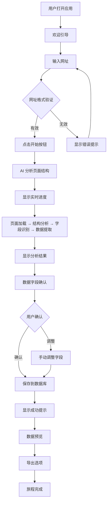

**流程步骤：**

1. **启动（Initiation）：**
   - 用户打开应用
   - 显示欢迎引导，介绍核心功能
   - 提供示例网址，降低学习成本

2. **输入网址（Input URL）：**
   - 大输入框 + 开始按钮（Google 搜索风格）
   - 实时验证网址格式
   - 提供清晰的错误提示

3. **AI 分析（AI Analysis）：**
   - 显示实时进度（Figma 风格）
   - 分步反馈：页面加载 → 结构分析 → 字段识别 → 数据提取
   - 预计时间：10-30 秒

4. **结果确认（Result Confirmation）：**
   - 显示 AI 识别的数据字段
   - Excel 风格表格展示（Excel 风格）
   - 用户可以手动调整字段

5. **保存和导出（Save and Export）：**
   - 自动保存到 SQLite 数据库
   - 显示成功提示
   - 提供导出选项（JSON、CSV、Excel）

**关键决策点：**
- 网址格式是否有效
- 用户是否确认 AI 识别的数据字段
- 用户是否需要手动调整字段

**成功标准：**
- 用户在第一次使用时就能成功爬取网站
- 用户能够理解 AI 分析过程和结果
- 用户能够轻松调整 AI 识别的数据字段
- 用户能够快速导出所需格式的数据

**错误恢复：**
- 网址格式错误：显示清晰的错误提示，提供示例
- AI 分析失败：显示错误信息，提供解决建议
- 数据提取失败：提供重试选项

### 2. 爬取任务旅程

**旅程描述：** 用户创建和管理爬取任务，查看进度，导出数据

**用户目标：** 高效管理多个爬取任务，批量处理数据

**流程设计：**

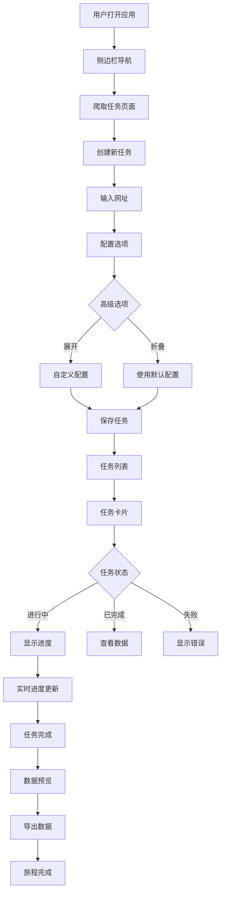

**流程步骤：**

1. **导航（Navigation）：**
   - 侧边栏导航（Notion 风格）
   - 爬取任务、数据管理、设置

2. **创建任务（Create Task）：**
   - 大输入框 + 开始按钮
   - 高级选项折叠（渐进式复杂度）
   - 自定义配置（高级用户）

3. **任务管理（Task Management）：**
   - 卡片布局展示任务（现代卡片风格）
   - 任务状态：进行中、已完成、失败
   - 实时进度更新

4. **数据预览（Data Preview）：**
   - Excel 风格表格展示数据
   - 支持编辑和筛选
   - 分页和排序

5. **批量导出（Batch Export）：**
   - 选择多个任务
   - 批量导出数据
   - 支持多种格式

**关键决策点：**
- 是否使用高级配置
- 任务配置是否保存
- 是否批量导出数据

**成功标准：**
- 用户能够快速创建和管理多个任务
- 任务进度实时更新
- 用户能够批量导出数据

**错误恢复：**
- 任务创建失败：显示错误信息，提供重试选项
- 任务执行失败：显示错误原因，提供解决建议

### 3. 数据管理旅程

**旅程描述：** 用户浏览、查询和管理爬取的数据

**用户目标：** 轻松查找、筛选和导出爬取的数据

**流程设计：**

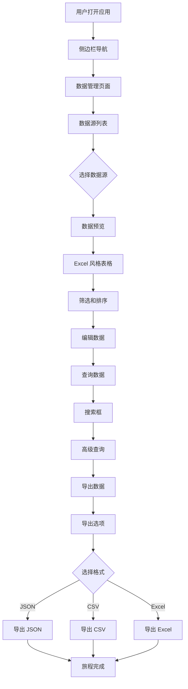

**流程步骤：**

1. **数据源选择（Data Source Selection）：**
   - 侧边栏显示数据源列表
   - 按网站类型、时间、状态筛选

2. **数据预览（Data Preview）：**
   - Excel 风格表格展示数据
   - 支持分页和排序
   - 实时编辑

3. **数据查询（Data Query）：**
   - 搜索框（Google 搜索风格）
   - 高级查询选项（折叠）
   - 实时搜索结果

4. **数据导出（Data Export）：**
   - 选择数据范围
   - 选择导出格式
   - 导出进度显示

**关键决策点：**
- 选择哪个数据源
- 是否使用高级查询
- 选择哪种导出格式

**成功标准：**
- 用户能够快速找到所需数据
- 用户能够轻松编辑和筛选数据
- 用户能够快速导出数据

**错误恢复：**
- 数据加载失败：显示错误信息，提供重试选项
- 导出失败：显示错误原因，提供解决建议

### 4. 错误恢复旅程

**旅程描述：** 用户遇到错误时的恢复路径

**用户目标：** 快速从错误中恢复，继续完成任务

**流程设计：**

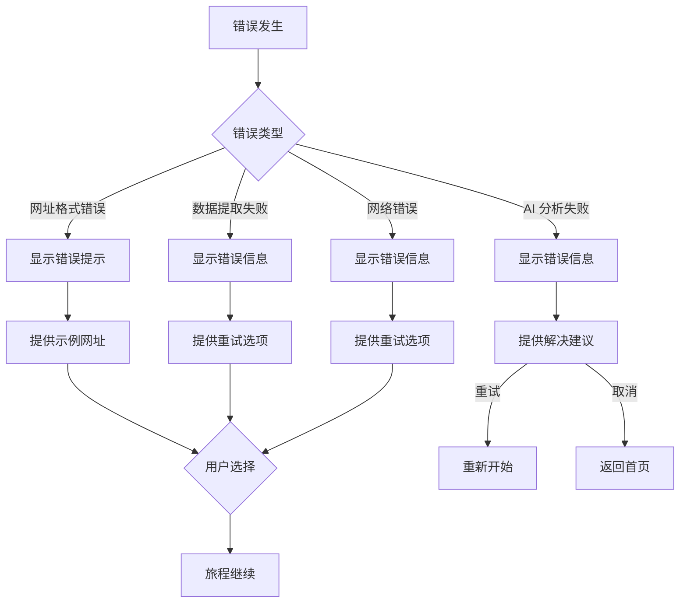

**流程步骤：**

1. **错误分类（Error Classification）：**
   - 网址格式错误
   - AI 分析失败
   - 数据提取失败
   - 网络错误

2. **错误提示（Error Display）：**
   - 清晰的错误信息
   - 错误原因说明
   - 解决建议

3. **恢复选项（Recovery Options）：**
   - 重试操作
   - 取消操作
   - 返回首页

**关键决策点：**
- 用户选择重试还是取消
- 是否需要查看详细错误信息

**成功标准：**
- 用户能够快速从错误中恢复
- 用户能够理解错误原因
- 用户能够选择合适的恢复路径

**错误恢复：**
- 提供清晰的错误信息
- 提供明确的恢复选项
- 避免用户感到困惑或无助

### 5. 数据质量验证旅程

**旅程描述：** 用户验证和调整 AI 识别的数据字段

**用户目标：** 确保 AI 识别的数据字段准确，提高数据质量

**流程设计：**

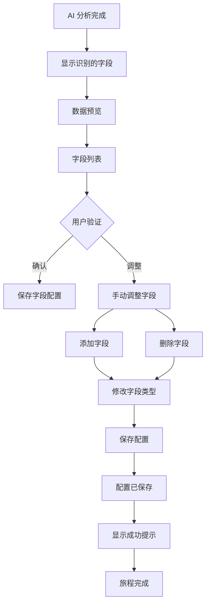

**流程步骤：**

1. **字段展示（Field Display）：**
   - 显示 AI 识别的所有数据字段
   - 字段类型、示例数据
   - 字段置信度

2. **字段验证（Field Validation）：**
   - 用户验证每个字段
   - 标记正确/错误的字段
   - 提供调整建议

3. **字段调整（Field Adjustment）：**
   - 添加新字段
   - 删除不需要的字段
   - 重命名字段
   - 修改字段类型

4. **配置保存（Configuration Save）：**
   - 保存字段配置
   - 显示成功提示
   - 应用到后续爬取

**关键决策点：**
- 字段是否正确
- 是否需要调整字段
- 是否保存配置

**成功标准：**
- 用户能够轻松验证和调整字段
- 用户能够提高数据质量
- 配置能够成功保存和应用

**错误恢复：**
- 配置保存失败：显示错误信息，提供重试选项
- 字段验证失败：提供清晰的错误提示

### 6. 批量爬取旅程

**旅程描述：** 用户批量创建和管理多个爬取任务

**用户目标：** 高效处理大量爬取任务

**流程设计：**

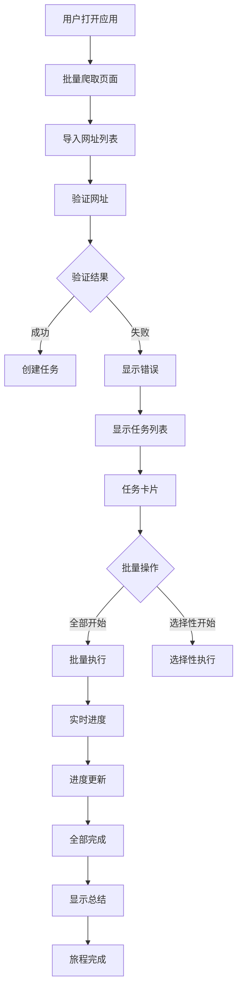

**流程步骤：**

1. **网址导入（URL Import）：**
   - 支持多种导入方式（文件、粘贴、手动输入）
   - 网址格式验证
   - 重复检测

2. **任务创建（Task Creation）：**
   - 批量创建任务
   - 应用默认配置
   - 支持自定义配置

3. **批量执行（Batch Execution）：**
   - 实时进度更新
   - 任务状态跟踪
   - 错误处理

4. **完成总结（Completion Summary）：**
   - 显示执行总结
   - 成功/失败统计
   - 数据导出选项

**关键决策点：**
- 是否全部开始还是选择性开始
- 是否使用默认配置
- 是否导出数据

**成功标准：**
- 用户能够快速导入大量网址
- 用户能够批量创建任务
- 用户能够监控批量执行进度

**错误恢复：**
- 网址导入失败：显示错误信息，提供重试选项
- 任务创建失败：跳过失败任务，继续执行
- 执行失败：显示错误原因，提供重试选项

### 7. 高级功能旅程

**旅程描述：** 用户使用高级功能，如自定义配置、API 集成

**用户目标：** 充分利用产品的高级功能，满足复杂需求

**流程设计：**

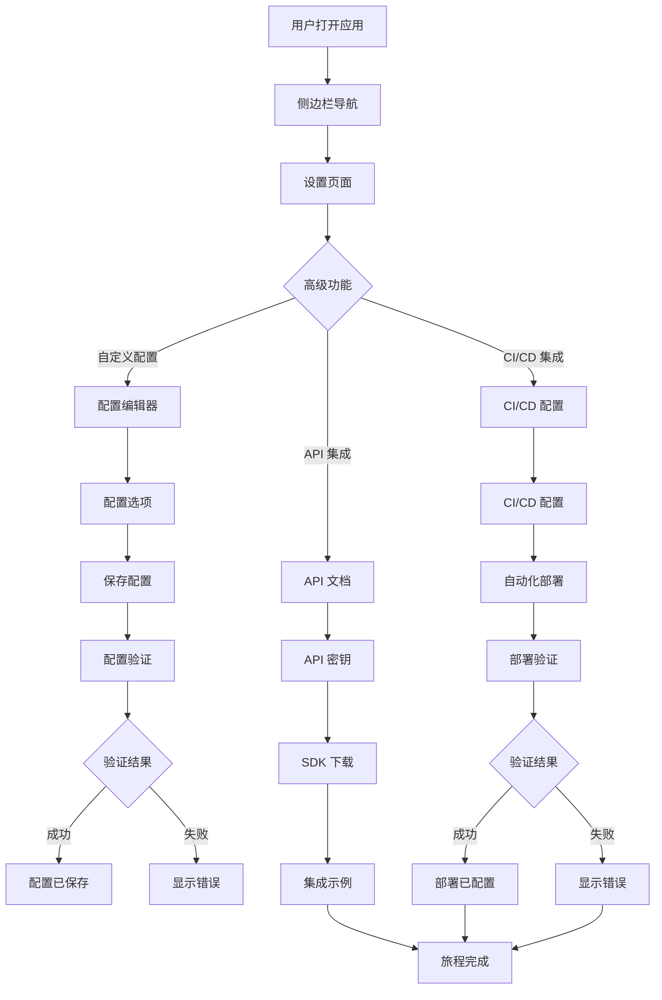

**流程步骤：**

1. **自定义配置（Custom Configuration）：**
   - 配置编辑器（代码编辑器风格）
   - 配置选项分类
   - 配置验证和保存

2. **API 集成（API Integration）：**
   - API 文档和示例
   - API 密钥管理
   - SDK 下载

3. **CI/CD 集成（CI/CD Integration）：**
   - CI/CD 配置编辑器
   - 自动化部署配置
   - 部署验证

**关键决策点：**
- 是否使用自定义配置
- 是否集成 API
- 是否配置 CI/CD

**成功标准：**
- 用户能够成功配置高级功能
- 用户能够集成 API 和 CI/CD
- 配置验证通过

**错误恢复：**
- 配置验证失败：显示错误信息，提供修复建议
- 集成失败：显示错误原因，提供解决步骤

### 8. 社区分享旅程

**旅程描述：** 用户分享爬取模板和经验到社区

**用户目标：** 贡献社区，获得认可和奖励

**流程设计：**

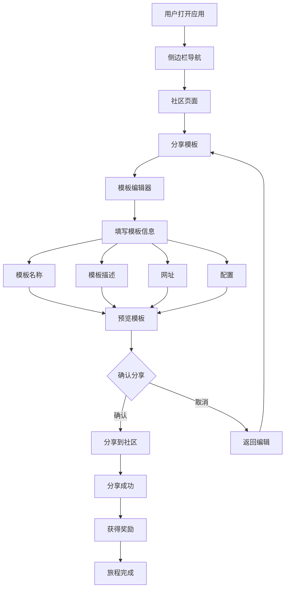

**流程步骤：**

1. **模板编辑（Template Editing）：**
   - 模板编辑器（代码编辑器风格）
   - 模板信息填写
   - 模板预览

2. **分享流程（Sharing Process）：**
   - 确认分享
   - 分享到社区
   - 获得奖励

**关键决策点：**
- 是否分享模板
- 是否确认分享信息

**成功标准：**
- 用户能够成功分享模板
- 用户能够获得奖励
- 模板在社区中可见

**错误恢复：**
- 分享失败：显示错误信息，提供重试选项
- 模板验证失败：显示错误原因，提供修复建议

### 9. AI 模型提供商配置旅程

**旅程描述：** 用户配置和管理 AI 模型提供商

**用户目标：** 配置多个 AI 模型提供商，实现灵活的模型选择和切换

**流程设计：**

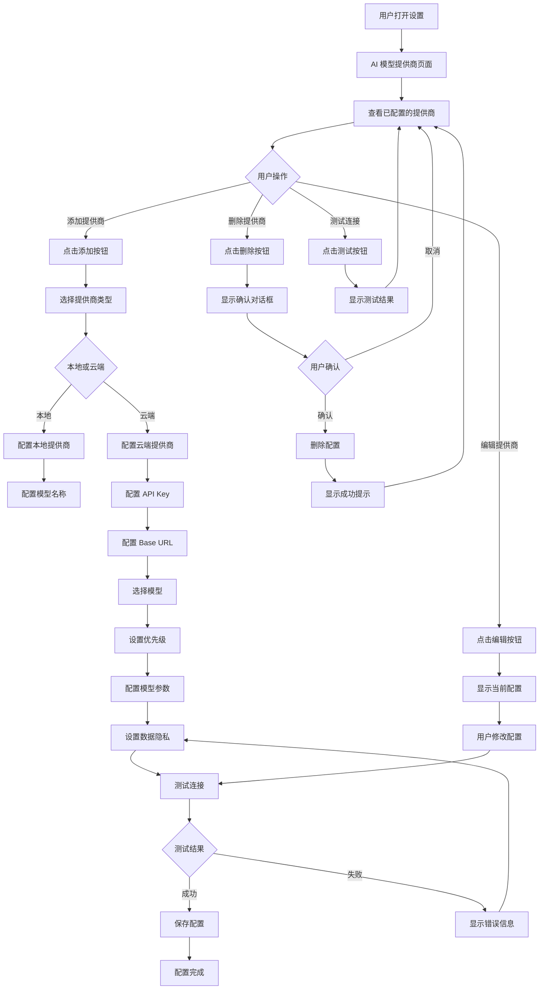

**流程步骤：**

1. **查看提供商（View Providers）：**
   - 显示已配置的模型提供商列表
   - 显示每个提供商的状态、性能、成本
   - 提供编辑、删除、测试操作

2. **添加提供商（Add Provider）：**
   - 选择提供商类型（本地或云端）
   - 配置提供商信息（名称、API Key、Base URL）
   - 选择模型和设置优先级
   - 配置模型参数和数据隐私
   - 测试连接并保存配置

3. **编辑提供商（Edit Provider）：**
   - 显示当前配置
   - 修改配置信息
   - 测试连接并保存配置

4. **删除提供商（Delete Provider）：**
   - 显示确认对话框
   - 删除配置
   - 显示成功提示

5. **测试连接（Test Connection）：**
   - 测试提供商连接
   - 显示测试结果
   - 提供错误信息和解决建议

**关键决策点：**
- 选择本地还是云端提供商
- 是否启用数据脱敏
- 是否保存配置
- 是否删除提供商

**成功标准：**
- 用户能够在 2 分钟内完成提供商配置（NFR49）
- 用户能够成功测试连接
- 用户能够管理多个提供商

**错误恢复：**
- 连接测试失败：显示错误信息，提供解决建议
- 配置验证失败：显示错误提示，提供修复建议
- 删除失败：显示错误原因，提供重试选项

### 10. 成本管理旅程

**旅程描述：** 用户管理和监控 AI 模型使用成本

**用户目标：** 设置成本预算，监控成本使用，优化成本

**流程设计：**

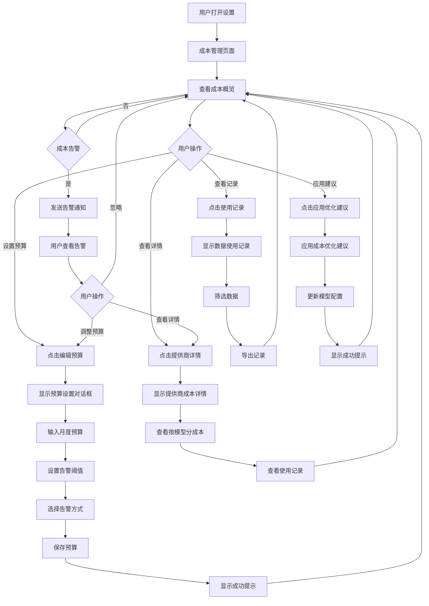

**流程步骤：**

1. **查看成本概览（View Cost Overview）：**
   - 显示本月成本概览
   - 显示按提供商分成本
   - 显示成本趋势图表
   - 显示成本优化建议

2. **设置预算（Set Budget）：**
   - 输入月度成本预算
   - 设置告警阈值
   - 选择告警方式
   - 保存预算设置

3. **查看成本详情（View Cost Details）：**
   - 显示提供商成本详情
   - 查看按模型分成本
   - 查看使用记录
   - 导出使用记录

4. **应用优化建议（Apply Optimization）：**
   - 查看成本优化建议
   - 应用优化建议
   - 更新模型配置

5. **处理成本告警（Handle Cost Alert）：**
   - 接收成本告警通知
   - 查看成本详情
   - 调整预算或采取行动

**关键决策点：**
- 设置多少预算
- 设置多少告警阈值
- 选择哪些告警方式
- 是否应用优化建议

**成功标准：**
- 用户能够设置成本预算和告警
- 用户能够实时监控成本使用
- 用户能够应用成本优化建议

**错误恢复：**
- 预算设置失败：显示错误信息，提供重试选项
- 成本数据加载失败：显示错误原因，提供重试选项
- 优化建议应用失败：显示错误信息，提供解决建议

### 11. 模型性能监控旅程

**旅程描述：** 用户监控和优化 AI 模型性能

**用户目标：** 监控模型性能，对比不同模型，优化性能

**流程设计：**

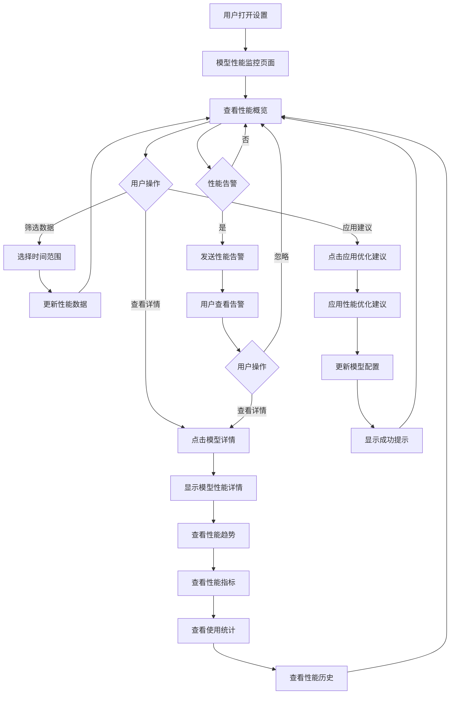

**流程步骤：**

1. **查看性能概览（View Performance Overview）：**
   - 显示性能概览（响应时间、准确率、成功率）
   - 显示性能趋势图表
   - 显示按模型分性能
   - 显示性能告警和优化建议

2. **查看性能详情（View Performance Details）：**
   - 显示模型性能详情
   - 查看性能趋势
   - 查看性能指标
   - 查看使用统计
   - 查看性能历史

3. **筛选性能数据（Filter Performance Data）：**
   - 选择时间范围（实时、1小时、24小时、7天、30天）
   - 更新性能数据显示

4. **应用优化建议（Apply Optimization）：**
   - 查看性能优化建议
   - 应用优化建议
   - 更新模型配置

5. **处理性能告警（Handle Performance Alert）：**
   - 接收性能告警通知
   - 查看性能详情
   - 采取优化行动

**关键决策点：**
- 选择哪个时间范围
- 是否应用优化建议
- 是否查看性能详情

**成功标准：**
- 用户能够实时监控模型性能
- 用户能够对比不同模型的性能
- 用户能够应用性能优化建议

**错误恢复：**
- 性能数据加载失败：显示错误原因，提供重试选项
- 优化建议应用失败：显示错误信息，提供解决建议

### 12. 模型选择和切换旅程

**旅程描述：** 用户选择和切换 AI 模型

**用户目标：** 选择合适的模型，快速切换模型，处理模型回退

**流程设计：**

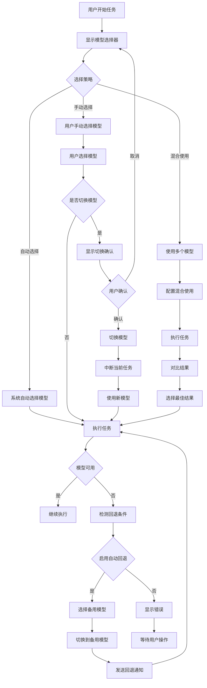

**流程步骤：**

1. **选择模型（Select Model）：**
   - 显示模型选择器
   - 选择选择策略（自动、手动、混合）
   - 选择模型
   - 确认选择

2. **切换模型（Switch Model）：**
   - 显示切换确认
   - 中断当前任务
   - 切换到新模型
   - 继续执行任务

3. **混合使用（Hybrid Usage）：**
   - 配置混合使用
   - 使用多个模型执行任务
   - 对比结果
   - 选择最佳结果

4. **处理模型回退（Handle Model Fallback）：**
   - 检测模型不可用
   - 选择备用模型
   - 切换到备用模型
   - 发送回退通知

**关键决策点：**
- 选择哪种选择策略
- 是否切换模型
- 是否启用自动回退
- 选择哪个备用模型

**成功标准：**
- 用户能够在 5 秒内切换模型（NFR50）
- 用户能够无缝切换模型（FR27）
- 用户能够处理模型回退

**错误恢复：**
- 模型切换失败：显示错误信息，提供重试选项
- 模型回退失败：显示错误原因，提供解决建议
- 混合使用失败：显示错误信息，提供重试选项

### 9. AI 模型提供商配置组件

**目的：** 让用户轻松配置和管理 AI 模型提供商

**使用场景：** 设置页面、模型选择器、任务配置

**结构：**
- 提供商列表
- 添加/编辑/删除按钮
- 连接测试按钮
- 性能和成本显示

**状态：**
- 默认：显示提供商列表
- 添加中：显示添加表单
- 编辑中：显示编辑表单
- 测试中：显示测试进度
- 删除中：显示确认对话框

**变体：**
- 完整模式（设置页面）
- 简化模式（模型选择器）
- 内联模式（任务配置）

**可访问性：**
- ARIA 标签：`aria-label="AI 模型提供商配置"`
- 按钮：`aria-label="添加提供商"`
- 键盘支持：Tab 键导航

**内容指南：**
- 提供商名称：显示提供商名称和类型
- 状态指示：在线、离线、测试中
- 性能指标：响应时间、准确率、成功率
- 成本显示：本月成本、预算

**交互行为：**
- 用户点击添加按钮时，显示添加表单
- 用户点击编辑按钮时，显示编辑表单
- 用户点击测试按钮时，测试连接
- 用户点击删除按钮时，显示确认对话框

**自定义理由：** 需要自定义组件来管理多个 AI 模型提供商，支持添加、编辑、删除、测试等操作。

### 10. 成本监控组件

**目的：** 实时显示和管理 AI 模型使用成本

**使用场景：** 设置页面、成本管理页面、任务执行

**结构：**
- 成本概览
- 成本趋势图表
- 按提供商分成本
- 成本告警
- 成本优化建议

**状态：**
- 默认：显示成本概览
- 告警中：显示成本告警
- 设置中：显示预算设置对话框

**变体：**
- 完整模式（成本管理页面）
- 简化模式（设置页面）
- 内联模式（任务执行）

**可访问性：**
- ARIA 标签：`aria-label="成本监控"`
- 图表：`role="img"` 和 `aria-label`
- 键盘支持：Tab 键导航

**内容指南：**
- 成本概览：本月总成本、预算、剩余预算
- 成本趋势：显示成本变化趋势
- 按提供商分成本：每个提供商的成本和占比
- 成本告警：当成本接近预算时显示告警
- 成本优化建议：提供成本优化建议

**交互行为：**
- 用户点击编辑预算时，显示预算设置对话框
- 用户点击查看详情时，显示提供商成本详情
- 用户点击应用建议时，应用成本优化建议
- 成本接近预算时，自动发送告警

**自定义理由：** 需要自定义组件来实时监控和管理 AI 模型使用成本，支持预算设置、告警、优化建议等功能。

### 11. 模型性能对比组件

**目的：** 对比不同 AI 模型的性能指标

**使用场景：** 设置页面、模型选择器、性能监控页面

**结构：**
- 性能概览
- 性能对比图表
- 按模型分性能
- 性能告警
- 性能优化建议

**状态：**
- 默认：显示性能概览
- 告警中：显示性能告警
- 筛选中：显示筛选选项

**变体：**
- 完整模式（性能监控页面）
- 简化模式（模型选择器）
- 内联模式（任务配置）

**可访问性：**
- ARIA 标签：`aria-label="模型性能对比"`
- 图表：`role="img"` 和 `aria-label`
- 键盘支持：Tab 键导航

**内容指南：**
- 性能概览：平均响应时间、准确率、成功率
- 性能对比：对比不同模型的性能指标
- 按模型分性能：每个模型的详细性能指标
- 性能告警：当性能下降时显示告警
- 性能优化建议：提供性能优化建议

**交互行为：**
- 用户点击查看详情时，显示模型性能详情
- 用户点击筛选时，显示筛选选项
- 用户点击应用建议时，应用性能优化建议
- 性能下降时，自动发送告警

**自定义理由：** 需要自定义组件来对比不同 AI 模型的性能指标，支持性能监控、告警、优化建议等功能。

### 12. 隐私警告组件

**目的：** 警告用户云端模型的数据隐私影响

**使用场景：** 首次使用云端模型、配置云端模型、切换到云端模型

**结构：**
- 警告标题
- 隐私说明
- 数据脱敏选项
- 隐私政策链接
- 操作按钮

**状态：**
- 默认：显示警告对话框
- 配置中：显示数据脱敏配置
- 确认中：显示确认选项

**变体：**
- 完整模式（首次使用）
- 简化模式（配置云端模型）
- 内联模式（切换到云端模型）

**可访问性：**
- ARIA 标签：`aria-label="隐私警告"`
- 对话框：`role="alertdialog"`
- 键盘支持：Tab 键导航，Esc 键关闭

**内容指南：**
- 警告标题：清晰的数据隐私警告
- 隐私说明：详细说明云端模型的数据隐私影响
- 数据脱敏选项：提供数据脱敏配置
- 隐私政策链接：提供完整的隐私政策

**交互行为：**
- 用户点击切换到本地模型时，切换到本地模型
- 用户点击继续使用云端模型时，显示数据脱敏选项
- 用户点击查看隐私政策时，打开隐私政策页面
- 用户启用数据脱敏时，保存脱敏配置

**自定义理由：** 需要自定义组件来警告用户云端模型的数据隐私影响，支持隐私说明、数据脱敏、隐私政策等功能。

### 13. 模型选择器组件

**目的：** 让用户选择和切换 AI 模型

**使用场景：** 任务创建、模型切换、任务执行

**结构：**
- 模型选择策略
- 可用模型列表
- 模型性能和成本显示
- 回退设置
- 确认按钮

**状态：**
- 默认：显示模型选择器
- 选择中：高亮选中的模型
- 切换中：显示切换确认
- 回退中：显示回退通知

**变体：**
- 完整模式（任务创建）
- 简化模式（模型切换）
- 内联模式（任务执行）

**可访问性：**
- ARIA 标签：`aria-label="模型选择器"`
- 选项：`role="radio"` 或 `role="option"`
- 键盘支持：方向键导航，Enter 键选择

**内容指南：**
- 模型选择策略：自动选择、手动选择、混合使用
- 可用模型列表：显示所有可用模型
- 模型性能和成本：响应时间、准确率、成本
- 回退设置：启用自动回退、回退超时

**交互行为：**
- 用户选择模型时，高亮选中的模型
- 用户点击确认时，确认模型选择
- 用户切换模型时，显示切换确认
- 模型不可用时，自动回退到备用模型

**自定义理由：** 需要自定义组件来让用户选择和切换 AI 模型，支持自动选择、手动选择、混合使用、回退等功能。

### Journey Patterns

**导航模式：**
- **侧边栏导航**：所有页面使用侧边栏导航，提供一致的导航体验
- **面包屑导航**：在深层页面提供面包屑导航，帮助用户了解当前位置

**决策模式：**
- **渐进式披露**：高级选项默认折叠，用户可以展开查看
- **确认对话框**：重要操作（如删除、导出）需要用户确认
- **即时验证**：输入即时验证，提供清晰的错误提示

**反馈模式：**
- **实时进度反馈**：长时间操作（如 AI 分析）显示实时进度
- **成功提示**：操作成功后显示明确的成功提示
- **错误提示**：操作失败后显示清晰的错误信息和解决建议
- **加载状态**：数据加载时显示加载状态

### Flow Optimization Principles

**效率优化：**
- **最小化步骤到价值**：让用户快速完成目标，减少不必要的步骤
- **减少认知负荷**：每个决策点只显示必要信息，避免信息过载
- **提供智能默认值**：基于用户行为和常见场景提供智能默认值

**愉悦优化：**
- **创造顿悟时刻**：第一次成功爬取网站时创造强烈的成就感
- **提供惊喜元素**：超预期的体验创造愉悦感
- **流畅的交互**：界面响应迅速，操作流畅，没有卡顿或延迟

**错误处理优化：**
- **友好的错误提示**：错误信息清晰易懂，提供解决建议
- **错误恢复路径**：提供明确的错误恢复路径，让用户能够快速恢复
- **预防性错误提示**：在用户可能犯错的地方提供预防性提示

---

## Component Strategy

### Design System Components

基于我们在 Step 6 中选择的混合策略，使用 Ant Design 作为基础组件库。Ant Design 是一个成熟的企业级 UI 组件库，提供了丰富的组件。

**Ant Design 提供的组件：**

**基础组件：**
- Button（按钮）
- Icon（图标）
- Typography（排版）
- Divider（分割线）

**布局组件：**
- Grid（栅格）
- Layout（布局）
- Space（间距）
- ConfigProvider（全局配置）

**导航组件：**
- Menu（菜单）
- Breadcrumb（面包屑）
- Pagination（分页）
- Steps（步骤条）

**数据录入组件：**
- Form（表单）
- Input（输入框）
- InputNumber（数字输入框）
- Select（选择器）
- Checkbox（复选框）
- Radio（单选框）
- Switch（开关）
- Slider（滑块）
- TimePicker（时间选择）
- DatePicker（日期选择）
- Upload（上传）
- Rate（评分）

**数据展示组件：**
- Table（表格）
- List（列表）
- Card（卡片）
- Tree（树形控件）
- Tabs（标签页）
- Badge（徽标数）
- Avatar（头像）
- Tag（标签）
- Progress（进度条）
- Statistic（统计数值）
- Descriptions（描述列表）
- Empty（空状态）

**反馈组件：**
- Alert（警告提示）
- Message（全局提示）
- Modal（对话框）
- Notification（通知提醒框）
- Popconfirm（气泡确认框）
- Popover（气泡卡片）
- Tooltip（文字提示）
- Drawer（抽屉）

**其他组件：**
- Dropdown（下拉菜单）
- Collapse（折叠面板）
- Carousel（走马灯）
- Skeleton（骨架屏）
- Spin（加载中）

**vscode_bmad_method_test 需要的组件：**

基于我们的用户旅程和混合平衡型设计方向，我们需要：

1. **URL 输入组件** - 大输入框 + 开始按钮（Google 搜索风格）
2. **实时进度组件** - 显示 AI 分析进度（Figma 风格）
3. **数据预览组件** - Excel 风格表格展示数据
4. **任务卡片组件** - 卡片布局展示爬取任务（现代卡片风格）
5. **侧边栏导航组件** - Notion 风格的侧边栏导航
6. **字段编辑器组件** - 编辑 AI 识别的数据字段
7. **批量操作组件** - 批量创建和管理任务
8. **错误提示组件** - 友好的错误提示和恢复路径

**差距分析：**

**Ant Design 可以直接使用的组件：**
- Table（数据预览组件的基础）
- Card（任务卡片组件的基础）
- Menu（侧边栏导航组件的基础）
- Input（URL 输入组件的基础）
- Progress（实时进度组件的基础）
- Form（字段编辑器组件的基础）
- Alert（错误提示组件的基础）

**需要自定义的组件：**
1. **URL 输入组件** - 基于 Input 组件，最小化自定义，实现直观的网址输入体验
2. **实时进度组件** - 基于 Progress 组件，最小化自定义，让用户了解 AI 分析进度
3. **数据预览组件** - 基于 Table 组件，最小化自定义，支持编辑和筛选
4. **任务卡片组件** - 基于 Card 组件，最小化自定义，支持快速操作
5. **侧边栏导航组件** - 基于 Menu 组件，最小化自定义，提供一致的导航体验
6. **字段编辑器组件** - 基于 Form 组件，最小化自定义，提高数据质量
7. **批量操作组件** - 基于现有组件，最小化自定义，支持批量创建和管理任务
8. **错误提示组件** - 基于 Alert 组件，最小化自定义，提供友好的错误提示

### Custom Components

#### 1. URL 输入组件

**目的：** 让用户轻松输入网址并开始爬取任务

**使用场景：** 首页、任务创建页面、侧边栏

**结构：**
- 大输入框（占页面宽度的 60-70%）
- 开始按钮（右侧）
- 示例网址提示（输入框下方）
- 网址格式验证提示

**状态：**
- 默认：显示输入框和开始按钮
- 输入中：实时验证网址格式
- 有效：开始按钮可点击
- 无效：显示错误提示，开始按钮禁用
- 加载中：显示加载状态

**变体：**
- 大尺寸（首页）
- 中尺寸（任务创建页面）
- 小尺寸（侧边栏）

**可访问性：**
- ARIA 标签：`aria-label="输入网址"`
- 键盘支持：Enter 键提交
- 错误提示：`aria-live="polite"`

**内容指南：**
- 输入框占位符："输入网址，例如：https://example.com"
- 示例网址："示例：https://news.ycombinator.com"
- 错误提示："请输入有效的网址"

**交互行为：**
- 用户输入网址时，实时验证网址格式
- 网址格式有效时，开始按钮可点击
- 网址格式无效时，显示错误提示，开始按钮禁用
- 用户点击开始按钮时，开始爬取任务
- 用户按 Enter 键时，开始爬取任务

**自定义理由：** Ant Design 的 Input 组件可以满足基本需求，但需要自定义样式和交互，实现 Google 搜索风格的大输入框，提供直观的网址输入体验。

#### 2. 实时进度组件

**目的：** 显示 AI 分析的实时进度，让用户了解当前状态

**使用场景：** 首页、任务卡片、侧边栏

**结构：**
- 进度条（总体进度）
- 步骤列表（分步进度）
- 当前步骤描述
- 预计剩余时间

**状态：**
- 默认：显示进度条和步骤列表
- 进行中：实时更新进度
- 完成：显示完成状态
- 错误：显示错误信息

**变体：**
- 大尺寸（首页）
- 中尺寸（任务卡片）
- 小尺寸（侧边栏）

**可访问性：**
- ARIA 标签：`aria-label="分析进度"`
- 进度条：`role="progressbar"`
- 键盘支持：Tab 键导航

**内容指南：**
- 步骤列表：页面加载 → 结构分析 → 字段识别 → 数据提取
- 当前步骤描述："正在分析页面结构..."
- 预计剩余时间："预计剩余时间：10 秒"
- 完成状态："分析完成！"

**交互行为：**
- 实时更新进度条和步骤列表
- 显示当前步骤描述和预计剩余时间
- 完成时显示完成状态
- 错误时显示错误信息

**自定义理由：** Ant Design 的 Progress 组件可以满足基本需求，但需要自定义样式和交互，实现 Figma 风格的分步进度反馈，让用户了解 AI 分析进度。

#### 3. 数据预览组件

**目的：** 以 Excel 风格展示爬取的数据，支持编辑和筛选

**使用场景：** 数据管理页面、任务卡片、侧边栏

**结构：**
- 表格（数据展示）
- 筛选器（列筛选）
- 排序（列排序）
- 分页（数据分页）
- 编辑（单元格编辑）

**状态：**
- 默认：显示表格
- 筛选中：显示筛选器
- 排序中：显示排序图标
- 编辑中：显示编辑器
- 加载中：显示加载状态

**变体：**
- 完整模式（数据管理页面）
- 预览模式（任务卡片）
- 简化模式（侧边栏）

**可访问性：**
- ARIA 标签：`aria-label="数据预览"`
- 表格：`role="table"`
- 键盘支持：方向键导航

**内容指南：**
- 表格列：字段名称、字段类型、示例数据、置信度
- 筛选器：按字段名称、字段类型、置信度筛选
- 排序：按字段名称、置信度排序
- 分页：每页显示 10 条数据

**交互行为：**
- 用户点击列标题时，排序数据
- 用户点击筛选器时，显示筛选选项
- 用户点击单元格时，显示编辑器
- 用户点击分页按钮时，切换页面

**自定义理由：** Ant Design 的 Table 组件可以满足基本需求，但需要自定义样式和交互，实现 Excel 风格的表格，支持编辑和筛选。

#### 4. 任务卡片组件

**目的：** 以现代卡片风格展示爬取任务，支持快速操作

**使用场景：** 任务列表、侧边栏、通知

**结构：**
- 任务名称
- 任务状态（进行中、已完成、失败）
- 任务进度
- 任务时间
- 快速操作按钮

**状态：**
- 默认：显示任务信息
- 进行中：显示进度条
- 已完成：显示完成状态
- 失败：显示错误信息
- 悬停：显示快速操作按钮

**变体：**
- 大尺寸（任务列表）
- 中尺寸（侧边栏）
- 小尺寸（通知）

**可访问性：**
- ARIA 标签：`aria-label="任务卡片"`
- 按钮：`aria-label="开始任务"`
- 键盘支持：Enter 键激活

**内容指南：**
- 任务名称：显示网址或任务名称
- 任务状态：进行中、已完成、失败
- 任务进度：显示进度条和百分比
- 任务时间：显示创建时间和完成时间
- 快速操作按钮：开始、暂停、删除

**交互行为：**
- 用户悬停时，显示快速操作按钮
- 用户点击开始按钮时，开始任务
- 用户点击暂停按钮时，暂停任务
- 用户点击删除按钮时，显示确认对话框

**自定义理由：** Ant Design 的 Card 组件可以满足基本需求，但需要自定义样式和交互，实现现代卡片风格，支持快速操作。

#### 5. 侧边栏导航组件

**目的：** 以 Notion 风格提供一致的导航体验

**使用场景：** 所有页面

**结构：**
- 导航菜单
- 数据源列表
- 快速搜索
- 用户设置

**状态：**
- 默认：显示导航菜单
- 展开中：显示子菜单
- 搜索中：显示搜索结果
- 悬停：高亮当前项

**变体：**
- 完整模式（桌面端）
- 简化模式（移动端）

**可访问性：**
- ARIA 标签：`aria-label="导航菜单"`
- 菜单项：`role="menuitem"`
- 键盘支持：方向键导航

**内容指南：**
- 导航菜单：爬取任务、数据管理、设置
- 数据源列表：按网站类型、时间、状态筛选
- 快速搜索：搜索任务和数据
- 用户设置：用户配置和偏好

**交互行为：**
- 用户点击菜单项时，导航到对应页面
- 用户点击数据源时，显示数据预览
- 用户输入搜索关键词时，显示搜索结果
- 用户点击设置时，打开设置页面

**自定义理由：** Ant Design 的 Menu 组件可以满足基本需求，但需要自定义样式和交互，实现 Notion 风格的导航体验。

#### 6. 字段编辑器组件

**目的：** 编辑 AI 识别的数据字段，提高数据质量

**使用场景：** 字段编辑页面、任务卡片、侧边栏

**结构：**
- 字段列表
- 字段类型
- 字段示例
- 字段置信度
- 编辑按钮

**状态：**
- 默认：显示字段列表
- 编辑中：显示编辑器
- 添加中：显示添加表单
- 删除中：显示确认对话框

**变体：**
- 完整模式（字段编辑页面）
- 预览模式（任务卡片）
- 简化模式（侧边栏）

**可访问性：**
- ARIA 标签：`aria-label="字段编辑器"`
- 按钮：`aria-label="编辑字段"`
- 键盘支持：Tab 键导航

**内容指南：**
- 字段列表：显示所有字段
- 字段类型：文本、数字、日期、链接等
- 字段示例：显示示例数据
- 字段置信度：显示 AI 识别的置信度
- 编辑按钮：编辑、添加、删除

**交互行为：**
- 用户点击编辑按钮时，显示编辑器
- 用户点击添加按钮时，显示添加表单
- 用户点击删除按钮时，显示确认对话框
- 用户保存时，保存字段配置

**自定义理由：** Ant Design 的 Form 组件可以满足基本需求，但需要自定义样式和交互，实现字段编辑功能，提高数据质量。

#### 7. 批量操作组件

**目的：** 批量创建和管理多个爬取任务

**使用场景：** 批量操作页面、任务卡片

**结构：**
- 网址列表
- 批量操作按钮
- 进度统计
- 错误列表

**状态：**
- 默认：显示网址列表
- 导入中：显示导入进度
- 创建中：显示创建进度
- 执行中：显示执行进度
- 完成中：显示完成统计

**变体：**
- 完整模式（批量操作页面）
- 简化模式（任务卡片）

**可访问性：**
- ARIA 标签：`aria-label="批量操作"`
- 按钮：`aria-label="批量开始"`
- 键盘支持：Tab 键导航

**内容指南：**
- 网址列表：显示所有网址
- 批量操作按钮：导入、创建、开始、导出
- 进度统计：显示成功、失败、进行中的任务数量
- 错误列表：显示失败的任务和错误原因

**交互行为：**
- 用户点击导入按钮时，导入网址列表
- 用户点击创建按钮时，批量创建任务
- 用户点击开始按钮时，批量开始任务
- 用户点击导出按钮时，批量导出数据

**自定义理由：** Ant Design 的组件可以满足基本需求，但需要自定义样式和交互，实现批量操作界面，支持批量创建和管理任务。

#### 8. 错误提示组件

**目的：** 提供友好的错误提示和恢复路径

**使用场景：** 错误页面、任务卡片、通知

**结构：**
- 错误类型
- 错误描述
- 错误原因
- 解决建议
- 恢复选项

**状态：**
- 默认：显示错误信息
- 展开中：显示详细错误
- 恢复中：显示恢复进度

**变体：**
- 完整模式（错误页面）
- 简化模式（任务卡片）
- 提示模式（通知）

**可访问性：**
- ARIA 标签：`aria-label="错误提示"`
- 按钮：`aria-label="重试"`
- 键盘支持：Enter 键激活

**内容指南：**
- 错误类型：网址格式错误、AI 分析失败、数据提取失败、网络错误
- 错误描述：清晰的错误描述
- 错误原因：详细的错误原因
- 解决建议：具体的解决建议
- 恢复选项：重试、取消、返回首页

**交互行为：**
- 用户点击展开按钮时，显示详细错误
- 用户点击重试按钮时，重试操作
- 用户点击取消按钮时，取消操作
- 用户点击返回首页按钮时，返回首页

**自定义理由：** Ant Design 的 Alert 组件可以满足基本需求，但需要自定义样式和交互，实现友好的错误提示和恢复路径。

### Component Implementation Strategy

**基础组件（来自 Ant Design）：**

- Button（按钮）- 用于所有操作按钮
- Input（输入框）- 用于 URL 输入组件的基础
- Table（表格）- 用于数据预览组件的基础
- Card（卡片）- 用于任务卡片组件的基础
- Menu（菜单）- 用于侧边栏导航组件的基础
- Progress（进度条）- 用于实时进度组件的基础
- Form（表单）- 用于字段编辑器组件的基础
- Alert（警告提示）- 用于错误提示组件的基础
- Icon（图标）- 用于所有图标
- Typography（排版）- 用于所有文本
- Divider（分割线）- 用于分割内容
- Space（间距）- 用于组件间距
- Spin（加载中）- 用于加载状态

**自定义组件（简化版）：**

1. **URL 输入组件** - 基于 Input 组件，最小化自定义，实现直观的网址输入体验
2. **实时进度组件** - 基于 Progress 组件，最小化自定义，让用户了解 AI 分析进度
3. **数据预览组件** - 基于 Table 组件，最小化自定义，支持编辑和筛选
4. **任务卡片组件** - 基于 Card 组件，最小化自定义，支持快速操作
5. **侧边栏导航组件** - 基于 Menu 组件，最小化自定义，提供一致的导航体验
6. **字段编辑器组件** - 基于 Form 组件，最小化自定义，提高数据质量
7. **批量操作组件** - 基于现有组件，最小化自定义，支持批量创建和管理任务
8. **错误提示组件** - 基于 Alert 组件，最小化自定义，提供友好的错误提示

**实施方法：**

- 使用设计系统令牌（颜色、字体、间距）构建自定义组件
- 确保与已建立的模式保持一致
- 遵循可访问性最佳实践
- 为常见用例创建可重用模式
- **最小化自定义**：只在真正需要时才自定义组件
- **渐进式开发**：MVP 阶段最小化自定义，根据用户反馈逐步添加自定义
- **明确理由**：每个自定义组件都有明确的理由和目标

**技术实现：**

- 使用 React + TypeScript 构建组件
- 使用 Ant Design 作为基础组件库
- 使用 Tailwind CSS 进行自定义样式
- 使用 Storybook 进行组件开发和文档化
- 使用设计系统令牌（颜色、字体、间距）
- 遵循可访问性最佳实践（ARIA 标签、键盘导航）

### Implementation Roadmap

**第一阶段 - 核心组件（MVP 阶段）：**

- **URL 输入组件** - 首次使用旅程需要，基于 Input 组件，最小化自定义
- **实时进度组件** - 首次使用旅程需要，基于 Progress 组件，最小化自定义
- **数据预览组件** - 数据管理旅程需要，基于 Table 组件，最小化自定义
- **错误提示组件** - 错误恢复旅程需要，基于 Alert 组件，最小化自定义

**第二阶段 - 支持组件（扩展阶段）：**

- **任务卡片组件** - 爬取任务旅程需要，基于 Card 组件，根据用户反馈添加自定义
- **侧边栏导航组件** - 所有旅程需要，基于 Menu 组件，根据用户反馈添加自定义

**第三阶段 - 增强组件（Post-MVP 阶段）：**

- **字段编辑器组件** - 数据质量验证旅程需要，基于 Form 组件，根据用户需求添加自定义
- **批量操作组件** - 批量爬取旅程需要，基于现有组件，根据用户需求添加自定义

这个路线图有助于根据用户旅程的关键性确定开发优先级，同时遵循渐进式开发原则，MVP 阶段最小化自定义，根据用户反馈逐步添加自定义。

---

## UX Consistency Patterns

### Button Hierarchy

**何时使用：** 定义主要、次要、危险按钮的使用场景

**视觉设计：**
- 主要按钮：蓝色背景（#2563EB），白色文字，圆角 4px，高度 40px
- 次要按钮：白色背景，蓝色边框（#2563EB），蓝色文字，圆角 4px，高度 40px
- 危险按钮：红色背景（#EF4444），白色文字，圆角 4px，高度 40px
- 禁用状态：灰色背景（#E5E7EB），灰色文字（#9CA3AF），不可点击

**行为：**
- 主要按钮：点击后立即执行操作，显示加载状态
- 次要按钮：点击后取消或返回，不显示加载状态
- 危险按钮：点击后显示确认对话框，确认后执行操作
- 禁用状态：不可点击，鼠标悬停时显示禁用光标

**可访问性：**
- ARIA 标签：`aria-label="开始爬取"`
- 键盘支持：Tab 键导航，Enter 键激活
- 焦点状态：蓝色边框（#2563EB），2px 宽度

**移动端考虑：**
- 按钮高度：44px（最小触摸目标）
- 按钮宽度：全宽或至少 120px
- 按钮间距：16px

**变体：**
- 大尺寸（48px）：用于欢迎页面的主要按钮
- 中尺寸（40px）：用于大多数场景（默认）
- 小尺寸（32px）：用于表格内的操作按钮

**使用场景：**
- 主要按钮：开始爬取、保存配置、导出数据
- 次要按钮：取消、返回、查看详情
- 危险按钮：删除任务、清空数据

**使用指南：**
- 明确使用场景，避免滥用变体
- 优先使用中尺寸（40px），只在特殊场景使用大尺寸或小尺寸
- 保持按钮层次的一致性，避免混淆

### Feedback Patterns

**何时使用：** 定义成功、错误、警告、信息的反馈机制

**视觉设计：**
- 成功反馈：绿色背景（#10B981），白色文字，图标 ✓
- 错误反馈：红色背景（#EF4444），白色文字，图标 ✗
- 警告反馈：黄色背景（#F59E0B），白色文字，图标 ⚠
- 信息反馈：蓝色背景（#2563EB），白色文字，图标 ℹ

**行为：**
- 成功反馈：操作成功后显示，3 秒后自动消失
- 错误反馈：操作失败后显示，5 秒后自动消失（可手动关闭）
- 警告反馈：潜在问题时显示，需要用户确认
- 信息反馈：操作进行中显示，操作完成后消失

**可访问性：**
- ARIA 标签：`aria-live="polite"`
- 键盘支持：Esc 键关闭，Tab 键导航
- 焦点状态：蓝色边框（#2563EB），2px 宽度

**移动端考虑：**
- 反馈位置：顶部居中，距离顶部 16px
- 反馈宽度：最大宽度 320px
- 反馈高度：自动，最小高度 48px

**变体：**
- 通知模式：右上角显示，可堆叠
- 内联模式：表单内显示，不自动消失
- 模态框模式：全屏显示，需要用户确认

**使用场景：**
- 成功反馈：任务创建成功、数据导出成功
- 错误反馈：网址格式错误、AI 分析失败
- 警告反馈：数据量过大、网络不稳定
- 信息反馈：任务进行中、数据已更新

**使用指南：**
- 错误反馈设置默认时间为 5 秒，如果用户没有手动关闭，就自动消失
- 错误信息包含重要的解决建议，给用户足够的时间阅读
- 成功反馈和信息反馈可以快速消失，避免干扰用户

### Form Patterns

**何时使用：** 定义表单输入、验证、错误处理的模式

**视觉设计：**
- 输入框：白色背景，灰色边框（#D1D5DB），圆角 4px，高度 40px
- 必填字段：红色星号（*），标签右侧显示
- 错误提示：红色文字（#EF4444），输入框下方显示
- 成功提示：绿色文字（#10B981），输入框下方显示

**行为：**
- 输入验证：实时验证（防抖 300ms），失去焦点时显示错误
- 必填验证：提交时验证，显示错误提示
- 表单提交：验证通过后提交，显示加载状态
- 表单重置：清空所有输入，恢复默认值

**可访问性：**
- ARIA 标签：`aria-label="输入网址"`
- 键盘支持：Tab 键导航，Enter 键提交
- 错误提示：`aria-live="polite"`
- 焦点状态：蓝色边框（#2563EB），2px 宽度

**移动端考虑：**
- 输入框高度：44px（最小触摸目标）
- 输入框宽度：全宽
- 输入框间距：16px

**变体：**
- 大尺寸：高度 48px，字体大小 16px
- 中尺寸：高度 40px，字体大小 14px
- 小尺寸：高度 32px，字体大小 12px

**使用场景：**
- 网址输入：实时验证、错误提示、示例网址
- 字段编辑：字段类型选择、必填标识、保存按钮
- 批量导入：文件上传、格式验证、导入进度

**使用指南：**
- 采用防抖技术，延迟验证，减少验证次数
- 防抖时间设置为 300ms，用户不会感觉到延迟
- 实时验证可以提升用户体验，但需要平衡性能

### Navigation Patterns

**何时使用：** 定义导航的一致性模式

**视觉设计：**
- 侧边栏导航：深色背景（#1F2937），白色文字，宽度 240px
- 当前项：蓝色背景（#2563EB），白色文字
- 悬停项：浅色背景（#374151），白色文字
- 面包屑导航：灰色文字（#6B7280），当前项蓝色文字（#2563EB）

**行为：**
- 侧边栏导航：点击菜单项导航到对应页面，当前项高亮
- 面包屑导航：点击面包屑导航到对应页面，当前项不可点击
- 快速搜索：输入搜索关键词，显示搜索结果，点击结果导航

**可访问性：**
- ARIA 标签：`aria-label="导航菜单"`
- 键盘支持：方向键导航，Enter 键激活
- 焦点状态：蓝色边框（#2563EB），2px 宽度

**移动端考虑：**
- 侧边栏导航：抽屉模式，宽度 280px
- 面包屑导航：简化显示，只显示当前页
- 快速搜索：顶部搜索框，全宽

**响应式设计：**
- 大屏幕（≥ 1200px）：侧边栏宽度 240px，完全展开
- 中屏幕（768px - 1199px）：侧边栏宽度 200px，完全展开
- 小屏幕（< 768px）：侧边栏收起，只显示图标，点击图标时展开侧边栏

**变体：**
- 完整模式：侧边栏 + 面包屑 + 快速搜索
- 简化模式：侧边栏 + 面包屑
- 移动模式：抽屉 + 面包屑

**使用场景：**
- 侧边栏导航：爬取任务、数据管理、设置
- 面包屑导航：首页 > 爬取任务 > 任务详情
- 快速搜索：搜索任务和数据

**使用指南：**
- 实现响应式设计，在小屏幕上自动收起侧边栏，只显示图标
- 用户点击图标时展开侧边栏，提供完整的导航体验
- 平衡用户体验和屏幕空间利用

### Modal and Overlay Patterns

**何时使用：** 定义模态框、抽屉、确认对话框的使用规则

**视觉设计：**
- 模态框：白色背景，圆角 8px，阴影，自适应宽度（最大 600px）
- 抽屉：白色背景，右侧滑入，宽度 400px
- 确认对话框：白色背景，圆角 8px，阴影，自适应宽度（最大 600px）
- 背景遮罩：黑色背景，透明度 0.5

**行为：**
- 模态框：点击遮罩或 Esc 键关闭，点击确认按钮执行操作
- 抽屉：点击遮罩或 Esc 键关闭，点击保存按钮保存配置
- 确认对话框：点击取消或遮罩关闭，点击确认执行危险操作

**可访问性：**
- ARIA 标签：`aria-label="确认对话框"`
- 键盘支持：Esc 键关闭，Tab 键导航，Enter 键确认
- 焦点陷阱：焦点限制在模态框内
- 焦点状态：蓝色边框（#2563EB），2px 宽度

**移动端考虑：**
- 模态框：全屏显示，底部操作按钮
- 抽屉：全屏显示，底部操作按钮
- 确认对话框：全屏显示，底部操作按钮

**变体：**
- 大尺寸：最大宽度 800px
- 中尺寸：最大宽度 600px（默认）
- 小尺寸：最大宽度 400px

**使用场景：**
- 确认对话框：删除任务、清空数据
- 编辑模态框：编辑字段、修改配置
- 抽屉：侧边栏设置、详细配置

**使用指南：**
- 实现自适应宽度，根据内容自动调整宽度，最大宽度为 600px
- 对于复杂的确认信息（如删除多个任务），自适应宽度可以确保信息显示完整
- 平衡用户体验和设计一致性

### Empty States and Loading States

**何时使用：** 定义空状态和加载状态的显示模式

**视觉设计：**
- 空状态：灰色背景（#F9FAFB），居中显示，图标 + 文字 + 操作按钮
- 加载状态：加载动画（Spinner），居中显示，文字提示
- 进度状态：进度条，百分比显示，步骤列表

**行为：**
- 空状态：显示友好提示，提供操作按钮引导用户
- 加载状态：显示加载动画，文字提示加载进度
- 进度状态：实时更新进度，显示当前步骤

**可访问性：**
- ARIA 标签：`aria-label="加载中"`
- 键盘支持：Tab 键导航，Enter 键激活
- 加载状态：`aria-busy="true"`
- 焦点状态：蓝色边框（#2563EB），2px 宽度

**移动端考虑：**
- 空状态：图标大小 64px（小屏幕 48px），文字大小 14px
- 加载状态：加载动画大小 32px，文字大小 14px
- 进度状态：进度条高度 8px，文字大小 14px

**响应式设计：**
- 大屏幕（≥ 1200px）：图标大小 96px，文字大小 16px
- 中屏幕（768px - 1199px）：图标大小 64px，文字大小 14px
- 小屏幕（< 768px）：图标大小 48px，文字大小 12px

**变体：**
- 大尺寸：图标大小 96px，文字大小 16px
- 中尺寸：图标大小 64px，文字大小 14px
- 小尺寸：图标大小 48px，文字大小 12px

**使用场景：**
- 空状态：没有任务、没有数据、没有搜索结果
- 加载状态：AI 分析中、数据加载中、任务执行中
- 进度状态：爬取进度、导出进度、导入进度

**使用指南：**
- 实现响应式设计，在小屏幕上自动缩小图标大小
- 平衡用户体验和屏幕空间利用
- 空状态提供友好的提示和操作按钮，引导用户

### Search and Filtering Patterns

**何时使用：** 定义搜索和筛选的一致性模式

**视觉设计：**
- 搜索框：白色背景，灰色边框（#D1D5DB），圆角 4px，高度 40px，搜索图标
- 筛选器：白色背景，灰色边框（#D1D5DB），圆角 4px，高度 40px，筛选图标
- 搜索结果：列表显示，高亮匹配文字
- 筛选结果：统计显示，重置按钮

**行为：**
- 搜索：实时搜索（防抖 300ms），显示搜索结果，点击结果导航
- 筛选：展开筛选器，选择筛选条件，显示筛选结果
- 重置：点击重置按钮，清空筛选条件，显示所有结果

**可访问性：**
- ARIA 标签：`aria-label="搜索"`
- 键盘支持：Tab 键导航，Enter 键搜索
- 搜索结果：`aria-live="polite"`
- 焦点状态：蓝色边框（#2563EB），2px 宽度

**移动端考虑：**
- 搜索框：全宽，高度 44px
- 筛选器：抽屉模式，全宽
- 搜索结果：列表显示，点击查看详情

**变体：**
- 大尺寸：高度 48px，字体大小 16px
- 中尺寸：高度 40px，字体大小 14px
- 小尺寸：高度 32px，字体大小 12px

**使用场景：**
- 搜索：搜索任务、搜索数据、搜索历史
- 筛选：按网站类型筛选、按时间筛选、按状态筛选

**使用指南：**
- 采用防抖技术，延迟搜索，减少搜索次数
- 防抖时间设置为 300ms，用户不会感觉到延迟
- 实时搜索可以提升用户体验，但需要平衡性能

---

## AI 模型提供商配置模式

### 何时使用：定义 AI 模型提供商配置的一致性模式

**视觉设计：**
- 提供商列表：卡片布局，显示提供商名称、类型、状态、性能、成本
- 添加/编辑表单：白色背景，灰色边框（#D1D5DB），圆角 4px
- 连接测试：加载动画，显示测试进度和结果
- 状态指示：在线（绿色 ✓）、离线（红色 ✗）、测试中（蓝色 ⟳）

**行为：**
- 添加提供商：显示添加表单，填写信息，测试连接，保存配置
- 编辑提供商：显示当前配置，修改信息，测试连接，保存配置
- 删除提供商：显示确认对话框，确认后删除配置
- 测试连接：显示测试进度，显示测试结果，提供错误信息

**可访问性：**
- ARIA 标签：`aria-label="AI 模型提供商配置"`
- 表单字段：`aria-label="提供商名称"`
- 按钮：`aria-label="测试连接"`
- 键盘支持：Tab 键导航，Enter 键提交

**移动端考虑：**
- 提供商列表：1 列布局，卡片显示
- 添加/编辑表单：全屏显示，底部操作按钮
- 连接测试：居中显示，加载动画

**变体：**
- 完整模式：设置页面，3 列布局
- 简化模式：模型选择器，2 列布局
- 内联模式：任务配置，1 列布局

**使用场景：**
- 配置 AI 模型提供商
- 编辑现有提供商配置
- 删除提供商
- 测试提供商连接

**使用指南：**
- 提供商列表显示所有已配置的提供商
- 添加/编辑表单支持本地和云端提供商
- 连接测试确保配置有效
- 删除提供商需要用户确认

### 成本管理反馈模式

### 何时使用：定义成本管理和反馈的一致性模式

**视觉设计：**
- 成本概览：进度条显示成本使用情况，百分比显示
- 成本趋势：图表显示成本变化趋势
- 成本告警：黄色背景（#F59E0B），白色文字，图标 ⚠
- 成本优化建议：蓝色背景（#2563EB），白色文字，图标 💡

**行为：**
- 成本跟踪：实时更新成本数据，显示成本使用情况
- 成本告警：当成本接近预算时发送告警，显示告警通知
- 成本优化：基于成本数据提供优化建议，用户可以应用或忽略
- 预算设置：用户可以设置月度成本预算和告警阈值

**可访问性：**
- ARIA 标签：`aria-label="成本管理"`
- 成本告警：`aria-live="assertive"` 立即播报告警
- 成本更新：`aria-live="polite"` 播报成本变化
- 键盘支持：Tab 键导航，Enter 键确认

**移动端考虑：**
- 成本概览：1 列布局，进度条显示
- 成本趋势：小图表显示
- 成本告警：顶部居中显示，最大宽度 320px

**变体：**
- 通知模式：右上角显示，可堆叠
- 内联模式：成本管理页面内显示
- 模态框模式：全屏显示，需要用户确认

**使用场景：**
- 查看成本概览
- 设置成本预算
- 接收成本告警
- 应用成本优化建议

**使用指南：**
- 成本概览使用进度条和百分比显示成本使用情况
- 成本趋势使用图表显示成本变化趋势
- 成本告警设置默认阈值为 80%，用户可以自定义
- 成本优化建议基于成本数据生成，用户可以选择应用或忽略

### 隐私警告模式

### 何时使用：定义隐私警告和确认的一致性模式

**视觉设计：**
- 隐私警告：黄色背景（#F59E0B），白色文字，图标 ⚠
- 隐私说明：白色背景，灰色文字（#6B7280），清晰说明
- 数据脱敏选项：复选框，默认启用
- 隐私政策链接：蓝色文字（#2563EB），下划线

**行为：**
- 首次使用云端模型：显示隐私警告，告知用户数据隐私影响
- 数据脱敏：提供数据脱敏选项，用户可以配置脱敏规则
- 隐私政策：提供完整的隐私政策链接，用户可以查看
- 用户确认：用户确认后继续使用云端模型

**可访问性：**
- ARIA 标签：`aria-label="隐私警告"`
- 警告播报：`aria-live="assertive"` 立即播报告警
- 复选框：`aria-label="启用数据脱敏"`
- 键盘支持：Tab 键导航，Enter 键确认

**移动端考虑：**
- 隐私警告：全屏显示，底部操作按钮
- 隐私说明：居中显示，字体大小 14px
- 数据脱敏选项：复选框，触摸目标 44x44px

**变体：**
- 完整模式：首次使用，全屏显示
- 简化模式：配置云端模型，内联显示
- 内联模式：切换到云端模型，小对话框显示

**使用场景：**
- 首次使用云端模型
- 配置云端模型
- 切换到云端模型
- 查看隐私政策

**使用指南：**
- 隐私警告明确告知用户云端模型的数据隐私影响
- 数据脱敏默认启用，用户可以配置脱敏规则
- 隐私政策提供完整的隐私说明和合规性信息
- 用户确认后才能继续使用云端模型

### 模型切换模式

### 何时使用：定义模型选择和切换的一致性模式

**视觉设计：**
- 模型选择器：白色背景，灰色边框（#D1D5DB），圆角 4px
- 模型选项：卡片布局，显示模型名称、类型、性能、成本
- 切换确认：黄色背景（#F59E0B），白色文字，图标 ⚠
- 回退通知：蓝色背景（#2563EB），白色文字，图标 ℹ

**行为：**
- 模型选择：显示可用模型列表，用户可以选择模型
- 模型切换：显示切换确认，确认后切换模型
- 自动回退：当首选模型不可用时，自动回退到备用模型
- 回退通知：发送回退通知，告知用户模型回退

**可访问性：**
- ARIA 标签：`aria-label="模型选择器"`
- 模型选项：`role="radio"` 或 `role="option"`
- 切换确认：`aria-live="assertive"` 立即播报确认
- 回退通知：`aria-live="polite"` 播报回退通知
- 键盘支持：方向键导航，Enter 键选择

**移动端考虑：**
- 模型选择器：全屏显示，1 列布局
- 模型选项：卡片显示，触摸目标 44x44px
- 切换确认：底部操作按钮

**变体：**
- 完整模式：任务创建，全屏显示
- 简化模式：模型切换，对话框显示
- 内联模式：任务执行，小选择器显示

**使用场景：**
- 选择 AI 模型
- 切换 AI 模型
- 处理模型回退
- 配置模型选择策略

**使用指南：**
- 模型选择器显示所有可用模型，包括性能和成本信息
- 模型切换需要用户确认，避免误操作
- 自动回退在 3 秒内完成（NFR54），确保系统可靠性
- 回退通知告知用户模型回退，提供操作选项

---

## Responsive Design & Accessibility

### Responsive Strategy

**桌面策略：**

- 使用额外的屏幕空间：多列布局、侧边栏导航、内容密度
- 桌面特定功能：快速搜索、面包屑导航、侧边栏导航

**平板策略：**

- 使用简化布局：保持核心功能，简化次要功能
- 手势和触摸交互：触摸目标大小至少 44x44px
- 信息密度：中等密度，避免信息过载

**移动策略：**

- 汉堡菜单：抽屉模式，点击图标展开侧边栏
- 布局折叠：侧边栏收起，只显示图标
- 最关键信息：核心功能（输入网址、查看任务、查看数据）

### Breakpoint Strategy

**自定义断点策略：**

- 移动端（< 768px）：移动优先，侧边栏收起，只显示图标
- 平板优化（768px - 1199px）：平板优化，侧边栏宽度 200px
- 桌面端（≥ 1200px）：桌面优化，侧边栏宽度 240px

**设计方法：**

- 移动优先设计：确保核心功能在小屏幕上可用
- 渐进增强：在大屏幕上添加更多功能
- 响应式布局：使用相对单位（rem、%、vw、vh）

### Accessibility Strategy

**WCAG 合规级别：**

- 目标：**Level A**（MVP 阶段必需，法律合规的基本可访问性）
- 长期目标：**Level AA**（Post-MVP 阶段，行业标准，提供良好的 UX）
- 关键 AA 要求：颜色对比度 4.5:1，触摸目标 44x44px

**关键可访问性考虑：**

- 颜色对比度：普通文本 4.5:1，大文本 3:1
- 键盘导航支持：所有功能可通过键盘访问
- 屏幕阅读器兼容性：支持 VoiceOver、NVDA、JAWS
- 触摸目标大小：最小 44x44px
- 焦点指示器：清晰的焦点状态，蓝色边框 2px
- 跳过链接：提供跳过导航的链接

**可访问性功能：**

- 高对比度模式：支持系统高对比度设置
- 屏幕阅读器支持：ARIA 标签和角色
- 键盘导航：Tab 键导航，Enter 键激活，Esc 键关闭
- 焦点管理：焦点限制在模态框内，焦点陷阱

### Testing Strategy

**响应式测试：**

- 设备测试：在实际手机（iPhone、Android）、平板（iPad、Android Tablet）上测试
- 浏览器测试：跨 Chrome、Firefox、Safari、Edge 测试
- 网络性能测试：真实设备网络性能测试（3G、4G、WiFi）

**可访问性测试：**

- 自动化测试：使用 axe DevTools、Lighthouse 进行自动化可访问性测试
- 屏幕阅读器测试：VoiceOver（macOS）、NVDA（Windows）、JAWS（Windows）
- 键盘导航测试：仅键盘导航测试，确保所有功能可通过键盘访问
- 色盲模拟测试：使用色盲模拟工具测试颜色对比度

**用户测试：**

- MVP 阶段：响应式测试 + 可访问性测试
- Post-MVP 阶段：响应式测试 + 可访问性测试 + 用户测试
- 用户测试：从小规模开始，逐步扩大

### Implementation Guidelines

**响应式开发：**

- 使用相对单位：rem、%、vw、vh 而非固定像素
- 移动优先媒体查询：从小屏幕开始，逐步增强到大屏幕
- 触摸目标测试：确保触摸目标大小至少 44x44px
- 图像优化：为不同设备优化图像和资源
- 性能优化：优化加载性能，减少不必要的资源

**可访问性开发：**

- 语义化 HTML 结构：使用正确的 HTML5 语义元素
- ARIA 标签和角色：为交互元素提供 ARIA 标签和角色
- 键盘导航实现：确保所有功能可通过键盘访问
- 焦点管理：管理焦点状态，提供跳过链接
- 高对比度模式：支持系统高对比度设置
- 颜色对比度：确保颜色对比度符合 WCAG AA 标准
- 可访问性培训和资源：提供可访问性培训和资源
- 可访问性检查清单：提供可访问性检查清单
- 可访问性审查流程：建立可访问性审查流程

---

## AI 模型提供商配置界面设计

### 设计目标

基于 PRD 第 8.7 节和功能需求 FR11-FR28，AI 模型提供商配置界面需要实现以下目标：

1. **简化配置流程**：用户可以在 2 分钟内完成 AI 模型提供商配置（NFR49）
2. **支持多提供商**：支持至少 5 个不同的 AI 模型提供商（NFR48）
3. **快速切换**：用户可以在 5 秒内切换 AI 模型提供商（NFR50）
4. **成本透明**：实时显示 API 使用和成本，提供预算管理
5. **隐私保护**：明确告知云端模型的数据隐私影响，提供数据脱敏选项
6. **性能监控**：显示每个模型的性能指标（响应时间、准确率、成功率）

### 配置界面架构

#### 主配置页面布局

```
┌─────────────────────────────────────────────────────────────┐
│  设置 > AI 模型提供商                                    │
├─────────────────────────────────────────────────────────────┤
│                                                             │
│  已配置的模型提供商                                          │
│  ┌─────────────────────────────────────────────────────┐    │
│  │ [Ollama] [本地] 优先级: 1  [编辑] [删除] [测试] │    │
│  │ 状态: ✓ 在线  响应时间: 2.3s  准确率: 95%   │    │
│  └─────────────────────────────────────────────────────┘    │
│  ┌─────────────────────────────────────────────────────┐    │
│  │ [OpenAI] [云端] 优先级: 2  [编辑] [删除] [测试] │    │
│  │ 状态: ✓ 在线  响应时间: 1.8s  准确率: 97%   │    │
│  │ 本月成本: $12.50  预算: $100.00  [查看详情]   │    │
│  └─────────────────────────────────────────────────────┘    │
│  ┌─────────────────────────────────────────────────────┐    │
│  │ [Qwen] [云端] 优先级: 3  [编辑] [删除] [测试]  │    │
│  │ 状态: ✓ 在线  响应时间: 2.1s  准确率: 96%   │    │
│  │ 本月成本: $8.30  预算: $50.00  [查看详情]    │    │
│  └─────────────────────────────────────────────────────┘    │
│                                                             │
│  [+ 添加模型提供商]  [导入配置]  [导出配置]                │
│                                                             │
│  模型选择策略                                              │
│  ○ 自动选择（推荐）  ● 手动选择  ○ 成本优化              │
│                                                             │
│  回退设置                                                  │
│  ☑ 启用自动回退  回退超时: 3 秒  [保存]                │
│                                                             │
└─────────────────────────────────────────────────────────────┘
```

#### 添加/编辑模型提供商对话框

```
┌─────────────────────────────────────────────────────────────┐
│  添加模型提供商                                    [×]    │
├─────────────────────────────────────────────────────────────┤
│                                                             │
│  提供商类型 *                                             │
│  ○ 本地模型  ● 云端模型                                    │
│                                                             │
│  提供商名称 *                                             │
│  ┌─────────────────────────────────────────────────────┐    │
│  │ OpenAI                                          │    │
│  └─────────────────────────────────────────────────────┘    │
│  [Ollama] [Anthropic] [Qwen] [豆包] [GLM] [Gemini]    │
│                                                             │
│  API Key *                                                │
│  ┌─────────────────────────────────────────────────────┐    │
│  │ sk-...                                          │    │
│  └─────────────────────────────────────────────────────┘    │
│  [显示/隐藏]  [生成 API Key]                              │
│                                                             │
│  Base URL（可选）                                          │
│  ┌─────────────────────────────────────────────────────┐    │
│  │ https://api.openai.com/v1                      │    │
│  └─────────────────────────────────────────────────────┘    │
│                                                             │
│  模型名称 *                                                │
│  ┌─────────────────────────────────────────────────────┐    │
│  │ gpt-4o                                         │    │
│  └─────────────────────────────────────────────────────┘    │
│  [查看可用模型]                                          │
│                                                             │
│  优先级 *                                                  │
│  ┌─────────────────────────────────────────────────────┐    │
│  │ 2                                              │    │
│  └─────────────────────────────────────────────────────┘    │
│  数字越小，优先级越高                                      │
│                                                             │
│  模型参数（可选）                                          │
│  温度: ━━━━━●━━━ 0.3  最大 Token 数: 4096            │
│                                                             │
│  数据隐私设置                                              │
│  ☑ 启用数据脱敏  [查看隐私说明]                          │
│  ⚠️ 使用云端模型时，数据将发送到云端服务器                  │
│                                                             │
│  [测试连接]  [取消]  [保存]                                │
│                                                             │
└─────────────────────────────────────────────────────────────┘
```

### 连接测试界面

```
┌─────────────────────────────────────────────────────────────┐
│  测试模型提供商连接                                [×]    │
├─────────────────────────────────────────────────────────────┤
│                                                             │
│  正在测试 OpenAI (gpt-4o) 连接...                      │
│                                                             │
│  ┌─────────────────────────────────────────────────────┐    │
│  │                                                     │    │
│  │              [加载动画]                              │    │
│  │                                                     │    │
│  │           正在连接到 API 服务器...                    │    │
│  │                                                     │    │
│  └─────────────────────────────────────────────────────┘    │
│                                                             │
│  预计时间: 10 秒                                          │
│                                                             │
└─────────────────────────────────────────────────────────────┘
```

### 连接测试结果

```
┌─────────────────────────────────────────────────────────────┐
│  测试结果                                          [×]    │
├─────────────────────────────────────────────────────────────┤
│                                                             │
│  ✓ 连接成功                                                │
│                                                             │
│  ┌─────────────────────────────────────────────────────┐    │
│  │ 提供商: OpenAI                                    │    │
│  │ 模型: gpt-4o                                      │    │
│  │ 响应时间: 1.8 秒                                  │    │
│  │ 状态: 在线                                         │    │
│  │ 准确率: 97%                                       │    │
│  └─────────────────────────────────────────────────────┘    │
│                                                             │
│  [关闭]  [保存配置]                                        │
│                                                             │
└─────────────────────────────────────────────────────────────┘
```

### 配置界面交互设计

#### 1. 添加模型提供商流程

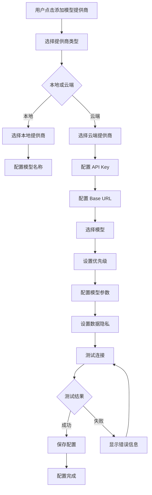

#### 2. 编辑模型提供商流程

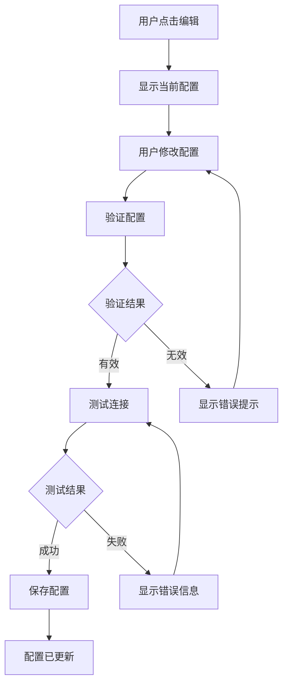

#### 3. 删除模型提供商流程

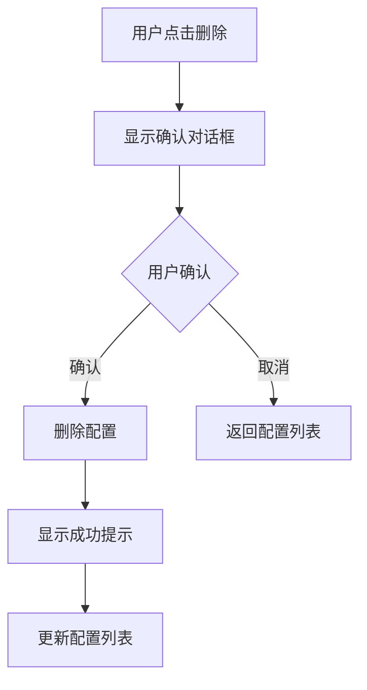

### 配置界面设计原则

#### 1. 渐进式披露

- **基础配置**：提供商名称、API Key、模型名称（必填）
- **高级配置**：Base URL、模型参数、优先级（可选，默认折叠）
- **隐私设置**：数据脱敏选项（默认启用，可关闭）

#### 2. 实时验证

- **API Key 验证**：输入时实时验证格式
- **连接测试**：保存前测试连接，确保配置有效
- **参数验证**：模型参数范围验证

#### 3. 智能默认值

- **优先级**：自动分配下一个可用优先级
- **模型参数**：提供合理的默认值（温度 0.3，最大 Token 4096）
- **Base URL**：自动填充默认端点

#### 4. 错误处理

- **连接失败**：显示清晰的错误信息和解决建议
- **API Key 无效**：提示检查 API Key 格式和权限
- **模型不可用**：提示选择其他模型或检查模型名称

### 配置界面可访问性

#### 键盘导航

- Tab 键：在表单字段之间导航
- Enter 键：提交表单
- Esc 键：关闭对话框
- 方向键：在选项之间导航

#### 屏幕阅读器支持

- ARIA 标签：所有表单字段有清晰的标签
- 错误提示：`aria-live="polite"` 实时播报
- 状态指示：`aria-busy="true"` 测试连接时

#### 焦点管理

- 焦点陷阱：对话框打开时焦点限制在对话框内
- 焦点返回：对话框关闭时焦点返回到触发元素
- 焦点指示：清晰的焦点状态（蓝色边框 2px）

### 配置界面响应式设计

#### 桌面端（≥ 1200px）

- 配置列表：3 列布局
- 对话框：最大宽度 600px
- 表单字段：并排显示（标签和输入框）

#### 平板端（768px - 1199px）

- 配置列表：2 列布局
- 对话框：最大宽度 500px
- 表单字段：堆叠显示

#### 移动端（< 768px）

- 配置列表：1 列布局
- 对话框：全屏显示
- 表单字段：堆叠显示，触摸目标 44x44px

---

## 成本管理和预算控制界面设计

### 设计目标

基于 PRD 功能需求 FR19-FR21 和非功能需求 NFR58-NFR59，成本管理界面需要实现以下目标：

1. **实时成本跟踪**：准确跟踪云端模型的 API 使用成本（NFR58）
2. **预算管理**：用户可以设置月度成本预算和告警阈值（NFR59）
3. **成本告警**：当成本接近预算时发送告警（NFR59）
4. **成本优化**：提供成本优化建议（FR21）
5. **成本透明**：清晰显示每个提供商和模型的成本

### 成本管理界面架构

#### 主成本管理页面布局

```
┌─────────────────────────────────────────────────────────────┐
│  设置 > 成本管理                                          │
├─────────────────────────────────────────────────────────────┤
│                                                             │
│  本月成本概览                                              │
│  ┌─────────────────────────────────────────────────────┐    │
│  │                                                     │    │
│  │  本月总成本: $20.80  预算: $100.00  [编辑预算]  │    │
│  │                                                     │    │
│  │  ━━━━━━━━━━━━━━━━━━━━━━━━━━━━━━━━━━━━━━━━━━━━  │    │
│  │  20.8%                                              │    │
│  │                                                     │    │
│  │  剩余预算: $79.20  预计月底: $45.00                │    │
│  │                                                     │    │
│  └─────────────────────────────────────────────────────┘    │
│                                                             │
│  按提供商分成本                                            │
│  ┌─────────────────────────────────────────────────────┐    │
│  │ OpenAI: $12.50  (60%)  [查看详情]               │    │
│  │ ━━━━━━━━━━━━━━━━━━━━━━━━━━━━━━━━━━━━━━━━━━━━  │    │
│  │                                                     │    │
│  │ Qwen: $8.30  (40%)  [查看详情]                  │    │
│  │ ━━━━━━━━━━━━━━━━━━━━━━━━━━━━━━━━━━━━━━━━━━━━  │    │
│  └─────────────────────────────────────────────────────┘    │
│                                                             │
│  成本趋势                                                  │
│  ┌─────────────────────────────────────────────────────┐    │
│  │                                                     │    │
│  │  [成本趋势图表]                                      │    │
│  │                                                     │    │
│  └─────────────────────────────────────────────────────┘    │
│  [本周]  [本月]  [本季度]  [本年度]                      │
│                                                             │
│  成本优化建议                                              │
│  ┌─────────────────────────────────────────────────────┐    │
│  │ 💡 建议：使用 Qwen 模型可以节省 30% 成本          │    │
│  │    Qwen 的准确率与 OpenAI 相当，但成本更低        │    │
│  │    [应用建议]  [忽略]                              │    │
│  └─────────────────────────────────────────────────────┘    │
│                                                             │
└─────────────────────────────────────────────────────────────┘
```

#### 成本详情页面布局

```
┌─────────────────────────────────────────────────────────────┐
│  成本详情 > OpenAI                                  [←]    │
├─────────────────────────────────────────────────────────────┤
│                                                             │
│  OpenAI 成本详情                                          │
│  ┌─────────────────────────────────────────────────────┐    │
│  │ 本月成本: $12.50  预算: $50.00  [编辑预算]    │    │
│  │                                                     │    │
│  │ ━━━━━━━━━━━━━━━━━━━━━━━━━━━━━━━━━━━━━━━━━━━━  │    │
│  │ 25%                                                 │    │
│  │                                                     │    │
│  │ 剩余预算: $37.50  预计月底: $25.00               │    │
│  └─────────────────────────────────────────────────────┘    │
│                                                             │
│  按模型分成本                                              │
│  ┌─────────────────────────────────────────────────────┐    │
│  │ gpt-4o: $10.00  (80%)  [查看详情]             │    │
│  │ gpt-3.5-turbo: $2.50  (20%)  [查看详情]       │    │
│  └─────────────────────────────────────────────────────┘    │
│                                                             │
│  使用记录                                                  │
│  ┌─────────────────────────────────────────────────────┐    │
│  │ 日期        模型        请求次数  成本      操作  │    │
│  │ 2026-04-13 gpt-4o     150      $5.00    [详情] │    │
│  │ 2026-04-12 gpt-4o     120      $4.00    [详情] │    │
│  │ 2026-04-11 gpt-3.5-turbo 80      $2.50    [详情] │    │
│  └─────────────────────────────────────────────────────┘    │
│  [导出记录]  [筛选]  [搜索]                              │
│                                                             │
└─────────────────────────────────────────────────────────────┘
```

#### 预算设置对话框

```
┌─────────────────────────────────────────────────────────────┐
│  设置预算                                          [×]    │
├─────────────────────────────────────────────────────────────┤
│                                                             │
│  月度成本预算 *                                            │
│  ┌─────────────────────────────────────────────────────┐    │
│  │ $100.00                                        │    │
│  └─────────────────────────────────────────────────────┘    │
│  建议预算: $50.00 - $200.00  [查看建议]                  │
│                                                             │
│  告警阈值 *                                              │
│  ┌─────────────────────────────────────────────────────┐    │
│  │ 80%                                            │    │
│  └─────────────────────────────────────────────────────┘    │
│  当成本达到预算的 80% 时发送告警                          │
│                                                             │
│  告警方式                                                  │
│  ☑ 应用内通知  ☑ 邮件通知  ☐ 短信通知                │
│                                                             │
│  [取消]  [保存]                                            │
│                                                             │
└─────────────────────────────────────────────────────────────┘
```

#### 成本告警通知

```
┌─────────────────────────────────────────────────────────────┐
│  ⚠️ 成本告警                                      [×]    │
├─────────────────────────────────────────────────────────────┤
│                                                             │
│  您的 OpenAI 成本已接近预算！                              │
│                                                             │
│  当前成本: $40.00  预算: $50.00  (80%)              │
│                                                             │
│  剩余预算: $10.00  预计月底: $55.00                   │
│                                                             │
│  建议：                                                    │
│  • 考虑使用成本更低的模型（如 Qwen）                      │
│  • 减少不必要的 API 调用                                 │
│  • 启用数据脱敏以减少 Token 使用                          │
│                                                             │
│  [查看详情]  [调整预算]  [忽略]                            │
│                                                             │
└─────────────────────────────────────────────────────────────┘
```

### 成本管理界面交互设计

#### 1. 设置预算流程

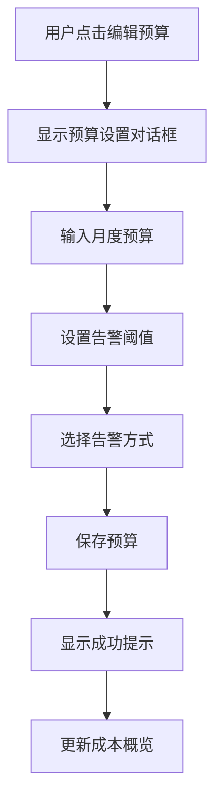

#### 2. 成本告警流程

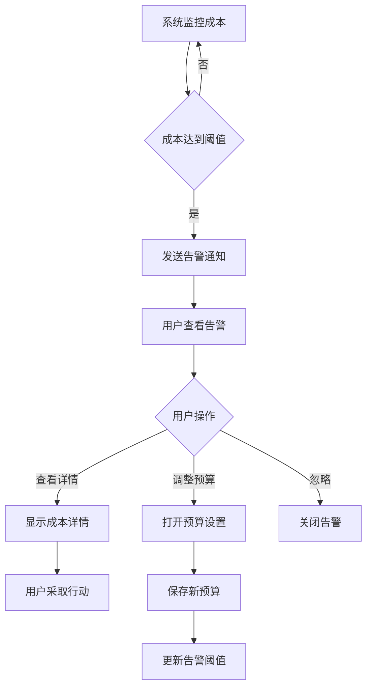

#### 3. 成本优化流程

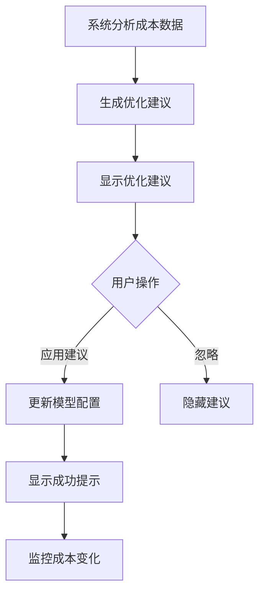

### 成本管理界面设计原则

#### 1. 可视化优先

- **成本概览**：使用进度条和百分比显示成本使用情况
- **成本趋势**：使用图表显示成本变化趋势
- **成本对比**：使用条形图对比不同提供商的成本

#### 2. 实时更新

- **成本跟踪**：实时更新成本数据
- **告警触发**：实时监控成本，及时发送告警
- **趋势更新**：实时更新成本趋势图表

#### 3. 智能建议

- **成本优化**：基于使用数据提供成本优化建议
- **预算建议**：基于历史数据建议合理的预算范围
- **模型推荐**：推荐成本更低但准确率相当的模型

#### 4. 用户控制

- **预算设置**：用户可以自定义月度预算
- **告警配置**：用户可以配置告警阈值和方式
- **建议应用**：用户可以选择应用或忽略优化建议

### 成本管理界面可访问性

#### 键盘导航

- Tab 键：在表单字段和按钮之间导航
- Enter 键：提交表单或确认操作
- Esc 键：关闭对话框或通知
- 方向键：在图表和列表中导航

#### 屏幕阅读器支持

- ARIA 标签：所有图表和列表有清晰的标签
- 成本播报：`aria-live="polite"` 实时播报成本变化
- 告警播报：`aria-live="assertive"` 立即播报告警

#### 焦点管理

- 焦点陷阱：对话框打开时焦点限制在对话框内
- 焦点返回：对话框关闭时焦点返回到触发元素
- 焦点指示：清晰的焦点状态（蓝色边框 2px）

### 成本管理界面响应式设计

#### 桌面端（≥ 1200px）

- 成本概览：3 列布局
- 成本趋势：大图表显示
- 使用记录：表格显示

#### 平板端（768px - 1199px）

- 成本概览：2 列布局
- 成本趋势：中等图表显示
- 使用记录：表格显示，简化列

#### 移动端（< 768px）

- 成本概览：1 列布局
- 成本趋势：小图表显示
- 使用记录：列表显示

---

## 模型性能监控界面设计

### 设计目标

基于 PRD 功能需求 FR25 和非功能需求 NFR52-NFR57，模型性能监控界面需要实现以下目标：

1. **实时监控**：实时显示每个模型的性能指标（NFR52）
2. **性能对比**：对比不同模型的性能（响应时间、准确率、成功率）
3. **历史数据**：提供历史性能数据，支持趋势分析
4. **性能告警**：当模型性能下降时发送告警
5. **性能优化**：提供性能优化建议

### 模型性能监控界面架构

#### 主性能监控页面布局

```
┌─────────────────────────────────────────────────────────────┐
│  设置 > 模型性能监控                                      │
├─────────────────────────────────────────────────────────────┤
│                                                             │
│  性能概览                                                  │
│  ┌─────────────────────────────────────────────────────┐    │
│  │                                                     │    │
│  │  平均响应时间: 2.1s  平均准确率: 96%  平均成功率: 98% │    │
│  │                                                     │    │
│  │  [性能趋势图表]                                      │    │
│  │                                                     │    │
│  └─────────────────────────────────────────────────────┘    │
│  [实时]  [1小时]  [24小时]  [7天]  [30天]               │
│                                                             │
│  按模型分性能                                              │
│  ┌─────────────────────────────────────────────────────┐    │
│  │ Ollama (llama3:8b)                                  │    │
│  │ 响应时间: 2.3s  准确率: 95%  成功率: 97%  [详情] │    │
│  │ ━━━━━━━━━━━━━━━━━━━━━━━━━━━━━━━━━━━━━━━━━━━━  │    │
│  │                                                     │    │
│  │ OpenAI (gpt-4o)                                    │    │
│  │ 响应时间: 1.8s  准确率: 97%  成功率: 99%  [详情] │    │
│  │ ━━━━━━━━━━━━━━━━━━━━━━━━━━━━━━━━━━━━━━━━━━━━  │    │
│  │                                                     │    │
│  │ Qwen (qwen-turbo)                                   │    │
│  │ 响应时间: 2.1s  准确率: 96%  成功率: 98%  [详情] │    │
│  │ ━━━━━━━━━━━━━━━━━━━━━━━━━━━━━━━━━━━━━━━━━━━━  │    │
│  └─────────────────────────────────────────────────────┘    │
│                                                             │
│  性能告警                                                  │
│  ┌─────────────────────────────────────────────────────┐    │
│  │ ⚠️ OpenAI 响应时间异常 (3.5s > 阈值 3.0s)    │    │
│  │    时间: 2026-04-13 10:30:00  [查看]  [忽略]  │    │
│  └─────────────────────────────────────────────────────┘    │
│                                                             │
│  性能优化建议                                              │
│  ┌─────────────────────────────────────────────────────┐    │
│  │ 💡 建议：OpenAI 响应时间较慢，考虑使用 Qwen       │    │
│  │    Qwen 的响应时间更快，准确率相当                  │    │
│  │    [应用建议]  [忽略]                              │    │
│  └─────────────────────────────────────────────────────┘    │
│                                                             │
└─────────────────────────────────────────────────────────────┘
```

#### 模型性能详情页面布局

```
┌─────────────────────────────────────────────────────────────┐
│  性能详情 > OpenAI (gpt-4o)                        [←]    │
├─────────────────────────────────────────────────────────────┤
│                                                             │
│  OpenAI (gpt-4o) 性能详情                                │
│  ┌─────────────────────────────────────────────────────┐    │
│  │ 响应时间: 1.8s  准确率: 97%  成功率: 99%       │    │
│  │                                                     │    │
│  │ [性能趋势图表]                                      │    │
│  │                                                     │    │
│  └─────────────────────────────────────────────────────┘    │
│  [实时]  [1小时]  [24小时]  [7天]  [30天]               │
│                                                             │
│  性能指标                                                  │
│  ┌─────────────────────────────────────────────────────┐    │
│  │ 响应时间                                              │    │
│  │ 平均: 1.8s  最小: 1.2s  最大: 3.5s  P95: 2.5s │    │
│  │                                                     │    │
│  │ 准确率                                                │    │
│  │ 平均: 97%  最小: 92%  最大: 99%  P95: 98%     │    │
│  │                                                     │    │
│  │ 成功率                                                │    │
│  │ 平均: 99%  最小: 95%  最大: 100%  P95: 99%    │    │
│  └─────────────────────────────────────────────────────┘    │
│                                                             │
│  使用统计                                                  │
│  ┌─────────────────────────────────────────────────────┐    │
│  │ 总请求数: 1,500  成功: 1,485  失败: 15         │    │
│  │ 成功率: 99%  平均每天: 50 请求                      │    │
│  └─────────────────────────────────────────────────────┘    │
│                                                             │
│  性能历史                                                  │
│  ┌─────────────────────────────────────────────────────┐    │
│  │ 日期        响应时间  准确率  成功率  操作      │    │
│  │ 2026-04-13 1.8s      97%     99%     [详情]    │    │
│  │ 2026-04-12 1.9s      96%     98%     [详情]    │    │
│  │ 2026-04-11 2.0s      97%     99%     [详情]    │    │
│  └─────────────────────────────────────────────────────┘    │
│  [导出数据]  [筛选]  [搜索]                              │
│                                                             │
└─────────────────────────────────────────────────────────────┘
```

### 模型性能监控界面交互设计

#### 1. 查看性能详情流程

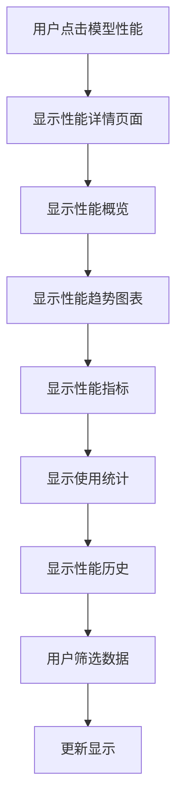

#### 2. 性能告警流程

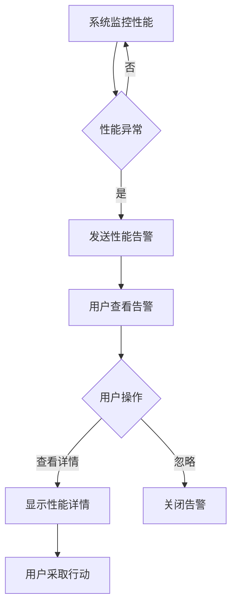

#### 3. 性能优化流程

```mermaid
flowchart TD
    A[系统分析性能数据] --> B[生成优化建议]
    B --> C[显示优化建议]
    C --> D{用户操作}
    D -->|应用建议| E[更新模型配置]
    D -->|忽略| F[隐藏建议]
    E --> G[显示成功提示]
    G --> H[监控性能变化]
```

### 模型性能监控界面设计原则

#### 1. 可视化优先

- **性能概览**：使用图表显示性能趋势
- **性能对比**：使用条形图对比不同模型的性能
- **性能指标**：使用进度条和百分比显示性能指标

#### 2. 实时更新

- **性能监控**：实时更新性能数据
- **告警触发**：实时监控性能，及时发送告警
- **趋势更新**：实时更新性能趋势图表

#### 3. 智能建议

- **性能优化**：基于性能数据提供优化建议
- **模型推荐**：推荐性能更好的模型
- **配置优化**：推荐优化模型配置

#### 4. 用户控制

- **时间范围**：用户可以选择查看不同时间范围的性能数据
- **告警配置**：用户可以配置性能告警阈值
- **建议应用**：用户可以选择应用或忽略优化建议

### 模型性能监控界面可访问性

#### 键盘导航

- Tab 键：在图表和列表之间导航
- Enter 键：查看详情或确认操作
- Esc 键：关闭对话框或通知
- 方向键：在图表和列表中导航

#### 屏幕阅读器支持

- ARIA 标签：所有图表和列表有清晰的标签
- 性能播报：`aria-live="polite"` 实时播报性能变化
- 告警播报：`aria-live="assertive"` 立即播报告警

#### 焦点管理

- 焦点陷阱：对话框打开时焦点限制在对话框内
- 焦点返回：对话框关闭时焦点返回到触发元素
- 焦点指示：清晰的焦点状态（蓝色边框 2px）

### 模型性能监控界面响应式设计

#### 桌面端（≥ 1200px）

- 性能概览：3 列布局
- 性能趋势：大图表显示
- 性能历史：表格显示

#### 平板端（768px - 1199px）

- 性能概览：2 列布局
- 性能趋势：中等图表显示
- 性能历史：表格显示，简化列

#### 移动端（< 768px）

- 性能概览：1 列布局
- 性能趋势：小图表显示
- 性能历史：列表显示

---

## 数据隐私警告和确认界面设计

### 设计目标

基于 PRD 功能需求 FR22-FR23 和架构决策 ADR-015，数据隐私警告和确认界面需要实现以下目标：

1. **隐私透明**：明确告知用户云端模型的数据隐私影响（FR23）
2. **用户控制**：用户可以选择是否使用云端模型（FR23）
3. **数据脱敏**：提供数据脱敏选项，保护敏感信息（FR22）
4. **合规性**：确保符合 GDPR、CCPA 等数据隐私法规
5. **用户教育**：提供隐私说明和最佳实践

### 数据隐私警告界面架构

#### 首次使用云端模型警告

```
┌─────────────────────────────────────────────────────────────┐
│  ⚠️ 数据隐私警告                                  [×]    │
├─────────────────────────────────────────────────────────────┤
│                                                             │
│  您即将使用云端 AI 模型（OpenAI）                          │
│                                                             │
│  ┌─────────────────────────────────────────────────────┐    │
│  │                                                     │    │
│  │  🔒 重要提示：                                     │    │
│  │                                                     │    │
│  │  使用云端模型时，您的数据将发送到云端服务器进行处理。   │    │
│  │  这意味着：                                         │    │
│  │                                                     │    │
│  │  • 数据将离开您的本地设备                             │    │
│  │  • 数据将存储在云端服务器上                           │    │
│  │  • 数据可能受到第三方访问                             │    │
│  │                                                     │    │
│  │  如果您处理敏感数据（如个人信息、商业机密），建议使用   │    │
│  │  本地模型（如 Ollama）。                             │    │
│  │                                                     │    │
│  └─────────────────────────────────────────────────────┘    │
│                                                             │
│  数据脱敏设置                                              │
│  ☑ 启用数据脱敏  [查看脱敏规则]                          │
│  脱敏将自动过滤敏感信息（如邮箱、电话、身份证号）            │
│                                                             │
│  隐私政策                                                  │
│  [查看完整隐私政策]  [了解 GDPR/CCPA 合规性]              │
│                                                             │
│  [切换到本地模型]  [我了解风险，继续使用云端模型]          │
│                                                             │
└─────────────────────────────────────────────────────────────┘
```

#### 数据脱敏配置界面

```
┌─────────────────────────────────────────────────────────────┐
│  数据脱敏配置                                      [×]    │
├─────────────────────────────────────────────────────────────┤
│                                                             │
│  脱敏规则                                                  │
│  ☑ 邮箱地址  [编辑规则]                                   │
│  ☑ 电话号码  [编辑规则]                                   │
│  ☑ 身份证号  [编辑规则]                                   │
│  ☑ 银行卡号  [编辑规则]                                   │
│  ☑ 地址信息  [编辑规则]                                   │
│  ☑ 姓名  [编辑规则]                                       │
│  ☐ 自定义规则  [+ 添加规则]                                │
│                                                             │
│  脱敏方式                                                  │
│  ● 部分脱敏（推荐）  ○ 完全脱敏  ○ 不脱敏          │
│                                                             │
│  部分脱敏示例：                                            │
│  • 邮箱：user***@example.com                              │
│  • 电话：138****5678                                      │
│  • 身份证：110101********1234                               │
│                                                             │
│  脱敏预览                                                  │
│  ┌─────────────────────────────────────────────────────┐    │
│  │ 原始数据：                                         │    │
│  │ 姓名：张三  邮箱：zhangsan@example.com              │    │
│  │ 电话：13812345678  身份证：110101199001011234        │    │
│  │                                                     │    │
│  │ 脱敏后数据：                                       │    │
│  │ 姓名：张三  邮箱：zhang***@example.com            │    │
│  │ 电话：138****5678  身份证：110101********1234        │    │
│  └─────────────────────────────────────────────────────┘    │
│                                                             │
│  [取消]  [保存配置]                                        │
│                                                             │
└─────────────────────────────────────────────────────────────┘
```

#### 隐私设置界面

```
┌─────────────────────────────────────────────────────────────┐
│  设置 > 隐私设置                                          │
├─────────────────────────────────────────────────────────────┤
│                                                             │
│  数据隐私设置                                              │
│  ┌─────────────────────────────────────────────────────┐    │
│  │ 默认模型类型                                      │    │
│  │ ● 本地模型（推荐）  ○ 云端模型  ○ 询问用户      │    │
│  │                                                     │    │
│  │ 本地模型优先，确保数据隐私和安全                     │    │
│  └─────────────────────────────────────────────────────┘    │
│                                                             │
│  ┌─────────────────────────────────────────────────────┐    │
│  │ 云端模型数据脱敏                                  │    │
│  │ ☑ 启用数据脱敏  [配置脱敏规则]                  │    │
│  │                                                     │    │
│  │ 脱敏将自动过滤敏感信息，保护您的隐私               │    │
│  └─────────────────────────────────────────────────────┘    │
│                                                             │
│  ┌─────────────────────────────────────────────────────┐    │
│  │ 云端模型使用确认                                  │    │
│  │ ☑ 每次使用云端模型前显示警告                      │    │
│  │ ☐ 仅首次使用时显示警告                            │    │
│  │ ☐ 不显示警告                                      │    │
│  └─────────────────────────────────────────────────────┘    │
│                                                             │
│  合规性设置                                                │
│  ┌─────────────────────────────────────────────────────┐    │
│  │ GDPR 合规                                        │    │
│  │ ☑ 启用 GDPR 合规模式  [查看详情]                │    │
│  │                                                     │    │
│  │ CCPA 合规                                       │    │
│  │ ☑ 启用 CCPA 合规模式  [查看详情]                │    │
│  │                                                     │    │
│  │ 中国网络安全法合规                                  │    │
│  │ ☑ 启用中国网络安全法合规模式  [查看详情]          │    │
│  └─────────────────────────────────────────────────────┘    │
│                                                             │
│  数据管理                                                  │
│  [查看数据使用记录]  [导出我的数据]  [删除我的数据]      │
│                                                             │
│  [保存设置]                                                │
│                                                             │
└─────────────────────────────────────────────────────────────┘
```

#### 数据使用记录界面

```
┌─────────────────────────────────────────────────────────────┐
│  数据使用记录                                      [←]    │
├─────────────────────────────────────────────────────────────┤
│                                                             │
│  数据使用概览                                              │
│  ┌─────────────────────────────────────────────────────┐    │
│  │ 总请求数: 1,500  云端请求: 500  本地请求: 1,000 │    │
│  │                                                     │    │
│  │ [使用趋势图表]                                      │    │
│  │                                                     │    │
│  └─────────────────────────────────────────────────────┘    │
│  [本周]  [本月]  [本季度]  [本年度]                      │
│                                                             │
│  按提供商分使用                                            │
│  ┌─────────────────────────────────────────────────────┐    │
│  │ Ollama: 1,000 请求  (67%)  [查看详情]            │    │
│  │ OpenAI: 500 请求  (33%)  [查看详情]               │    │
│  └─────────────────────────────────────────────────────┘    │
│                                                             │
│  使用记录                                                  │
│  ┌─────────────────────────────────────────────────────┐    │
│  │ 日期        提供商  模型        数据类型  操作      │    │
│  │ 2026-04-13 Ollama  llama3:8b  本地      [详情]    │    │
│  │ 2026-04-13 OpenAI  gpt-4o     云端      [详情]    │    │
│  │ 2026-04-12 Ollama  llama3:8b  本地      [详情]    │    │
│  └─────────────────────────────────────────────────────┘    │
│  [导出记录]  [筛选]  [搜索]                              │
│                                                             │
└─────────────────────────────────────────────────────────────┘
```

### 数据隐私警告界面交互设计

#### 1. 首次使用云端模型流程

```mermaid
flowchart TD
    A[用户选择云端模型] --> B[显示隐私警告]
    B --> C[用户阅读警告]
    C --> D{用户选择}
    D -->|切换到本地模型| E[切换到本地模型]
    D -->|继续使用云端模型| F[显示脱敏选项]
    E --> G[使用本地模型]
    F --> H{是否启用脱敏}
    H -->|是| I[启用数据脱敏]
    H -->|否| J[不启用数据脱敏]
    I --> K[使用云端模型]
    J --> K
```

#### 2. 配置数据脱敏流程

```mermaid
flowchart TD
    A[用户打开数据脱敏配置] --> B[显示脱敏规则]
    B --> C[用户选择脱敏规则]
    C --> D[用户选择脱敏方式]
    D --> E[查看脱敏预览]
    E --> F{用户确认}
    F -->|确认| G[保存配置]
    F -->|修改| C
    G --> H[显示成功提示]
```

#### 3. 查看数据使用记录流程

```mermaid
flowchart TD
    A[用户打开数据使用记录] --> B[显示使用概览]
    B --> C[显示使用趋势]
    C --> D[显示按提供商分使用]
    D --> E[显示使用记录]
    E --> F[用户筛选数据]
    F --> G[更新显示]
    G --> H[用户导出记录]
```

### 数据隐私警告界面设计原则

#### 1. 透明度优先

- **明确告知**：清晰告知用户云端模型的数据隐私影响
- **风险提示**：明确提示使用云端模型的风险
- **合规说明**：提供 GDPR、CCPA 等合规性说明

#### 2. 用户控制

- **模型选择**：用户可以选择使用本地或云端模型
- **脱敏控制**：用户可以配置数据脱敏规则
- **警告控制**：用户可以配置警告显示频率

#### 3. 默认安全

- **本地优先**：默认使用本地模型，确保数据隐私
- **脱敏启用**：默认启用数据脱敏，保护敏感信息
- **警告显示**：默认显示隐私警告，提醒用户注意

#### 4. 用户教育

- **隐私说明**：提供详细的隐私说明和最佳实践
- **合规指导**：提供 GDPR、CCPA 等合规性指导
- **使用记录**：提供数据使用记录，让用户了解数据使用情况

### 数据隐私警告界面可访问性

#### 键盘导航

- Tab 键：在表单字段和按钮之间导航
- Enter 键：提交表单或确认操作
- Esc 键：关闭对话框
- 方向键：在选项之间导航

#### 屏幕阅读器支持

- ARIA 标签：所有警告和表单字段有清晰的标签
- 警告播报：`aria-live="assertive"` 立即播报告警
- 状态播报：`aria-live="polite"` 播报状态变化

#### 焦点管理

- 焦点陷阱：对话框打开时焦点限制在对话框内
- 焦点返回：对话框关闭时焦点返回到触发元素
- 焦点指示：清晰的焦点状态（蓝色边框 2px）

### 数据隐私警告界面响应式设计

#### 桌面端（≥ 1200px）

- 警告对话框：最大宽度 600px
- 配置界面：3 列布局
- 使用记录：表格显示

#### 平板端（768px - 1199px）

- 警告对话框：最大宽度 500px
- 配置界面：2 列布局
- 使用记录：表格显示，简化列

#### 移动端（< 768px）

- 警告对话框：全屏显示
- 配置界面：1 列布局
- 使用记录：列表显示

---

## 模型选择和切换交互设计

### 设计目标

基于 PRD 功能需求 FR16-FR18 和非功能需求 NFR50-NFR51，模型选择和切换交互需要实现以下目标：

1. **快速切换**：用户可以在 5 秒内切换 AI 模型提供商（NFR50）
2. **无缝切换**：支持无缝切换，不中断正在进行的任务（FR27）
3. **智能回退**：当首选模型不可用时，自动回退到备用模型（FR18）
4. **混合使用**：支持同一任务使用多个模型，取最佳结果（FR28）
5. **用户控制**：用户可以手动选择或自动选择模型

### 模型选择器组件设计

#### 模型选择器界面

```
┌─────────────────────────────────────────────────────────────┐
│  选择 AI 模型                                      [×]    │
├─────────────────────────────────────────────────────────────┤
│                                                             │
│  当前任务：爬取商品列表                                  │
│                                                             │
│  模型选择策略                                              │
│  ● 自动选择（推荐）  ○ 手动选择  ○ 混合使用        │
│                                                             │
│  ┌─────────────────────────────────────────────────────┐    │
│  │ 自动选择                                          │    │
│  │                                                     │    │
│  │ 系统将根据任务复杂度自动选择最合适的模型：         │    │
│  │ • 简单任务：使用本地模型（Ollama）                │    │
│  │ • 复杂任务：使用云端模型（OpenAI）                │    │
│  │ • 成本优化：使用成本最低的模型（Qwen）             │    │
│  │                                                     │    │
│  └─────────────────────────────────────────────────────┘    │
│                                                             │
│  可用模型                                                  │
│  ┌─────────────────────────────────────────────────────┐    │
│  │ ● Ollama (llama3:8b)  [本地]  优先级: 1       │    │
│  │   响应时间: 2.3s  准确率: 95%  成本: $0.00   │    │
│  │                                                     │    │
│  │ ○ OpenAI (gpt-4o)  [云端]  优先级: 2        │    │
│  │   响应时间: 1.8s  准确率: 97%  成本: $0.05/请求│    │
│  │                                                     │    │
│  │ ○ Qwen (qwen-turbo)  [云端]  优先级: 3         │    │
│  │   响应时间: 2.1s  准确率: 96%  成本: $0.02/请求│    │
│  └─────────────────────────────────────────────────────┘    │
│                                                             │
│  回退设置                                                  │
│  ☑ 启用自动回退  回退超时: 3 秒  [配置回退顺序]      │
│                                                             │
│  [取消]  [确认选择]                                        │
│                                                             │
└─────────────────────────────────────────────────────────────┘
```

#### 模型切换界面

```
┌─────────────────────────────────────────────────────────────┐
│  切换 AI 模型                                      [×]    │
├─────────────────────────────────────────────────────────────┤
│                                                             │
│  当前模型：OpenAI (gpt-4o)                                │
│                                                             │
│  切换到：                                                  │
│  ┌─────────────────────────────────────────────────────┐    │
│  │ ● Ollama (llama3:8b)  [本地]  优先级: 1       │    │
│  │   响应时间: 2.3s  准确率: 95%  成本: $0.00   │    │
│  │                                                     │    │
│  │ ○ Qwen (qwen-turbo)  [云端]  优先级: 3         │    │
│  │   响应时间: 2.1s  准确率: 96%  成本: $0.02/请求│    │
│  └─────────────────────────────────────────────────────┘    │
│                                                             │
│  ⚠️ 切换模型将中断当前任务，是否继续？                    │
│                                                             │
│  [取消]  [确认切换]                                        │
│                                                             │
└─────────────────────────────────────────────────────────────┘
```

#### 模型回退界面

```
┌─────────────────────────────────────────────────────────────┐
│  模型回退通知                                      [×]    │
├─────────────────────────────────────────────────────────────┤
│                                                             │
│  ⚠️ OpenAI (gpt-4o) 不可用，已自动回退到备用模型      │
│                                                             │
│  ┌─────────────────────────────────────────────────────┐    │
│  │ 原模型：OpenAI (gpt-4o)                           │    │
│  │ 状态：不可用  错误：API 请求超时                  │    │
│  │                                                     │    │
│  │ 回退到：Ollama (llama3:8b)                        │    │
│  │ 状态：在线  响应时间: 2.3s  准确率: 95%       │    │
│  └─────────────────────────────────────────────────────┘    │
│                                                             │
│  任务将继续使用备用模型执行，您可以：                        │
│  • 等待原模型恢复后切换回原模型                          │
│  • 手动切换到其他模型                                    │
│  • 禁用自动回退功能                                      │
│                                                             │
│  [切换回原模型]  [切换到其他模型]  [关闭]              │
│                                                             │
└─────────────────────────────────────────────────────────────┘
```

### 模型选择和切换交互设计

#### 1. 自动选择模型流程

```mermaid
flowchart TD
    A[用户开始任务] --> B[系统分析任务复杂度]
    B --> C{任务复杂度}
    C -->|简单| D[选择本地模型]
    C -->|复杂| E[选择云端模型]
    C -->|成本优化| F[选择成本最低模型]
    D --> G[执行任务]
    E --> G
    F --> G
    G --> H{模型可用}
    H -->|是| I[继续执行]
    H -->|否| J[触发回退]
    J --> K[选择备用模型]
    K --> G
```

#### 2. 手动选择模型流程

```mermaid
flowchart TD
    A[用户打开模型选择器] --> B[显示可用模型]
    B --> C[用户选择模型]
    C --> D{是否切换模型}
    D -->|是| E[显示切换确认]
    D -->|否| F[关闭选择器]
    E --> G{用户确认}
    G -->|确认| H[切换模型]
    G -->|取消| F
    H --> I[中断当前任务]
    I --> J[使用新模型]
```

#### 3. 自动回退流程

```mermaid
flowchart TD
    A[模型执行任务] --> B{模型可用}
    B -->|是| C[继续执行]
    B -->|否| D[检测回退条件]
    D --> E{启用自动回退}
    E -->|是| F[选择备用模型]
    E -->|否| G[显示错误]
    F --> H[切换到备用模型]
    H --> I[发送回退通知]
    I --> J[继续执行任务]
    G --> K[等待用户操作]
```

### 模型选择和切换设计原则

#### 1. 智能默认

- **自动选择**：根据任务复杂度自动选择最合适的模型
- **成本优化**：优先选择成本最低的模型
- **性能优先**：优先选择性能最好的模型

#### 2. 用户控制

- **手动选择**：用户可以手动选择模型
- **回退控制**：用户可以配置回退行为
- **切换控制**：用户可以随时切换模型

#### 3. 无缝体验

- **快速切换**：5 秒内完成模型切换（NFR50）
- **无缝切换**：不中断正在进行的任务（FR27）
- **自动回退**：3 秒内自动回退到备用模型（NFR54）

#### 4. 透明反馈

- **切换通知**：切换模型时发送通知
- **回退通知**：自动回退时发送通知
- **状态显示**：实时显示模型状态

### 模型选择和切换可访问性

#### 键盘导航

- Tab 键：在模型选项之间导航
- Enter 键：选择模型或确认操作
- Esc 键：关闭选择器
- 方向键：在模型选项之间导航

#### 屏幕阅读器支持

- ARIA 标签：所有模型选项有清晰的标签
- 状态播报：`aria-live="polite"` 播报模型状态变化
- 通知播报：`aria-live="assertive"` 播报切换和回退通知

#### 焦点管理

- 焦点陷阱：选择器打开时焦点限制在选择器内
- 焦点返回：选择器关闭时焦点返回到触发元素
- 焦点指示：清晰的焦点状态（蓝色边框 2px）

### 模型选择和切换响应式设计

#### 桌面端（≥ 1200px）

- 模型选择器：最大宽度 600px
- 模型选项：3 列布局
- 切换界面：最大宽度 500px

#### 平板端（768px - 1199px）

- 模型选择器：最大宽度 500px
- 模型选项：2 列布局
- 切换界面：最大宽度 400px

#### 移动端（< 768px）

- 模型选择器：全屏显示
- 模型选项：1 列布局
- 切换界面：全屏显示
